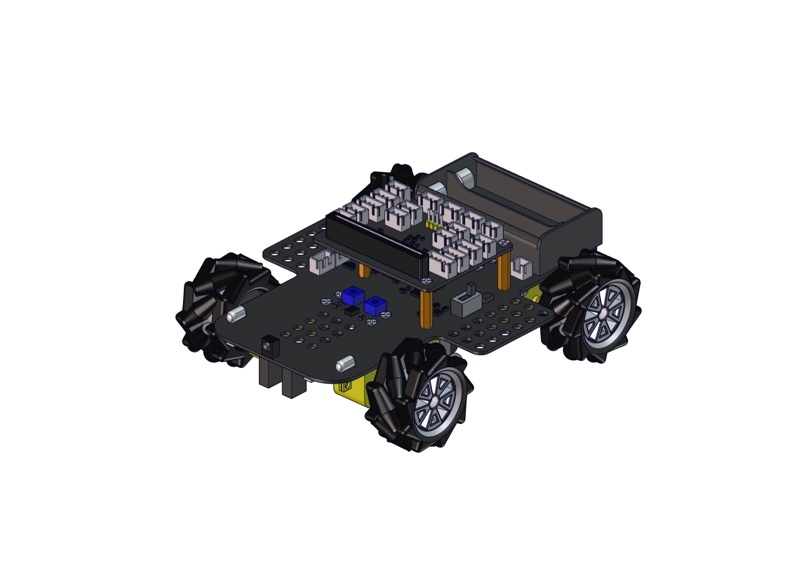

# Getting Started With 4WD Mecanum Robot

## 1.Introduction

Have you wondered to learn programming or have your own programming robot? Nowadays, programming has developed to a lower age group, and it will be a trend for everyone to be able to program thanks to the spread of simple graphical programming platforms, from micro:bit to Arduino and Raspberry Pi. Maybe you haven't heard of them before. It doesn't matter because with the help of this product and tutorial, you can easily install a multi-functional programming car and experience the fun of being a maker.

Micro:bit is a highly integrated microcontroller of powerful functions and small size. It is very suitable to be applied in STEAM education for it functions to make robots, wearable devices and electronic interactive games via the combination of code programming and graphical programming.

This Keyestudio 4WD Mecanum Robot Car is a smart DIY car specially designed for micro:bit. The smart car kit consists of a car body with extended functions, a PCB base plate with integrated motor drive sensors, 4 decelerating DC motors, Mecanum wheels, various modules and sensors and acrylic boards. Therefore, you can easily assemble a cool Mecanum wheel 4WD smart car by yourself, and then use Microsoft's online graphical programming platform Make Code to program the micro:bit control board to control the car. In the process, you can not only experience the fun of creation but enhance hands-on ability and learn
programming skills as well.

MakeCode for micro:bit is the most widely used graphical programming environment on the micro:bit official website. It is based on the graphical programming environment developed by Microsoft's open source project MakeCode. This graphical programming can also be converted to code languages, python and javascript language. This combination makes learn programming easy. At the same time, MakeCode programming can be simulated or programmed for actual electronic
components.

For your convenience, source code has been provided in every project, as well as code programming steps and code explanation in details. Hope you can better understand them.

## 2.Description

This product is a smart car based on Micro:bit. It boasts multiply functions including ultrasonic sound following, line tracking, infrared control and Bluetooth control. It comes with a passive buzzer which is able to play music, 4 WS2812RGB LEDs to display different colors, 2 colorful lights to make direction lights for the car. This product uses two 18650 lithium batteries for power supply.

When installing and disassembling the battery, please pay attention to the positive and negative poles of the battery, and be sure not to reverse the them. By the way, the motor speed of this product is adjustable.

In order to provide you with better experience, corresponding documents about installation and test code are also provided.

## 3.Parameters

-   Connector port input: DC 6V---9V

-   Operating voltage of drive board system: 5V

-   Standard operating power consumption: about 2.2W

-   Maximum power: Maximum output power is 12W

-   Motor speed: 200RPM/1min

-   Working temperature range: 0-50℃

-   Size: 120\*120\*120mm

-   Environmental protection attributes: ROHS

Note: working voltage of micro:bit is 3.3V, driver shield integrates 3.3V/5V communication conversion circuit.

## 4.Kit List

| \# | Picture                                                                                               | Components                                                                 | Quantity |
|----|-------------------------------------------------------------------------------------------------------|----------------------------------------------------------------------------|----------|
| 1  |                                                       | KS0511 Acrylic Board T=3mm                                                 | 1        |
| 2  |                                                       | Acrylic Board with Lego Holes T=3mm                                        | 1        |
| 3  |                                                       | 4.5V Motor                                                                 | 4        |
| 4  |                                                       |  23\*15\*5MM Fixing Board                                                  | 4        |
| 5  |                                                      | Servo                                                                      | 1        |
| 6  |  | Mecanum Wheels                                                             | 4        |
| 7  |                                                    | Keyestudio Micro:bit IO Port Expansion Sensor Shield With Level Conversion | 1        |
| 8  |                                                      | KS4031--- With Micro:bit V2.0                                              |          |
|    |                                                                                                       | KS4032---- Without Micro:bit V2.0                                          |          |
| 9  |                                                    |  Keyestudio Driver Board                                                   | 1        |
| 10 |                                                      | M3\*20MM Dual-pass Copper Pillar                                           | 4        |
| 11 |                                                      |  4265c Lego Part                                                           | 4        |
| 12 |                                                      |  43093 Lego Part                                                           | 4        |
| 13 |                                                      | Acrylic Gasket Six in One Pack                                             | 1        |
| 14 |                                                      | M3\*6MM Round Head Screw                                                   | 18       |
| 15 |                                                      | Keyestudio Ultrasonic Module                                               | 1        |
| 16 |                                                      | M3 Nickle-plated Nut                                                       | 14       |
| 17 |                                                      | M3\*30MM Round Head Screw                                                  | 9        |
| 18 |                                                      | M2 Nickle-plated Nut                                                       | 3        |
| 19 |                                                      | M2\*8MM Round Head Screw                                                   | 3        |
| 20 |                                                      | M3\*8MM Round Head Screw                                                   | 5        |
| 21 |                                                  | Remote Control (without batteries)                                         | 1        |
| 22 |                                                      | Plastic String 3\*100mm                                                    | 5        |
| 23 |                                                       | USB Cable                                                                  | 1        |
| 24 |                                                       | HX-2.54 2P DuPont Wire 100mm                                               | 1        |
| 25 |                                                      |  HX-2.54 4P DuPont Wire 50mm                                               | 2        |
| 26 |                                                       | XH2.54 4P DuPont Wire 160mm                                                | 1        |
| 27 |                                                       | XH2.54 3P DuPont Wire 50mm                                                 | 2        |
| 28 |                                                      | 3\*40mm Screwdriver                                                        | 1        |
| 29 |                                                      | M1.2\*5mm Round Head Self-tapping Screw                                    | 6        |

## 5.Preparations:

**5.1 Background Information about Micro:bit**

**( 1 )What is Micro:bit?**

Micro:bit is an open source hardware platform based on the ARM architecture launched by British Broadcasting Corporation (BBC) together with ARM, Barclays, element14, Microsoft and other institutions. The core device is a 32-bit Arm Cortex-M4 with FPU micro-processing.

Though it is just the size of a credit card, the Micro:bit main board is equipped with loads of components,including a 5\*5 LED dot matrix, 2 programmable buttons, an accelerometer, a compass, a thermometer, a touch-sensitive logo and a MEMS microphone, a Bluetooth module of low energy, and a buzzer and others. Thus, it also boasts multiple functions.

The buzzer built in the other side of the board makes playing all kinds of sound possible without any external equipment. The golden fingers and gears added provide a better fixing of crocodile clips. Moreover, this board has a sleeping mode to lower power consumption of batteries and it can be entered if users long press the Reset & Power button on the back of it. It is capable of reading the data of sensors, controlling servos and RGB lights and attaching with a shield so as to connect with various sensors. It also supports a variety of codes and graphical programming platforms, and is compatible with almost all PCs and mobile devices. It has no need to install drivers. It is of high integration of electronic modules, and has a serial port monitoring function for easy debugging.

The board has found wide applications. It can be applied in programming video games, making interactions between light and sound, controlling a robot, conducting scientific experiments, developing wearable devices and make some cool inventions like robots and musical instruments, basically everything imaginable.

**( 2 )Layout**

For more information,please resort to following links：https://tech.microbit.org/hardware/

https://microbit.org/new-microbit/

https://www.microbit.org/get-started/user-guide/overview/

<https://microbit.org/get-started/user-guide/features-in-depth/>

**( 3 ) Pinout**

**The functions of pins:**

| GPIO                       | P0，P1，P2，P3，P4，P5，P6，P7，P8，P9，P10，P11，P12，P13，P14，P15，P16，P19，P20                |
|----------------------------|----------------------------------------------------------------------------------------------------|
| ADC/DAC                    | P0，P1，P2，P3，P4，P10                                                                            |
| IIC                        | P19（SCL），P20（SDA）                                                                             |
| SPI                        | P13（SCK），P14（MISO），P15（MOSI）                                                               |
| PWM（used frequently）     | P0，P1，P2，P3，P4，P10                                                                            |
| PWM（not frequently used） | P5、P6、P7、P8、P9、P11、P12、P13、P14、P15、P16、P19、P20                                         |
| Occupied                   | P3(LED Col3)，P4(LED Col1)，P5(Button A)，P6(LED Col4)，P7(LED Col2)，P10(LED Col5)，P11(Button B) |

Browse the official website for more details:

<https://tech.microbit.org/hardware/edgeconnector/>

<https://microbit.org/guide/hardware/pins/>

**( 4 )Notes for the application of Micro:bit main board**

It is recommended to cover it with a silicone protector to prevent short circuit for it has a lot of sophisticated electronic components.
    
Its IO port is very weak in driving since it can merely handle current less than 300mA. Therefore, do not connect it with devices operating in large current, such as servo MG995 and DC motor or it will get burnt. Furthermore, you must figure out the current requirements of the devices before you use them and it is generally recommended to use the board together with a Micro:bit shield.
    
It is recommended to power the main board via the USB interface or via the battery of 3V. The IO port of this board is 3V, so it does not support sensors of 5V. If you need to connect sensors of 5 V, a Micro: Bit expansion board is required.
    
When using pins(P3, P4, P6, P7 and P10)shared with the LED dot matrix, blocking them from the matrix or the LEDs may display randomly and the data about sensors connected maybe wrong.
    
Pin 19 and 20 can not be used as IO ports though the Makecode shows they can. They can only be used as I2C communication.
    
The battery port of 3V cannot be connected with battery more than 3.3V or the main board will be damaged.
    
Forbid to operate it on metal products to avoid short circuit.

To put it simple, Micro:bit V2 main board is like a microcomputer which has made programming at our fingertips and enhanced digital innovation. And as for programming environment, BBC provides a website: <https://microbit.org/code/,> which has a graphical MakeCode program easy for use.

**5.2.Install Micro:bit driver**

Micro:bit is free of driver installation. However, in case your computer fail to recognize the main board, you can install the diver too.

Just enter the link https://fs.keyestudio.com/KS4031-4032 to download the driver file  of
micro:bit in file folder 

## 6.Assemble 4WD Mecanum Robot 

This chapter will introduce the function and structure of keyestudio 4WD Mecanum Robot Car. It is a programmable car based on BBC micro:bit. Driven by motors, it boasts a line tracking sensor and an infrared receiver integrated into the bottom plate, an ultrasonic sensor, servos ,2 colorful lights, 4 WS2812 RGB lights. The wiring is not complicated and it has Lego jacks to facilitate
connection with other peripheral devices. Abundant hardware resources will enable you to master more knowledge and skills, so that you can use your imagination to create more technological inventions.

#### 6.1.Basic Information about Keyestudio 4WD Mecanum Robot Car

This car can help you to better learn to use Micro:bit and obtain electronic knowledge.

**Components:** an ultrasonic sensor, servos ,2 colorful lights, 4 WS2812 RGB lights 4 decelerating DC motors, Mecanum wheels,

| Sensor | Colorful light | Decelerating DC motor | Servo | Ultrasonic sensor | Line Tracking Sensor | Infrared Receiver   | WS2812  RGB light  | Power switch |
|--------|----------------|-----------------------|-------|-------------------|----------------------|---------------------|--------------------|--------------|
| \#     | 2              | 4                     | 1     | 1                 | 1                    | 1                   | 4                  | 1            |

Note: the line tracking sensor, WS2812 RGB lights and infrared receiver servo are integrated in the base.

**Pins：**

| Pin on Micro:bit  | Sensors of the keyestudio 4WD Mecanum Robot Car |
|-------------------|-------------------------------------------------|
| P1 P2             | Line Tracking Sensor                            |
| P14               | Servo                                           |
| P8                | 4个WS2812RGB Lights                             |
| P9                | Infrared Receiver                               |
| P15P16            | Ultrasonic Sensor                               |

**Power supply and Battery**

The keyestudio 4WD Mecanum Robot Car is powered by two 18650 batteries. The battery holder of the car is compatible with any type of 18650 lithium battery (rechargeable). You can use a universal battery charger to charge the 18650 lithium battery.

Please note: This product does not contain batteries.

#### 6.2. the Installation of keyestudio 4WD Mecanum Robot Car

| Part 1                                                                                  |                                                                                                                                                                                                                   |
|-----------------------------------------------------------------------------------------|-------------------------------------------------------------------------------------------------------------------------------------------------------------------------------------------------------------------|
|  Components Needed                                                                      |                    |
|   Installation Diagram                                                                  |                |
|   Prototype                                                                             |                |
| Part 2                                                                                  |                                                                                                                                                                                                                   |
|   Components Needed                                                                     |                    |
|    Installation Diagram                                                                 |                |
|    Prototype                                                                            |                |
| Part 3                                                                                  |                                                                                                                                                                                                                   |
|  Components Needed                                                                      |                    |
|     Installation Diagram                                                                |                |
|   Prototype                                                                             |                |
| Part 4（adjust the angle of the servo first）                                           |                                                                                                                                                                                                                   |
| Adjust the angle of the servo to 90 degrees according to the test code in project 8.15  |                                                                                                                                             |
|  Components Needed                                                                      |                    |
|   Installation Diagram (mind the installation direction)                                |                |
|   Prototype                                                                             |                |
| Part 5                                                                                  |                                                                                                                                                                                                                   |
|  Components Needed                                                                      |        |
|   Installation Diagram                                                                  |    |
|   Prototype                                                                             |    |
| Part 6                                                                                  |                                                                                                                                                                                                                   |
|   Components Needed                                                                     |    |
|   Installation Diagram                                                                  |    |
|   Prototype                                                                             |    |
| Part 7                                                                                  |                                                                                                                                                                                                                   |
|  Components Needed                                                                      |    |
|  Installation Diagram (mind the direction of the motor)                                 |    |
|   Prototype                                                                             |    |
| Part 8                                                                                  |                                                                                                                                                                                                                   |
|   Components Needed                                                                     |    |
| Installation Diagram (Pay attention to the installation direction of the mecanum wheel) |  |
|   Prototype                                                                             |  |
| Part 9                                                                                  |                                                                                                                                                                                                                   |
|  Components Needed                                                                      |  |
|    Installation Diagram                                                                 |  |
|   Prototype                                                                             |  |
| Part 10                                                                                 |                                                                                                                                                                                                                   |
|   Components Needed                                                                     |  |
|    Installation Diagram                                                                 |  |
|   Prototype                                                                             |  |
| Start Wiring                                                                            |                                                                                                                                                                                                                   |
|  The wiring of the RGB lights                                                           |                                                                                                                                    |
|  The wiring of the infrared receiver module                                             |                                                                                                                                    |
| The wiring of the motor and colorful lights                                             |                                                                                                                                    |
|  The wiring of the line-tracking sensor                                                 |                                                                                                                                    |
|  The wiring of the ultrasonic sensor                                                    |                                                                                                                                    |
|  The wiring of the servo                                                                |                                                                                                                                    |
|  The wiring of the M1 motor                                                             |                                                                                                                                    |
|  The wiring of the M2 motor                                                             |                                                                                                                                    |
|  The wiring of the M3 motor                                                             |                                                                                                                                    |
|  The wiring of the M4 motor                                                             |                                                                                                                                    |
| The wiring of the power supply (the 5V is connected to the shield)                      |                                                                                                                                                             |
|   Note the negative and positive poles of the battery                                   | 
                                                                                                                                                            |

## 7. Resources:

[Download PDF files](https://fs.keyestudio.com/KS4031-4032) 

BBC microbit MicroPython:

<https://microbit-micropython.readthedocs.io/en/latest/tutorials/introduction.html>

MicroPython:

<https://docs.openmv.io/reference/index.html>

ustruct library:

<https://docs.openmv.io/library/ustruct.html>

math library:

<https://docs.openmv.io/library/math.html>

utime(sleep_us,tick_us) library:

[https://docs.openmv.io/library/utime.html\#](https://docs.openmv.io/library/utime.html)

 
