#  **Makecode Tutorial**

## Get Started with Micro:bit

The following instructions are applied for Windows system but can also serve as a reference if you are using a different system.

#### 1 Write code and program：

This chapter describes how to write program and load the program to the Micro: Bit main board V2.

You are recommended to browse the official website of Micro:bit for more details, and the link is attached below:

[https://microbit.org/guide/quick/](Https://microbit.org/guide/quick/)

**Step 1: connect the Micro: Bit main board with your computer**

Firstly, link the Micro: Bit main board with your computer via the USB cable. Macs, PCs, Chromebooks and Linux（including Raspberry Pi）systems are all compatible with the Micro: Bit main board.

Note that if you are about to pair the board with your phone or tablet, please refer to this link: [https:/microbit.org/get-started/user-guide/mobile/](https://microbit.org/get-started/user-guide/mobile/)

Secondly, if the red LED on the back of the board is on, that means the board is powered. When your computer communicates with the main board via the USB cable, the yellow LED on it will flashes. For example, it will flicker when you burn a
“hex”file.

Then Micro: bit main board will appear on your computer as a driver named “MICROBIT(E:)”. Please note that it is not an ordinary USB disk as shown below.

**Step 2: write programs**

View the link <https://makecode.microbit.org/> in your browser. Click ‘New Project’;

The dialog box‘Create a Project’ appears, fill it with‘heartbeat’and click ‘Create √’to edit.

(If you are running Windows 10 system, it is also viable to edit on the APP MakeCode for micro:bit , which is exactly like editing in the website. And the link to the APP is:[https://www.microsoft.com/zh-cn/p/makecode-for-micro-bit/9pjc7sv48lcx?ocid=badgep&rtc=1&activetab=pivot:overviewtab](https://www.microsoft.com/zh-cn/p/makecode-for-micro-bit/9pjc7sv48lcx?ocid=badgep&rtc=1##activetab=pivot:overviewtab))

Write a set of micro:bit code. You can drag some modules in the Blocks to the editing area and then run your program in Simulator of MakeCode editor as shown in the picture below which demonstrates how to edit ‘heartbeat’ program .

Click the arrow behind “JS JavaScript”to choose between“JavaScript”or “Python”and you will find the corresponding program in JavaScript language or Python language as shown below:

**Step 3: download code**

If your computer is Windows 10 and you have downloaded the APP MakeCode for micro:bit to write program, what you will have to do to download the program to your Micro: Bit main board is merely clicking the ‘Download’ button, then all is done.

If you are writing program through the website, following these steps:

Click the ‘Download’ in the editor to download a "hex" file, which is a compact program format that the Micro: Bit main board can read. Once the hexadecimal file is downloaded, copy it to your board just like the process that you copy the file to the USB driver. If you are running Windows system, you can also right-click and select ‘Send to → MICROBIT(E:) ‘to copy the hex file to the Micro: Bit main board.

You can also directly drag the "hex" file onto the MICROBIT (E:) disk.

During the process of copying the downloaded hex file to the Micro: bit main board, the yellow signal light on the back side of the board flashes. When the copy is completed, the yellow signal light will stop flashing and remain on.

**Step 4: run the program：**

After the program is uploaded to the Micro: bit main board, you could still power it via the USB cable or change to via an external power. The 5 x 5 LED dot matrix on the board displays the heartbeat pattern.

|  |
|--------------------------------------------------|--------------------------------------------------|
| Power via USB cable                              | Power via external power (3V)                    |

**Caution:**

When you programs each time, the driver of Micro: bit will automatically eject and return and your hexadecimal files will disappear . And the board can only have access to hexadecimal files (hex) and save no other files.

**Step 5：about other programming languages**

This chapter has described how to use the Micro:bit main board.

But except for the Makecode graphical programming introduced you can also write Micro:bit programs in other languages. Go to the link: https://microbit.org/code/> to know about other programming languages , or view the link: <https://microbit.org/projects/>, to find something you want to have a go.

#### 2.Makecode：

Browse <https://makecode.microbit.org/> and enter Makecode online editor or open the APP MakeCode for micro:bit of Windows 10.

Click“New Project”, and input“heartbeat”, then click “create √”to enter Makecode editor, as shown below:

There are blocks“on start”and“forever”in the code editing area.

When the power is plugged or reset,“on start”means that the code in the block only executes once, while“forever”implies that the code runs cyclically.

#### 3. Quick Download

As mentioned before, if your computer is Windows 10 and you have downloaded the APP MakeCode for micro:bit to write programs, the program written can be quickly downloaded to the Micro: Bit main board by selecting ‘Download’.

While it is a little more trickier if you are using a browser to enter Makecode. However, if you use Google Chrome, suitable for Linux，macOS and Windows 10, the process can be quicker too.

We use the webUSB function of Chrome to allow the internet page to access the hardware device connected USB.

You could refer to the following steps to connect and pair devices.

**Device pairing:**

Connect micro:bit to your computer by USB cable.

Click“...”beside“Download”and tap“Connect device”;

Click“Next”;

Click another“Next”;

Then select the corresponding device and click“Connect”. If no devices shows up
for selection, please refer to: [https://makecode.microbit.org/device/usb/webusb/troubleshoot](https://makecode.microbit.org/device/usb/webusb/troubleshoot%20)

And for updating the firmware of the Micro:bit:
[https://microbit.org/guide/firmware/](https://microbit.org/guide/firmware/%20)
.

If the links are too troublesome for you , then you can also turn to our ‘Troubleshooting Downloads with WebUSB’and“upload the firmware”in the folder we provided in the link:

https://fs.keyestudio.com/KS4031-4032

Click“Done”to finish the pairing.

**Download program:**

After the pairing, click “download”to directly download the program to the board. If it is successfully downloaded, the icon  will shift to .

#### 4.Makecode extension libraries:

We have made a makecode extension library for this Mecanum robot car.

**Add an extension library of the Mecanum robot car:**

Please follow the following steps to add extension files:

Open Makecode to enter a certain project→click the gear-shaped icon(for setting) in the upper right corner→choose“Extensions”;

Or click”Advanced”to select“Extensions”as shown below:

Input the link <https://github.com/keyestudio2019/mecanum_robot> to search;

Tap the searching result“MecanumRobot”to download and install it;

This process may take a few seconds.

After the installation, you can find the extension files **Mecanum Robot** and
**IrRemote** on the left side.

And extension file Neopixel is also installed.

Note: the extension files added are only available for this project. Therefore, when you create a new **MecanumRobot** project, you will need to add these extension files again.

**Update or delete the MecanumRobot extension files:**

Please follow the following steps to update or delete extension files:

Click "Js JavaScript" to change to textual version:

Click the“Explorer”on the left side:

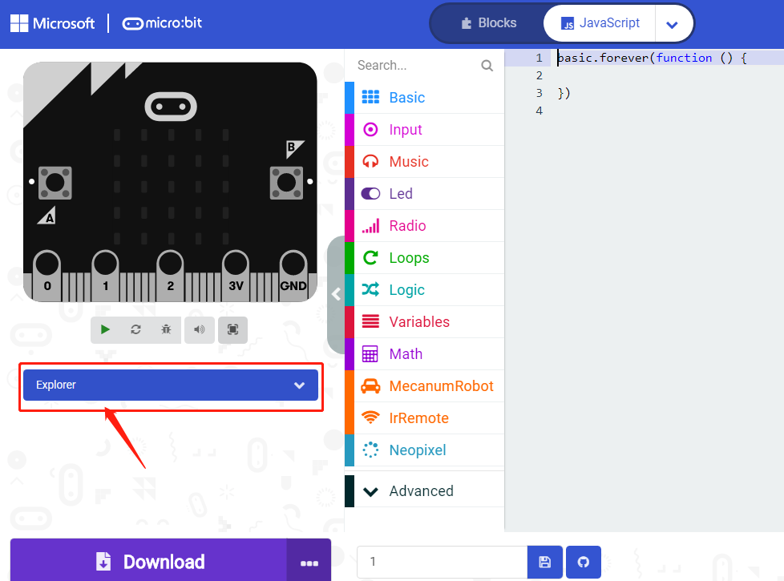

You can find these added files in the list;

Click the dustbin icon beside the file to delete the corresponding file;

Tap the refresh icon to update the corresponding MecanumRobot extension file.

#### 5.Resources and test code

We also provide a link：https://fs.keyestudio.com/KS4031-4032

You can obtain relevant test codes, tutorials and troubleshooting methods as well, as shown in the figure below:

#### 6.Input test code

We provide hexadecimal code files (project files) for each project. The file contains all the contents of the project and can be imported directly, or you can manually drag the code blocks to complete the program for each project. For simple projects, dragging a block of code to complete the program is recommended.For complex projects, it is recommended to conduct the program by importing the hexadecimal code file we provide.

Let's take the "Heatbeat" project as an example to show how to load the code.

Open the Web version of Makecode or the Windows 10 App version of Makecode;

Click“Import File”;

Select“../Makecode Code/Project 1\_ Heart beat/Project 1\_ Heart beat.hex”

Then click“Go ahead”.

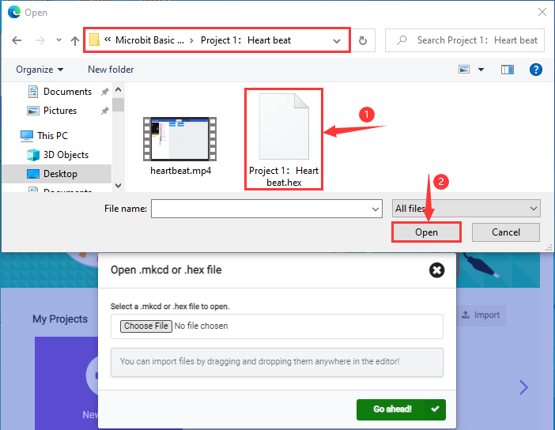

In addition to importing the test code file provided into the Makecode compiler above, you can also drag the the test code file provided into the code editing area of the Makecode compiler, as shown in the figure below:

After a few seconds, it is done.

Note: if your computer system is Windows7 or 8 instead of Windows 10, the pairing cannot be done via Google Chrome. Therefore, digital signal or analog signal of sensors and modules cannot be shown on the serial port simulator.

However, you need to read the corresponding digital signal or analog signal.So what can we do? You can use the CoolTerm software to read the serial port data of the microbit. Next chapter is about how to install CoolTerm.

#### 7.Install CoolTerm：

CoolTerm program is used to read the data on serial port.

Download CoolTerm program:

<https://freeware.the-meiers.org/>

After the download, we need to install CoolTerm program file, below is PC Window system taken as an example.

1.  Choose“win”to download the zip file of CoolTerm

2.  Unzip file and open it. (also suitable for Mac and Linux system)

3. Double-click.（Please make sure that the driver of Micro:bit is installed and the main board is connected with the computer.)

The functions of each button on the Toolbar are listed below: <http://wiki.keyestudio.com/index.php/File:IDE.png>

|         | Open up a new Terminal                           |
|--------------------------------------------------------|--------------------------------------------------|
|         | Open a saved Connection                          |
|         |  Save the current Connection to disk             |
|  | Open the Serial Connection                       |
|  | Close the Serial Connection                      |
|  | Clear the Received Data                          |
|  | Open the Connection Options Dialog               |
|  | Display the Terminal Data in Hexadecimal Format  |
|         | Display the Help Window                          |

## Projects

(Note: project 8.1 to 8.12 will be conducted with the built-in sensors and LED dot matrix of the Micro:bit main board V2)

### Project 1: Heartbeat

**(1)Project Description**

This project is easy to conduct with a micro:bit V2 main board, a Micro USB cable and a computer. The micro:bit LED dot matrix will display a relatively big heart-shaped pattern and then a smaller one. This alternative change of this pattern is like heart beating. This experiment serves as a starter for your entry to the programming world.

**(2)Experimental Preparation：**

-   Connect micro:bit to computer with the USB cable

-   Open online Makecode editor

Import Hex profile (How to import?)

Or click“New Project”and drag blocks step by step

**(3)Test Code**

The route to get test code（[How to load?](##_5.5.导入代码：)）

| File Type | Path                                                                                  | File Name                |
|-----------|---------------------------------------------------------------------------------------|--------------------------|
| Hex file  | KS4031(4032) folder/Makecode Tutorial/Makecode Code/Project Code/Project 1：Heartbeat | Project 1：Heartbeat.hex |

Or you could edit code step by step in the editing area.

Go to“Basic”→“show icon”.

Copy it again and place into“forever”block.

Click“❤”to select“”.

Complete Program：

 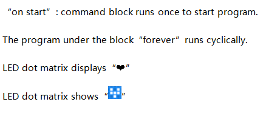
                                                                                                                                                                                                                                                                                                                  |

Click“JavaScript" to view the corresponding JavaScript code:

**(4)Test Results**

Download code to micro:bit and keep USB cable connected. The LED dot matrix will display  and  ceaselessly.

([How to download?] [How to quick download?])

If the download is not success, try to disconnect micro:bit from your computer and then reconnect them and reopen Makecode to try again.

### Project 2: Light A Single LED

**(1)Project Description**

The LED dot matrix consists of 25 LEDs arranged in a 5 by 5 square. In order to locate these LEDs quickly, as the figure shown below, we can regarded this matrix as a coordinate system and create two aces by marking those in rows from 0 to 4 from top to bottom, and the ones in columns from 0 to 4 from the left to the right. Therefore, the LED sat in the second of the first line is (1,0）and the LED positioned in the fifth of the fourth column is (3,4）and others likewise.

**(2)Experimental Preparation：**

-   Connect micro:bit to computer with the USB cable

-   Open online Makecode editor

Import Hex profile [(How to import?)](##_7.6.导入代码)

Or click“New Project”and drag blocks step by step

**(3)Test Code**

The route to get test code（[How to load?](##_5.5.导入代码：)）

| File Type | Path                                                                                           | File Name                         |
|-----------|------------------------------------------------------------------------------------------------|-----------------------------------|
| Hex file  | KS4031(4032) folder/Makecode Tutorial/Makecode Code/Project Code/Project 2：Light A Single LED | Project 2：Light A Single LED.hex |

Or you could edit code step by step in the editing area.

A. Click“Led”→“more”→“led enable false”

B. Put it into the“on start”block, and click the drop-down triangle button to select“true”.

\*\*\*\*\*\*\*\*\*\*\*\*\*\*\*\*\*\*\*\*\*\*\*\*\*\*\*\*\*\*\*\*\*\*\*\*\*\*\*\*\*\*\*\*\*\*\*\*\*\*\*\*\*\*\*\*\*\*\*\*\*\*\*\*\*\*\*\*\*\*\*\*\*\*\*\*\*
(2) A. Enter“Led”→“toggle x 0 y 0”block;

B. Combine it with“forever”，alter“x 0”into“x 1”.

\*\*\*\*\*\*\*\*\*\*\*\*\*\*\*\*\*\*\*\*\*\*\*\*\*\*\*\*\*\*\*\*\*\*\*\*\*\*\*\*\*\*\*\*\*\*\*\*\*\*\*\*\*\*\*\*\*\*\*\*\*\*\*\*\*\*\*\*\*\*\*\*\*\*\*\*\*

(3) A. Enter“Basic”→“pause (ms) 100”from“

B. Then move it below the“toggle x1 y0”block, and set to 500ms.

(4) Duplicate code stringonce and place it into“forever”block.

\*\*\*\*\*\*\*\*\*\*\*\*\*\*\*\*\*\*\*\*\*\*\*\*\*\*\*\*\*\*\*\*\*\*\*\*\*\*\*\*\*\*\*\*\*\*\*\*\*\*\*\*\*\*\*\*\*\*\*\*\*\*\*\*\*\*\*\*\*\*\*\*\*\*\*\*\*

A. Enter“Led”→“plot x 0 y 0”

B. Keep it beneath block“pause(ms)500”, then set to“plot x 3 y 4”:

\*\*\*\*\*\*\*\*\*\*\*\*\*\*\*\*\*\*\*\*\*\*\*\*\*\*\*\*\*\*\*\*\*\*\*\*\*\*\*\*\*\*\*\*\*\*\*\*\*\*\*\*\*\*\*\*\*\*\*\*\*\*\*\*\*\*\*\*\*\*\*\*\*\*\*\*\*

Replicate“pause (ms) 500”once and keep it below the block“plot x3y4”

Click“Led”→“unplot x 0 y 0”and set to“unplot x3 y 4”;

Lay down it beneath“pause (ms) 500”block

Copy“pause (ms) 500”block once, and keep it below the“unplot x3 y 4”block.

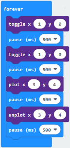

Complete Program：                                                 |
 

Click“JavaScript”to switch into corresponding JavaScript code:

**(4)Test Results:**

After uploading test code to micro:bit main board V2 and powering the main board via the USB cable, the LED in (1,0) lights up for 0.5s and the one in (3,4) shines for 0.5s and repeat this sequence.

([How to download?] [How to quick download?])

### Project 3: LED Dot Matrix

**(1)Project Description**

Dot matrices are very commonplace in daily life. They have found wide applications in LED advertisement screens, elevator floor display, bus stop announcement and so on.

The LED dot matrix of Micro: Bit main board V2 contains 25 LEDs in a grid. Previously, we have succeeded in controlling a certain LED to light by integrating its position value into the test code. Supported by the same theory, we can turn on many LEDs at the same time to showcase patterns, digits and characters.

What’s more, we can also click”show icon“ to choose the pattern we like to display. Last but not the least, we can design patterns by ourselves.

**(2)Experimental Preparation：**

-   Connect micro:bit to computer with the USB cable

-   Open online Makecode editor

Import Hex profile [(How to import?)](##_7.6.导入代码)

Or click“New Project”and drag blocks step by step

**(3)Test Code**

**Code 1：**

The route to get test code（[How to load?](##_5.5.导入代码：)）

| File Type | Path                                                                                          | File Name                    |
|-----------|-----------------------------------------------------------------------------------------------|------------------------------|
| Hex file  | KS4031(4032) folder/Makecode Tutorial/Makecode Code/Project Code/Project 3： LED Dot Matrix-1 | Project 3： LED Dot Matrix-1 |

Or you could edit code step by step in the editing area.

A. Enter“Led”→“more”→“led enable false”

Click the drop-down triangle button to select“true”

Combine it with “on start” block

\*\*\*\*\*\*\*\*\*\*\*\*\*\*\*\*\*\*\*\*\*\*\*\*\*\*\*\*\*\*\*\*\*\*\*\*\*\*\*\*\*\*\*\*\*\*\*\*\*\*\*\*\*\*\*\*\*\*\*\*\*\*\*\*\*

Click“Led”to move“plot x 0 y 0”into“forever”，then replicate“plot x 0 y 0”for 8 times, respectively set to“x 2”y 0”,“x 2”y 1”,“x 2”y 2”,“x 2”y 3”,“x 2”y 4”,“x 1”y 3”“x 0”y 2”,“x 3”y 3”,“x 4”y 2”.

Complete Program：

 
                                              |

Select“JavaScript" and“Python”to switch into JavaScript and Python language code:

**Code 2：**

The route to get test code（[How to load?](##_5.5.导入代码：)）

| File Type | Path                                                                                          | File Name                    |
|-----------|-----------------------------------------------------------------------------------------------|------------------------------|
| Hex file  | KS4031(4032) folder/Makecode Tutorial/Makecode Code/Project Code/Project 3： LED Dot Matrix-2 | Project 3： LED Dot Matrix-2 |

Or you could edit code step by step in the editing area.

A. Enter“Basic”→“show number 0”block,

Duplicate it for 4 times, then separately set to“show number 1”,“show number 2”,“show number 3”,“show number 4”,“show number 5”.

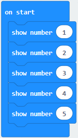

\*\*\*\*\*\*\*\*\*\*\*\*\*\*\*\*\*\*\*\*\*\*\*\*\*\*\*\*\*\*\*\*\*\*\*\*\*\*\*\*\*\*\*\*\*\*\*\*\*\*\*\*\*\*\*\*\*\*\*\*\*\*\*\*\*

Click“Basic”→“show leds”, then put it into“forever”block，tick blue boxes to light LED and generate“↓”pattern.

\*\*\*\*\*\*\*\*\*\*\*\*\*\*\*\*\*\*\*\*\*\*\*\*\*\*\*\*\*\*\*\*\*\*\*\*\*\*\*\*\*\*\*\*\*\*\*\*\*\*\*\*\*\*\*\*\*\*\*\*\*\*\*\*\*

Move out the block“show string” from“Basic”block, and leave it beneath the“show leds” block.

Choose“show icon”from“Basic”block, and leave it beneath the block“show string“Hello!”block

\*\*\*\*\*\*\*\*\*\*\*\*\*\*\*\*\*\*\*\*\*\*\*\*\*\*\*\*\*\*\*\*\*\*\*\*\*\*\*\*\*\*\*\*\*\*\*\*\*\*\*\*\*\*\*\*\*\*\*\*\*\*\*\*\*

A. Enter“Basic”→“show arrow North”;

B. Leave it into“forever”block，replicate“show arrow North”for 3 times，respectively set to“North East”,“South East”, “South West”,“North West”.

Click“Basic”to get block“clear screen”then remain it below the block “show arrow North West”.

\*\*\*\*\*\*\*\*\*\*\*\*\*\*\*\*\*\*\*\*\*\*\*\*\*\*\*\*\*\*\*\*\*\*\*\*\*\*\*\*\*\*\*\*\*\*\*\*\*\*\*\*\*\*\*\*\*\*\*\*\*\*\*\*\*

Drag“pause (ms) 100”block from“Basic”block and set to 500ms, then leave it below“clear screen”block.

Complete Program:

 
                                                 |

Select“JavaScript" and“Python”to switch into JavaScript and Python language code:

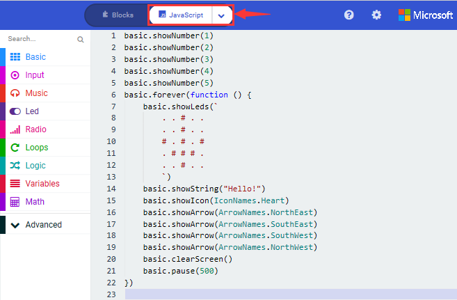

**(4)Test Results:**

Upload code 1 and power the board , we will see the icon

Upload code 2 and plug micro:bit in power, Micro: bit starts showing number 1, 2, 3, 4, and 5, then cyclically display,“Hello!”,
,,, and patterns.

([How to download?] [How to quick download?])

### Project 4: Programmable Buttons

**(1)Project Description**

Buttons can be used to control circuits. In an integrated circuit with a push button, the circuit is connected when pressing the button and it is open the other way around.

Micro: Bit main board boasts three push buttons, two are programmable buttons(marked with A and B), and the one on the other side is a reset button. By pressing the two programmable buttons can input three different signals. We can press button A or B alone or press them together and the LED dot matrix shows A,B and AB respectively. Let’s get started.

**(2)Experimental Preparation：**

-   Connect micro:bit to computer with the USB cable

-   Open online Makecode editor

Import Hex profile [(How to import?)]

Or click“New Project”and drag blocks step by step

**(3)Test Code**

**Code 1：**

Press buttons on micro:bit, micro:bit will display character strings.

The route to get test code（[How to load?]）

| File Type | Path                                                                                               | File Name                         |
|-----------|----------------------------------------------------------------------------------------------------|-----------------------------------|
| Hex file  | KS4031(4032) folder/Makecode Tutorial/Makecode Code/Project Code/Project 4：Programmable Buttons-1 | Project 4：Programmable Buttons-1 |

Or you could edit code step by step in the editing area.

Delete“on start”and“forever”firstly，then click“Input”→“on button A pressed”

\*\*\*\*\*\*\*\*\*\*\*\*\*\*\*\*\*\*\*\*\*\*\*\*\*\*\*\*\*\*\*\*\*\*\*\*\*\*\*\*\*\*\*\*\*\*\*\*\*\*\*\*\*\*\*\*\*\*\*\*\*\*\*\*\*

A. Click“Basic”→“show string”;

B. Then place it into“on button A pressed”block, change “Hello!”into“A”.

Copy code stringonce, tap the drop-down button“A”to select“B”and modify character“A”into“B”.

\*\*\*\*\*\*\*\*\*\*\*\*\*\*\*\*\*\*\*\*\*\*\*\*\*\*\*\*\*\*\*\*\*\*\*\*\*\*\*\*\*\*\*\*\*\*\*\*\*\*\*\*\*\*\*\*\*\*\*\*\*\*\*\*\*

Copyonce，and set to“on button A+B pressed”and“show string “AB”

\*\*\*\*\*\*\*\*\*\*\*\*\*\*\*\*\*\*\*\*\*\*\*\*\*\*\*\*\*\*\*\*\*\*\*\*\*\*\*\*\*\*\*\*\*\*\*\*\*\*\*\*\*\*\*\*\*\*\*\*\*\*\*\*\*

**Complete Code:**

 
                                           |

Select“JavaScript" and“Python”to switch into JavaScript and Python language code:

**Code 2：**

The route to get test code[How to load?]

| File Type | Path                                                                                               | File Name                         |
|-----------|----------------------------------------------------------------------------------------------------|-----------------------------------|
| Hex file  | KS4031(4032) folder/Makecode Tutorial/Makecode Code/Project Code/Project 4：Programmable Buttons-2 | Project 4：Programmable Buttons-2 |

Or you could edit code step by step in the editing area.

A. Click“Led”→“more”→“led enable false”,

B. Put it into the block“on start”，click drop-down triangle button to select“true” .

\*\*\*\*\*\*\*\*\*\*\*\*\*\*\*\*\*\*\*\*\*\*\*\*\*\*\*\*\*\*\*\*\*\*\*\*\*\*\*\*\*\*\*\*\*\*\*\*\*\*\*\*\*\*\*\*\*\*\*\*\*\*\*\*\*\*\*\*\*\*\*\*\*

A. Tap“Variables”→“Make a Variable...”→“New variable name：”

B. Enter“item”in the dialog box and click“OK”，then variable“item”is produced. And move“set item to 0”into“on start”block

A. Click“Input”→“on button A pressed”.

B. Go to“Variables”→“ change item by 1 ”

C. Place it into“on button A pressed”and 1 is modified into 5.

\*\*\*\*\*\*\*\*\*\*\*\*\*\*\*\*\*\*\*\*\*\*\*\*\*\*\*\*\*\*\*\*\*\*\*\*\*\*\*\*\*\*\*\*\*\*\*\*\*\*\*\*\*\*\*\*\*\*\*\*\*\*\*\*\*\*\*\*\*\*\*\*\*

Duplicatecode string once，click the drop-down button to select“B”，then set“change item by -5”.

\*\*\*\*\*\*\*\*\*\*\*\*\*\*\*\*\*\*\*\*\*\*\*\*\*\*\*\*\*\*\*\*\*\*\*\*\*\*\*\*\*\*\*\*\*\*\*\*\*\*\*\*\*\*\*\*\*\*\*\*\*\*\*\*\*\*\*\*\*\*\*\*\*\*\*\*\*\*

A. Enter“Led”→“plot bar graph of 0 up to 0”

B. Keep it into“forever”block

C. Go to“Variables”to move“item”into 0 box，change 0 into 25.

\*\*\*\*\*\*\*\*\*\*\*\*\*\*\*\*\*\*\*\*\*\*\*\*\*\*\*\*\*\*\*\*\*\*\*\*\*\*\*\*\*\*\*\*\*\*\*\*\*\*\*\*\*\*\*\*\*\*\*\*\*\*\*\*\*\*\*\*\*\*\*\*\*\*\*\*\*

A. Go to“Logic”to move out “if...true...then...”and “=”blocks，

B. Keep“=”into“true”box and set to “\>”

C. Select“item”in the“Variables”and lay it down at left box of “\>”，change 0 into 25；

D. Enter“Variables”to drag“set item to 0”block into“if...true..then...”, alter 0 into 25.

\*\*\*\*\*\*\*\*\*\*\*\*\*\*\*\*\*\*\*\*\*\*\*\*\*\*\*\*\*\*\*\*\*\*\*\*\*\*\*\*\*\*\*\*\*\*\*\*\*\*\*\*\*\*\*\*\*\*\*\*\*\*\*\*\*\*\*\*\*\*\*\*\*\*\*\*\*\*

(7) A. Replicate code stringonce

B.“\>”is modified into“\<”and 25 is changed into 0,

C. Leave it beneath code string.

**Complete Program：**

 
                                                |

Click“JavaScript" to switch into JavaScript code:

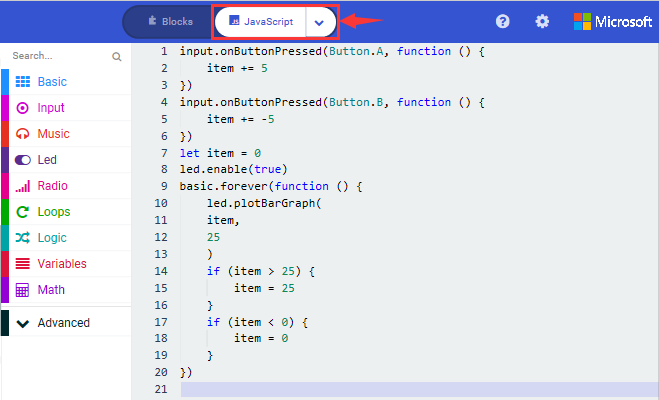

**(4)Test Results:**

After uploading test code 1 to micro:bit main board V2 and powering the main board via the USB cable, the 5\*5 LED dot matrix shows A if button A is pressed, B if button B pressed, and AB if button A and B pressed together.

After uploading test code 2 to micro:bit main board V2 and powering the main board via the USB cable, when pressing the button A the LEDs turning red increase by 5 while when pressing the button B the LEDs turning red reduce.

([How to download?] [How to quick download?])

### Project 5: Temperature Measurement

**(1)Project Description**

The Micro:bit main board V2 is not equipped with a temperature sensor, but uses the temperature sensor built into NFR52833 chip for temperature detection. Therefore, the detected temperature is more closer to the temperature of the chip, and there maybe deviation from the ambient temperature.

Note: the temperature sensor of Micro:bit main board is shown below:

**(2)Experimental Preparation：**

-   Connect micro:bit to computer with the USB cable

-   Open online Makecode editor

Import Hex profile (How to import?)

Or click“New Project”and drag blocks step by step.

**(3)Test Code**

**Code 1**：

Micro:bit detects temperature

The route to get test code（How to load?）

| File Type | Path                                                                                                  | File Name                            |
|-----------|-------------------------------------------------------------------------------------------------------|--------------------------------------|
| Hex file  | KS4031(4032) folder/Makecode Tutorial/Makecode Code/Project Code/Project 5：Temperature Measurement-1 | Project 5：Temperature Measurement-1 |

Or you could edit code step by step in the editing area.

Go to“Advanced” →“Serial” →“serial redirect to USB”

Place it into “on start”

\*\*\*\*\*\*\*\*\*\*\*\*\*\*\*\*\*\*\*\*\*\*\*\*\*\*\*\*\*\*\*\*\*\*\*\*\*\*\*\*\*\*\*\*\*\*\*\*\*\*\*\*\*\*\*\*\*\*\*\*\*\*\*\*\*\*\*\*\*\*\*\*\*\*\*\*\*

Click“Serial”to drag out“serial write value x=0”

Move it into“forever”block

Go to“Input” →“temperature(℃)”

Place it into 0 box

Change x into Temperature

\*\*\*\*\*\*\*\*\*\*\*\*\*\*\*\*\*\*\*\*\*\*\*\*\*\*\*\*\*\*\*\*\*\*\*\*\*\*\*\*\*\*\*\*\*\*\*\*\*\*\*\*\*\*\*\*\*\*\*\*\*\*\*\*\*\*\*\*\*\*\*\*\*\*\*\*\*

Move“pause (ms) 100”from“Basic”block and place it under block“serial
write.....temperature(℃)”

Complete Program：

                                                |

Click“JavaScript" to view the corresponding JavaScript code:

Download code 1 to micro:bit board and keep USB cable connected, then tap button
:

( How to quick download?)

Temperature data is shown below:

Through the test, the room temperature is 35℃when touching the NFR51822 chip of micro:bit; however, the temperature rises to 37℃ when it touches water cup.

Open CoolTerm, click Options to select SerialPort. Set COM port and 115200 baud rate(the baud rate of USB serial communication of Micro:bit is 115200 through the test). Click“OK”and“Connect”.

The serial monitor shows the current ambient temperature value, as shown below:

**Code 2：**

Micro:bit display different pictures by temperature(the temperature value in the code could be adjusted).

The route to get test code（How to load?）

| File Type | Path                                                                                                  | File Name                            |
|-----------|-------------------------------------------------------------------------------------------------------|--------------------------------------|
| Hex file  | KS4031(4032) folder/Makecode Tutorial/Makecode Code/Project Code/Project 5：Temperature Measurement-2 | Project 5：Temperature Measurement-2 |

Or you could edit code step by step in the editing area.

You could set temperature based on real situation.

Click“Led”→“more”→“led enable false”into“on start”，click drop-down triangle button to select“true” 

\*\*\*\*\*\*\*\*\*\*\*\*\*\*\*\*\*\*\*\*\*\*\*\*\*\*\*\*\*\*\*\*\*\*\*\*\*\*\*\*\*\*\*\*\*\*\*\*\*\*\*\*\*\*\*\*\*\*\*\*\*\*\*\*\*

A. Go to“Logic”→“if..true...then...else”and “=” block;

B. Move“if..true...then...else” into“forever”block，then place“=”into“true”box.

\*\*\*\*\*\*\*\*\*\*\*\*\*\*\*\*\*\*\*\*\*\*\*\*\*\*\*\*\*\*\*\*\*\*\*\*\*\*\*\*\*\*\*\*\*\*\*\*\*\*\*\*\*\*\*\*\*\*\*\*\*\*\*\*\*\*\*\*\*\*\*\*\*\*\*\*\*\*

A. Change“=”into“≥”

B. Go to“Input”→“temperature(℃)”and move it into left 0 box;

C. Change 0 into 35.

\*\*\*\*\*\*\*\*\*\*\*\*\*\*\*\*\*\*\*\*\*\*\*\*\*\*\*\*\*\*\*\*\*\*\*\*\*\*\*\*\*\*\*\*\*\*\*\*\*\*\*\*\*\*\*\*\*\*\*\*\*\*\*\*\*

Tap“Basic”→“show icon”，copy it once and lay down them under the“if ...then” and else blocks, then click the drop-down triangle button to select“”.
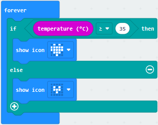

Complete Program：

 

Click“JavaScript", the corresponding JavaScript code is shown below:

**(4)Test Results:**

Upload the Code 1 and plug in power. And 5\*5LED displays the ambient temperature. When pressing the temperature sensor, the temperature will grow on dot matrix.

Upload the code 2 plug in micro:bit via USB cable, when the ambient temperature is less than 35℃, 5\*5LED will show. When the temperature is equivalent to or greater than 35℃, the pattern will appear.

([How to download?] [How to quick download?])

### Project 6: Geomagnetic Sensor

**(1)Project Description**

This project mainly introduces the use of the Micro:bit’s compass. In addition to detecting the strength of the magnetic field, it can also be used to determine the direction, an important part of the heading and attitude reference system (AHRS) as well.

It uses FreescaleMAG3110 three-axis magnetometer. Its I2C interface communicates with the outside, the range is ±1000µT, the maximum data update rate is 80Hz. Combined with accelerometer, it can calculate the position. Additionally, it is applied to magnetic detection and compass blocks.

Then we could read the value detected by it to determine the location. We need to calibrate the Micro:bit board when magnetic sensor works. The correct calibration method is to rotate the Micro:bit board.

In addition, the objects nearby may affect the accuracy of readings and calibration.

**(2)Experimental Preparation：**

-   Connect micro:bit to computer with the USB cable

-   Open online Makecode editor

Import Hex profile [(How to import?)](##_7.6.导入代码) Or click“New Project”and drag blocks step by step

**(3)Test Code**

**Code 1：**

Press A on micro:bit, the value of compass is shown.

The route to get test code（[How to load?](##_5.5.导入代码：)）

| File Type | Path                                                                                             | File Name                       |
|-----------|--------------------------------------------------------------------------------------------------|---------------------------------|
| Hex file  | KS4031(4032) folder/Makecode Tutorial/Makecode Code/Project Code/Project 6：Geomagnetic Sensor-1 | Project 6：Geomagnetic Sensor-1 |

Or you could edit code step by step in the editing area.

A. Click“Input”→“more”→“calibrate compass”

B. Lay down it into block“on start”.

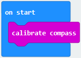

A. Go to“Input”→“on button A pressed”.

B. Enter“Basic”→“show number”, put it into“on button A pressed”block;

C. Tap“Input”→“compass heading(℃)”， and place it into“show number”

\*\*\*\*\*\*\*\*\*\*\*\*\*\*\*\*\*\*\*\*\*\*\*\*\*\*\*\*\*\*\*\*\*\*\*\*\*\*\*\*\*\*\*\*\*\*\*\*\*\*\*\*\*\*\*\*\*\*\*\*\*\*\*\*\*

Complete Program：

 
                                                    |

Select“JavaScript" and“Python”to switch into JavaScript and Python language code:

**Code Description：**

Upload the code 1, plug in micro:bit via USB cable.

As the button A is pressed, LED dot matrix indicates that“TILT TO FILL SCREEN”then enter the calibration interface. The calibration method: rotate the micro:bit to make LED dot matrix draw a square (25 LEDs are on), as shown in the following figure:

([How to download?] [How to quick download?])

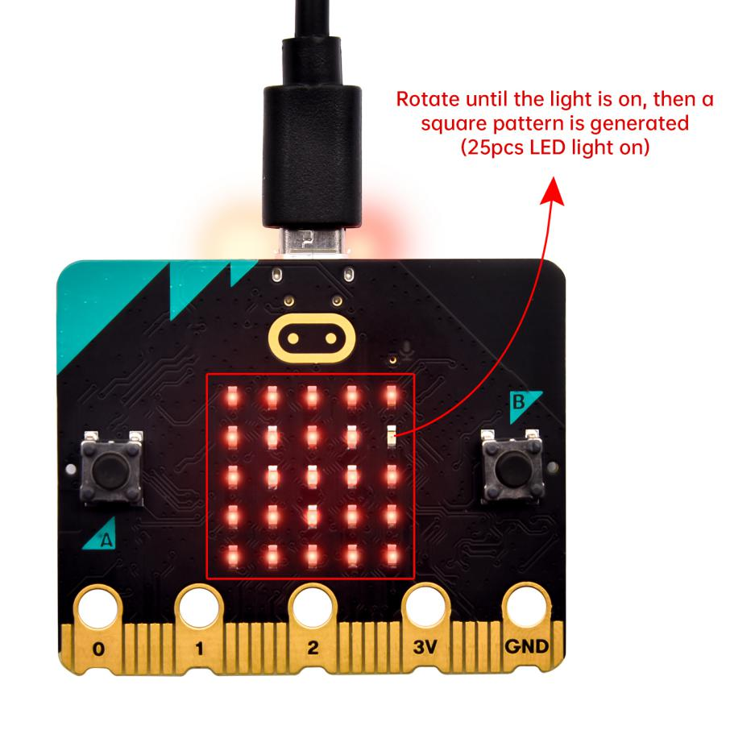

The calibration will be finished until you view the smile patternappear.

The serial monitor will show 0°, 90°, 180° and 270° when pressing A.

**Code 2：**

Make micro: bit board point to the north, south, east and west horizontally , LED dot matrix displays the corresponding direction patterns. The route to get test code（How to load?）

| File Type | Path                                                                                             | File Name                       |
|-----------|--------------------------------------------------------------------------------------------------|---------------------------------|
| Hex file  | KS4031(4032) folder/Makecode Tutorial/Makecode Code/Project Code/Project 6：Geomagnetic Sensor-2 | Project 6：Geomagnetic Sensor-2 |

This module can keep reading data to determine direction, so does point to the current magnetic North Pole by arrow.

For the above picture, the arrow pointing to the upper right when the value ranges from 292.5 to 337.5. Because 0.5 can’t be input in the code, the values we get are 293 and 338.

Link computer with micro:bit board by micro USB cable, and program in MakeCode editor:

Enter“Input”→ “more”→“calibrate compass”

Move“calibrate compass”into“on start”

\*\*\*\*\*\*\*\*\*\*\*\*\*\*\*\*\*\*\*\*\*\*\*\*\*\*\*\*\*\*\*\*\*\*\*\*\*\*\*\*\*\*\*\*\*\*\*\*\*\*\*\*\*\*\*\*\*\*\*\*\*\*\*\*\*

A. Click“Variables”→“Make a Variable...”→“New variable name：”

B. Input“x”in the blank box and click“OK”, and the variable “x” is generated.

C. Drag out“set x to”into“forever”block

A. Go to“Input”→“compass heading(℃)”, and keep it into“0”box

Tap“Logic”→“if...then...else”, leave it below block“sex x to compass heading”, then clickicon for 6 times.

\*\*\*\*\*\*\*\*\*\*\*\*\*\*\*\*\*\*\*\*\*\*\*\*\*\*\*\*\*\*\*\*\*\*\*\*\*\*\*\*\*\*\*\*\*\*\*\*\*\*\*\*\*\*\*\*\*\*\*\*\*\*\*\*\*

A. Place“and”into“true”block

B. Then move“=”block to the left box of “and”

C. Click“Variables”to drag“x”to the left “0”box, change 0 into 293 and set to “≥”;

D. Then copy“x≥293”once and leave it to the right “0”box and set to“x\<338”

\*\*\*\*\*\*\*\*\*\*\*\*\*\*\*\*\*\*\*\*\*\*\*\*\*\*\*\*\*\*\*\*\*\*\*\*\*\*\*\*\*\*\*\*\*\*\*\*\*\*\*\*\*\*\*\*\*\*\*\*\*\*\*\*\*

A. Go to“Basic”→“show leds”

B. Lay it down beneath block, then click“show leds”and the pattern appears.

A. Duplicate for 6 times.

B. Separately leave them into the blank boxes behind “else if”.

C. Set to“x≥23 and x\<68”,“x≥68 and x\<113 ”,“x≥113 and x\<158 ”,“x≥158 and x\<203 ”,“x≥203 and x\<248 ”,“x≥248 and x\<293 ”respectively.

D. Then copy “show leds”for 7 times and keep them below the “else if.......then” block respectively.

E. Click the blue boxes to form the pattern“”,“”,“”,“" />”,“”,“”and“”.

\*\*\*\*\*\*\*\*\*\*\*\*\*\*\*\*\*\*\*\*\*\*\*\*\*\*\*\*\*\*\*\*\*\*\*\*\*\*\*\*\*\*\*\*\*\*\*\*\*\*\*\*\*\*\*\*\*\*\*\*\*\*\*\*\*\*\*\*\*\*\*\*\*\*\*\*\*

Complete Program：

“on start”: command block only runs once to start program. Calibrate compass

The program under the block “forever” runs cyclically.

Store the angle of the compass heading into the variable x

When 293≤x<338，the next program will be executed
 appears on the dot matrix
When 23≤x<68，the next program will be executed

 is displayed on dot matrix

When 68≤x<113, the next program will be executed
 is shown on dot matrix

When 113≤x<158，the next program will be executed

 pattern appears

When 158≤x<203, the next program will be executed.
Dot matrix shows

When 203≤x<248,  the next program will be executed.
Dot matrix displays

When 248≤x<293, the next program will be executed.
Dot matrix shows 

When x is not among the above rang, the next program will be executed under else block.

Select“JavaScript" and“Python”to switch into JavaScript and Python language code:

**(4)Test Results:**

Upload code 2 and plug micro:bit into power. After calibration, tilt micro:bit board, and the LED dot matrix displays the direction signs.

([How to download?] [How to quick download?])

### Project 7: Accelerometer

**(1)Project Description**

The micro:bit board has a built-in Freescale MMA8653FC three-axis acceleration sensor (accelerometer). Its I2C interface works on external communication, the range can be set to ±2g, ±4g, and ±8g, and the maximum data update rate can reach 800Hz.

When the Micro:bit is stationary or moving at a constant speed, the accelerometer only detects the gravitational acceleration; when the Micro:bit is slightly shaken, the acceleration detected is much smaller than the gravitational acceleration and can be ignored. Therefore, in the process of using Micro:bit, the main purpose is to detect the changes of the gravitational acceleration on the x, y, and z axes when the attitude changes.

For this project, we will introduce the detection of several special postures by the accelerometer.

**(2)Experimental Preparation：**

-   Connect micro:bit to computer with the USB cable

-   Open online Makecode editor

Import Hex profile [(How to import?)](##_7.6.导入代码) Or click“New Project”and drag blocks step by step

**(3)Test Code**

**Code 1：**

The route to get test code（[How to load?](##_5.5.导入代码：)）

| File Type | Path                                                                                        | File Name                  |
|-----------|---------------------------------------------------------------------------------------------|----------------------------|
| Hex file  | KS4031(4032) folder/Makecode Tutorial/Makecode Code/Project Code/Project 7：Accelerometer-1 | Project 7：Accelerometer-1 |

Or you could edit code step by step in the editing area.

(1) A. Enter“Input”→“on shake”，

B. Click“Basic”→“show number”, place it into“on shake”block, then change 0 into 1.

(2) A. Copy code string for 7 times; separately click the triangle button to select“logo up”,“logo down”,“screen
up”,“screen down”,“tilt left”,“tilt right”and“free fall”, then respectively change 1 into 2, 3, 4, 5, 6, 7, 8.

\*\*\*\*\*\*\*\*\*\*\*\*\*\*\*\*\*\*\*\*\*\*\*\*\*\*\*\*\*\*\*\*\*\*\*\*\*\*\*\*\*\*\*\*\*\*\*\*\*\*\*\*\*\*\*\*\*\*\*\*\*\*\*\*\*\*\*\*\*\*\*\*\*\*\*\*\*\*

Complete Program：

 
 

Click“JavaScript", you will view the corresponding JavaScript code:

**Code 2：**

Detect the value of acceleration speed at x, y and z axis

The route to get test code（[How to load?](##_5.5.导入代码：)）

| File Type | Path                                                                                        | File Name                  |
|-----------|---------------------------------------------------------------------------------------------|----------------------------|
| Hex file  | KS4031(4032) folder/Makecode Tutorial/Makecode Code/Project Code/Project 7：Accelerometer-2 | Project 7：Accelerometer-2 |

Or you could edit code step by step in the editing area.

A. Go to“Advanced”→“Serial”→“serial redirect to USB”

B. Drag it into“on start”

\*\*\*\*\*\*\*\*\*\*\*\*\*\*\*\*\*\*\*\*\*\*\*\*\*\*\*\*\*\*\*\*\*\*\*\*\*\*\*\*\*\*\*\*\*\*\*\*\*\*\*\*\*\*\*\*\*\*\*\*\*\*\*\*\*\*\*\*\*\*\*\*\*\*\*\*\*\*

A. Enter“Serial”→“serial write value x =0”

B. Leave it into“forever”block

\*\*\*\*\*\*\*\*\*\*\*\*\*\*\*\*\*\*\*\*\*\*\*\*\*\*\*\*\*\*\*\*\*\*\*\*\*\*\*\*\*\*\*\*\*\*\*\*\*\*\*\*\*\*\*\*\*\*\*\*\*\*\*\*\*\*\*\*\*\*\*\*\*\*A.
Click“Input”→“acceleration(mg) x”；

B. Keep it into“0”box and capitalize the“x”

\*\*\*\*\*\*\*\*\*\*\*\*\*\*\*\*\*\*\*\*\*\*\*\*\*\*\*\*\*\*\*\*\*\*\*\*\*\*\*\*\*\*\*\*\*\*\*\*\*\*\*\*\*\*\*\*\*\*\*\*\*\*\*\*\*\*\*\*\*\*\*\*\*\*\*\*\*

Go to“Basic”and move out“pause (ms) 100”below the block, then set to 100ms.

\*\*\*\*\*\*\*\*\*\*\*\*\*\*\*\*\*\*\*\*\*\*\*\*\*\*\*\*\*\*\*\*\*\*\*\*\*\*\*\*\*\*\*\*\*\*\*\*\*\*\*\*\*\*\*\*\*\*\*\*\*\*\*\*\*\*\*\*\*\*\*\*\*\*\*\*\*

Replicate code string for 3 times and keep them into“forever”block，separately set the whole code string as follows:

Complete Program：

 

Click“JavaScript" to view the corresponding JavaScript code:

Download code 1 to micro:bit board, keep USB cable connected and click

([How to quick download?])

After referring to the MMA8653FC data manual and the hardware schematic diagram of the Micro: Bit main board V2, the accelerometer coordinate of the Micro: Bit V2 motherboard are shown in the figure below:

The following interface shows the decomposition value of acceleration in X axis, Y axis and Z axis respectively, as well as acceleration synthesis (acceleration synthesis of gravity and other external forces).

If you're running Windows 7 or 8 instead of Windows 10, via Google Chrome won't be able to match devices. You'll need to use the CoolTerm serial monitor software to read data.

You could open CoolTerm software, click Options, select SerialPort, set COM port and put baud rate to 115200 (after testing, the baud rate of USB SerialPort communication on Micro: Bit main board V2 is 115200), click OK, and Connect. The CoolTerm serial monitor shows the data of X axis, Y axis and Z axis , as shown in the figures below :

**(4)Test Results:**

After uploading the test code 1 to micro:bit main board V2 and powering the board via the USB cable, if we shake the Micro: Bit main board V2. no matter at any direction, the LED dot matrix displays the digit “1”.

([How to download?] [How to quick download?])

When it is kept upright （make its logo above the LED dot matrix）, the number 2 shows.

When it is kept upside down( make its logo below the LED dot matrix) , it shows as below.

When it is placed still on the desk, showing its front side, the number 4 appears.

When it is placed still on the desk, showing its back side, the number 5 exhibits.

When the board is tilted to the left , the LED dot matrix shows the number 6 as shown below.

When the board is tilted to the right , the LED dot matrix displays the number 7 as shown below

When the board is knocked to the floor, this process can be considered as a free fall and the LED dot matrix shows the number 8. (please note that this test is not recommended for it may damage the main board.)

Attention: if you’d like to try this function, you can also set the acceleration to 3g, 6g or 8g. But still ,we do not recommend.

### Project 8: Light Detection

**(1)Project Description**

In this project, we focus on the light detection function of the Micro: Bit main board V2. It is achieved by the LED dot matrix since the main board is not equipped with a photoresistor.

When the light irradiates the LED matrix, the voltage change will be produced. Therefore, we could determine the light intensity by voltage change.

**(2)Experimental Preparation：**

-   Connect micro:bit to computer with the USB cable

-   Open online Makecode editor

Import Hex profile [(How to import?)](##_7.6.导入代码)

Or click“New Project”and drag blocks step by step

**(3)Test Code**

The route to get test code（[How to load?](##_5.5.导入代码：)）

| File Type | Path                                                                                        | File Name                  |
|-----------|---------------------------------------------------------------------------------------------|----------------------------|
| Hex file  | KS4031(4032) folder/Makecode Tutorial/Makecode Code/Project Code/Project 8：Light Detection | Project 8：Light Detection |

Or you could edit code step by step in the editing area.

(1)A. Enter“Advanced”→“Serial”→“serial redirect to USB”;

B. Drag it into“on start”block.

\*\*\*\*\*\*\*\*\*\*\*\*\*\*\*\*\*\*\*\*\*\*\*\*\*\*\*\*\*\*\*\*\*\*\*\*\*\*\*\*\*\*\*\*\*\*\*\*\*\*\*\*\*\*\*\*\*\*\*\*\*\*\*\*\*\*\*\*\*\*\*\*\*\*\*

(2) A. Go to“Serial”→“serial write value x =0”;

B. Move it into“forever”

A. Click“Input”→“acceleration(mg) x”

B. Put“acceleration(mg) x”in the“0”box and change “x”into“Light intensity”.

\*\*\*\*\*\*\*\*\*\*\*\*\*\*\*\*\*\*\*\*\*\*\*\*\*\*\*\*\*\*\*\*\*\*\*\*\*\*\*\*\*\*\*\*\*\*\*\*\*\*\*\*\*\*\*\*\*\*\*\*\*\*\*\*\*\*\*\*\*\*\*\*\*\*\*

A. Click“Basic”→“pause (ms) 100”;

B. Lay it down into“forever”and set to 100ms.

\*\*\*\*\*\*\*\*\*\*\*\*\*\*\*\*\*\*\*\*\*\*\*\*\*\*\*\*\*\*\*\*\*\*\*\*\*\*\*\*\*\*\*\*\*\*\*\*\*\*\*\*\*\*\*\*\*\*\*\*\*\*\*\*\*\*\*\*\*\*\*\*\*\*\*

Complete Program：

                                                |

Click“JavaScript" to switch into the corresponding JavaScript code:

**(4) Test Results：**

Download code to micro:bit board don’t plug off USB cable and click

([How to quick download?])

The intensity value is 0 when covering LED dot matrix. And the value varies with the light intensity. When placing micro:bit under the sunlight, the stronger the light is, the larger the intensity value is. As shown below:

Open“CoolTerm”, click“Options”to select “SerialPort”, and set “COM” port and 115200 baud rate(the baud rate of USB serial communication of micro:bit is 115200 through the test).

Then click“OK”and“Connect”. The light intensity value is shown below:

### Project 9: Speaker

**(1)Project Description**

The Micro: Bit main board V2 has an built-in speaker, which makes adding sound to the programs easier. We can program the speaker to air all kinds of tones, like playing the son *Ode to Joy.*

**(2)Experimental Preparation：**

-   Connect micro:bit to computer with the USB cable

-   Open online Makecode editor

Import Hex profile [(How to import?))

Or click“New Project”and drag blocks step by step

**(3)Test Code:**

The route to get test code（[How to load?]）

| File Type | Path                                                                                | File Name          |
|-----------|-------------------------------------------------------------------------------------|--------------------|
| Hex file  | KS4031(4032) folder/Makecode Tutorial/Makecode Code/Project Code/Project 9：Speaker | Project 9：Speaker |

Or you could edit code step by step in the editing area.

Enter“Basic”module to find “show icon”and drag it into“on start”block;

Click the little triangle to find “”

\*\*\*\*\*\*\*\*\*\*\*\*\*\*\*\*\*\*\*\*\*\*\*\*\*\*\*\*\*\*\*\*\*\*\*\*\*\*\*\*\*\*\*\*\*\*\*\*\*\*\*\*\*\*\*\*\*\*\*\*\*\*\*\*\*\*\*\*\*\*\*\*\*\*\*\*\*\*

(2) Enter“Music”module to find and drug“play sound giggle until done” into “forever”block;

Enter“Basic”module to find and drug“pause(ms) 100” into “forever” block ;

Change 100 into 1000;

( 3 ) Copy  three times and place it into “forever” block ;

Click the little triangle to select “happy”,”hello”,”yawn”;

\*\*\*\*\*\*\*\*\*\*\*\*\*\*\*\*\*\*\*\*\*\*\*\*\*\*\*\*\*\*\*\*\*\*\*\*\*\*\*\*\*\*\*\*\*\*\*\*\*\*\*\*\*\*

Complete Program：

Select “JavaScript" and “Python” to switch into JavaScript and Python language code:

**(4)Test Results:**

After uploading the test code to micro:bit main board V2 and powering the board via the USB cable, the speaker utters sound and the LED dot matrix shows the logo of music.

([How to download?] [How to quick download?])

### Project 10: Touch-sensitive Logo

**(1)Project Description**

The Micro: Bit main board V2 is equipped with a golden touch-sensitive logo, which can act as an input component and function like an extra button.

It contains a capacitive touch sensor that senses small changes in the electric field when pressed (or touched), just like your phone or tablet screen do.When you press it , you can activate the program.

**(2)Experimental Preparation：**

-   Connect micro:bit to computer with the USB cable

-   Open online Makecode editor

Import Hex profile [(How to import?)](##_7.6.导入代码)

Or click“New Project”and drag blocks step by step

**(3)Test Code**

The route to get test code（[How to load?](##_5.5.导入代码：)）

| File Type | Path                                                                                 | File Name              |
|-----------|--------------------------------------------------------------------------------------|------------------------|
| Hex file  | KS4031(4032) folder/Makecode Tutorial/Makecode Code/Project 10：Touch-sensitive Logo | Project 9：Speaker.hex |

Or you could edit code step by step in the editing area.

( 1 ) Delete block“on start”and“forever”;

( 2 )Enter“Input”module to find and drag“on logo pressed” ;

Click the little triangle to find“touched”;

( 3 ) Enter module“Variables”→choose“Make a Variable”→input“start”→click“OK”

The variable“start”is established;

Enter“Variables”module to find and drag “set start to 0” into “on logo touched”block;

( 4 )Enter“Input”module →click “more”→ find and drag“running time(ms)”into the“0”of“set start to 0”block;

( 5 )Enter“Basic”module to find and drag“show icon” into “on logo touched”block;

( 6 )Enter“Input”module to find and drag“on logo pressed”→choose “released”→establish variable “time”;

Enter“Variables”module to find and drag “set time to 0”into “on logo pressed”block;

Enter“Math”module to find and drag “0-0”into the “0”of“set start to 0”block;

( 7 )Enter“Input”module→ “more” → find and drag “running time(ms)” into “0”on the left side of “0-0”;

Enter“Variables”module to find and drag“start” into “0”on the right side of “0-0”;

( 8 )Enter“Basic”module to find and drag“show number” into “on logo released”block;

Enter“Math”module to find and drag“square root 0” into“0”; Click the little triangle to find”integer÷”;

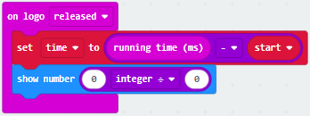

( 9 ) Enter“Variables”module to find and drag“time”into“0”on the left side of“0-0”and change the“0”on the right side to”1000”;
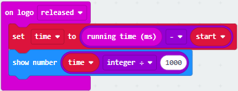

Complete Program：

Select“JavaScript" and“Python”to switch into JavaScript and Python language code:

**(4)Test Results:**

After uploading the test code to micro:bit main board V2 and powering the board via the USB cable, the LED dot matrix exhibits the heart pattern when the touch-sensitive logo is pressed or touched and displays digit when the logo is released.

([How to download?] [How to quick download?])

### Project 11: Microphone

**(1)Project Description**

The Micro: Bit main board V2 is built with a microphone which can test the volume of ambient environment. When you clap, the microphone LED indicator turns on. Since it can measure the intensity of sound, you can make a noise scale or disco lighting changing with music. The microphone is placed on the opposite side of the microphone LED indicator and in proximity with holes that lets sound pass.When the board detects sound, the LED indicator lights up.

**(2)Experimental Preparation：**

-   Connect micro:bit to computer with the USB cable

-   Open online Makecode editor

Import Hex profile [(How to import?)](##_7.6.导入代码)

Or click“New Project”and drag blocks step by step

**(3)Test Code**

**Code 1**

The route to get test code（[How to load?]）

| File Type | Path                                                                         | File Name                    |
|-----------|------------------------------------------------------------------------------|------------------------------|
| Hex file  | KS4031(4032) folder/Makecode Tutorial/Makecode Code/Project 11：Microphone-1 | Project 11：Microphone-1.hex |

Or you could edit code step by step in the editing area.

(1 ) Delete block“on start”and“forever”;

( 2 ) Enter“Input”module to find and drag“on loud sound”;

Enter“Basic”module to find and drag “show number”into “on loud sound”block ;

( 3 )Copy  once;

Click the little triangle of “lond” to choose”quiet”;

Click the little triangle of “” to choose””;

Complete Program：

Select“JavaScript" and“Python”to switch into JavaScript and Python language code:

**(4)Test Results 1:**

After uploading test code to micro:bit main board V2 and powering the board via the USB cable, the LED dot matrix displays pattern “”when you claps and pattern when it is quiet around.([How to download?] [How to quick download?])

**Code 2:**

The route to get test code（[How to load?]）

| File Type | Path                                                                         | File Name                    |
|-----------|------------------------------------------------------------------------------|------------------------------|
| Hex file  | KS4031(4032) folder/Makecode Tutorial/Makecode Code/Project 11：Microphone-2 | Project 11：Microphone-2.hex |

Or you could edit code step by step in the editing area.

Enter“Advanced”module→ choose“Serial”to find and drag“serial redirect to USB”into “on start”block ;

Enter“Variables”module→ choose“Make a Variable”→ input “maxSound”→click “OK”,variable ”maxSound”is established;

Enter“Variables”module to find and drag“set maxSound to 0”into “on start”block ;

Enter“Logic”module to find and drag“if true then...else”into “forever” block ;

Enter“Input”module to find and dragbutton A is pressed”into “then” ;

Enter“Basic”module to find and drag“show number”into “then” ;

Enter“Variables”module to find and drag“maxSound”into “0” ;

Establish variable“soundLevel”;

Enter“Variables”module to find and drag“set soundLevel to 0”into “else”;

Enter“Input”module to find and drag“sound level” into “0”;

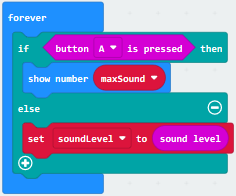

Enter“Led”module to find and drag“plot bar graph of 0 up to 0” into “else”;

Enter“Variables”module to find and drag“soundLevel”into the“0”behind “of”;

Change the “0”behind “up” to “255”;

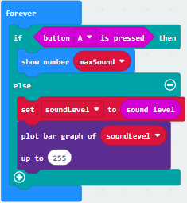

Enter“Logic”module to find and drag“if true then”into “else”block ;

Enter“Logic”module to find and drag“0 \> 0”into “then” ;

Enter“Variables”module to find and drag“soundLevel”into “0”on the left side of “0-0” ;

Enter“Variables”module to find and drag“maxSound” into “0” on the right side;

Enter“Variables”module to find and drag“set maxSound to 0”into the second “then”;

Enter“Variables”module to find and drag“soundLevel”into the “0” ;

Complete Program：

Select“JavaScript" and“Python”to switch into JavaScript and Python language code:

**(5)Test Results 2:**

Upload test code to micro:bit main board V2, power the board via the USB cable and click “Show console Device”as shown below.

( [How to quick download?])

When the sound is louder around, the sound value shows in the serial port is bigger as shown below.

What’s more, when pressing the button A, the LED dot matrix displays the value of the biggest volume( please note that the biggest volume can be reset via the Reset button on the other side of the board ) while when clapping, the LED dot matrix shows the pattern of the sound.

### Project 12: Bluetooth Wireless Communication

**(1)Project Description**

The Micro: Bit main board V2 comes with a nRF52833 processor (with a built-in BLE(Bluetooth Low Energy) device Bluetooth 5.1 ) and a 2.4GHz antenna for Bluetooth wireless communication and 2.4GHz wireless communication. With the help of them, the board is able to communicate with a variety of Bluetooth devices, including smart phones and tablets.

In this project, we mainly concentrate on the Bluetooth wireless communication function of this main board. Linked with Bluetooth, it can transmit code or signals. To this end, we should connect an Apple device (a phone or an iPad) to the board.

Since setting up Android phones to achieve wireless transmission is similar to that of Apple devices, no need to illustrate again.

**(2)Experimental Preparation：**

-   Connect micro:bit to computer with the USB cable

-   Open online Makecode editor

Import Hex profile [(How to import?)](##_7.6.导入代码)

Or click“New Project”and drag blocks step by step

**(3)Procedures:**

For Apple devices, enter this link <https://www.microbit.org/get-started/user-guide/ble-ios/> with your computer
first, and then click “Download pairing HEX file”to download the Micro: Bit firmware to a folder or desk, and upload the downloaded firmware to the Micro: Bit main board V2.

Search “micro bit”in your App Store to download the APP micro:bit.

Connect your Apple device with Micro: Bit main board V2:

Firstly, turn on the Bluetooth of your Apple device and open the APP micro:bit to select item “Choose micro:bit”to start pairing Bluetooth.

Please make sure that the Micro: Bit main board V2 and your computer are still linked via the USB cable.

Secondly, click“Pair a new micro:bit”;

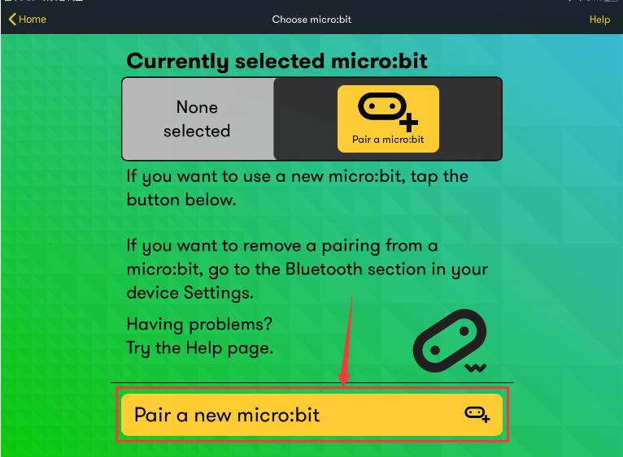

Following the instructions to press button A and B at the same time(do not release them until you are told to) and press Reset & Power button for a few seconds.

Release the Reset & Power button, you will see a password pattern shows on the LED dot matrix. Now , release buttons A and B and click Next.

Set the password pattern on your Apple device as the same pattern showed on the matrix and click Next.

Still click Next and a dialog box props up as shown below. Then click "Pair". A few seconds later, the match is done and the LED dot matrix displays the "√" pattern.

After the match with Bluetooth, write and upload code with the App.

Click “Create Code” to enter the programming page and write code. Click  and the box
 appears, and then select “Create √”.

Name the code as “1 “and click  to save it.

Click the third item“Flash”to enter the uploading page. The default code program for uploading is the one saved just now and named "1" and then click the other "Flash" to upload the code program "1".

If the code is uploaded successfully a few seconds later, the App will emerge as below and the LED dot matrix of the Micro: Bit main board V2 will exhibit a heart pattern.

Projects above all conduct with the built-in sensors and the LED dot matrix of the main board while the following ones will carry out with the help of external sensors of this turtle car. **（Attention：to avoid burning the the Micro:bit main board V2, please remove the USB cable and the external power from the board before fix it with the shield of the car; likewise, the USB cable and the external power should be cut from the main board before disconnect the shield from the board.)**

### Project 13：Colorful Lights

**(1)Project Description**

This module consists of a commonly used LED with 7colors but in white
appearance. It can automatically flash different colors to create fantastic
light effects when high level is input like a normal LED.

**(2)Experimental Preparation：**

-   Insert micro:bit board into slot of keyestudio 4WD Mecanum Robot Car

-   Place batteries into battery holder

-   Dial power switch to ON end

-   Connect micro:bit to computer by USB cable

-   Open online Makecode editor

Import Hex profile (How to import?), or click “New Project”and drag blocks step by step(add MecanumRobot extension library first)

[**(How to add Mecanum_Robot extension?)**

**(3)Test Code**

**Code1**

Make the RGB light flash 7 lights alternatively.

Code path:

| File Type | Path                                                                                  | File Name                         |
|-----------|---------------------------------------------------------------------------------------|-----------------------------------|
| Hex file  | KS4031(4032) folder/Makecode Tutorial/Makecode Code/Project 13：Colorful Lights-1.hex | Project 13：Colorful Lights-1.hex |

Or you could edit code step by step in the editing area.

Click“MecanumRobot”→find and drag指to“on start”;

Copy  once;

Click the little triangle behind “Left”to choose“Right”：

Compete Program:

Click“JavaScript" to view the corresponding JavaScript code: ：

**Code 2：**

| File Type | Path                                                                                  | File Name                         |
|-----------|---------------------------------------------------------------------------------------|-----------------------------------|
| Hex file  | KS4031(4032) folder/Makecode Tutorial/Makecode Code/Project 13：Colorful Lights-2.hex | Project 13：Colorful Lights-2.hex |

Or you could edit code step by step in the editing area.

Click“MecanumRobot” to find and dragto“forever”;

Copy  once;

Click the little triangle behind “Left”to choose“Right”：

Click“Basic”to find and drag and tap the little triangle to choose “1 second”;

Copy 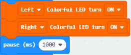once and choose OFF
;

Put them in forever.

Complete Program:

**(4)Test Results:**

Download code 1 to micro:bit board and dial POWER switch to ON end, 2 RGB lights of smart car emit red, green, blue, indigo, dark red, yellow and white color cyclically.

Download code 2 to micro:bit board, 2 RGB lights show different color cyclically.

([How to download?] [How to quick download?])

### Project 14：WS2812 RGB LEDs

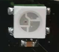

**(1)Project Description**

The driver shield cooperates 4 pcs WS2812 RGB LEDs, compatible with micro:bit board and controlled by P8. In this lesson, we will make RGB LEDs display different colors by P8. In this lesson, 3 sets of test code are provided to make the 4 WS2812 RGB LEDs display different effects.

**(2)Experimental Preparation：**

-   Insert micro:bit board into slot of keyestudio 4WD Mecanum Robot Car

-   Place batteries into battery holder

-   Dial power switch to ON end

Import Hex profile (How to import?), or click“New Project”and drag blocks step by step(add MecanumRobot extension library first)

[**(How to add Mecanum_Robot extension?)**

**(3)Test Code**

**Code 1：**

| File Type | Path                                                                                  | File Name                         |
|-----------|---------------------------------------------------------------------------------------|-----------------------------------|
| Hex file  | KS4031(4032) folder/Makecode Tutorial/Makecode Code/Project 14：WS2812 RGB LEDs-1.hex | Project 14：WS2812 RGB LEDs-1.hex |

Or you could edit code step by step in the editing area.

a. Enter“Neopixel” →“set strip to Neopixel at pin P0 with 24 leds as RGB (GRB format)”

b. Place it into“on start”block，

c. Signal end P8 of WS2812 RGB is controlled by P8 of micro:bit . So we set to P8.

d. Smart car has 4 pcs WS2812 RGB lights, so set to 4 leads

Click“Neopixel”to move block“strip clear”into“on start”block.

Enter“Neopixel”to move block“strip show color red” into “forever” block

Click“Basic”to move“pause (ms) 100”block into“forever”block

Then set to 1000ms

Copy code string for eight times, and click red to respectively set to orange, yellow, green, blue, indigo, violet, purple and white.

Tap the triangle icon to select orange, yellow, green, blue, indigo, violet, purple and white.

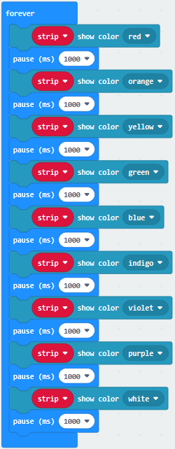

Complete Code

| 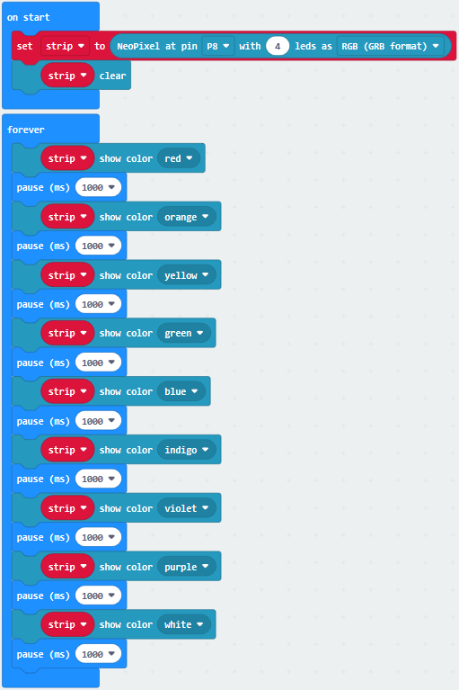     |

Click“JavaScript" to switch into the corresponding JavaScript
code:

**Code 2：**

| File Type | Path                                                                                  | File Name                         |
|-----------|---------------------------------------------------------------------------------------|-----------------------------------|
| Hex file  | KS4031(4032) folder/Makecode Tutorial/Makecode Code/Project 14：WS2812 RGB LEDs-2.hex | Project 14：WS2812 RGB LEDs-2.hex |

a. Enter“Neopixel” →“set strip to Neopixel at pin P0 with 24 leds as RGB (GRB format)”

b. Place it into“on start”block，

c. Signal end P8 of WS2812 RGB is controlled by P8 of micro:bit . So we set to P8.

d. Smart car has 4 pcs WS2812 RGB lights, so set to 4 leads

Click“Loops”to drag“for index from 0 to 4...do”into“forever”block

Change 4 into 3

Click“Neopixel”to move block“strip clear”into block“for index from 0 to 3...do”

Tap“Neopixel”→“more”→“strip set pixel color at 0 to red”

Place it into“for index from 0 to 3...do”block

Click“Variables”to move“index”into 0 box

Click“Neopixel”to move“strip show”into“for index from 0 to 3...do” block

Tap“Basic”to move “pause (ms) 100”block into“index from 0 to 3...do”

Replicate code stringfor eight times and place them into“forever”block

Click red to respectively choose orange, yellow, green, blue, indigo, violet, purple and white

Complete Code：

|   |
|------------------------------------------------------------------------------------------------------------------------------------------------------|
|                                                                                                                                                      |

Click“JavaScript" to switch into the corresponding JavaScript code:

**Code 3：**

| File Type | Path                                                                                  | File Name                         |
|-----------|---------------------------------------------------------------------------------------|-----------------------------------|
| Hex file  | KS4031(4032) folder/Makecode Tutorial/Makecode Code/Project 14：WS2812 RGB LEDs-3.hex | Project 14：WS2812 RGB LEDs-3.hex |

Or you could edit code step by step in the editing area.

a. Enter“Neopixel” →“set strip to Neopixel at pin P0 with 24 leds as RGB (GRB format)”

b. Place it into“on start”block，

c. Signal end P8 of WS2812 RGB is controlled by P8 of micro:bit . So we set to P8.

d. Smart car has 4 pcs WS2812 RGB lights, set to 4 leads

Click“Variables”→“Make a Variable...”

Input R to build up variable R

We create variable“G”and“B”in same way

Drag“set B to 0”into“on start”block

Copy“set B to 0”twice and click triangle button to choose G and B

Click“Loops”to get block“for index from 0 to 4...do”

Leave it into “forever”and change 4 into 3

Move block“set B to 0”into“for index from 0 to 3...do”block,

Click B to choose R

Go to“Math”to drag block“pick random 0 to 10”into 0 box

Change 0 into 10, 10 into 255

Replicate block twice and place
them into“for index from 0 to 3...do”block.

Click R to select G and B

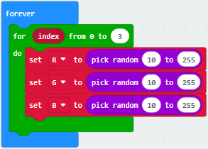

Tap“Neopixel”and move“strip clear”into“for index from 0 to 3...do” block.

Go to“Neopixel”→“more”→“strip set pixel color at 0 to red”

Leave it in the block“for index from 0 to 3...do”block

Drag block“red 255 green 255 blue 255”into“red”box

Tap“Variables”to move“index”block into 0 box

Separately drag R , G and B into 255 box, as shown below:

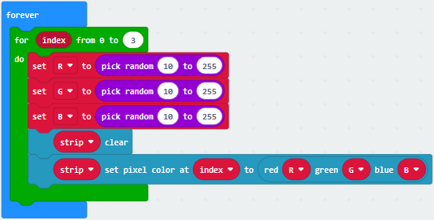

Click“Basic”to drag“pause (ms) 100” under block “strip.....B”

Set to 500ms.

Click“Neopixel”to move“strip show”block under “pause(as) 500”

Complete Code:

                                                |

Click“JavaScript" to switch into the corresponding JavaScript code:

**(4)Test Results:**

Download code 1 to micro：bit, and dial POWER to ON end. All four WS2812RGB LEDs light up a different color a time cyclically.

Download code 2 to micro：bit, WS2812RGB LEDs display like flow light.

Download code 3 to micro：bit, every WS2812RGB light shows random color one by one.

(How to download?] [How to quick download?)

### Project 15：Servo

**(1)Project Description**

For those DIY smart cars, they often have the function of automatic obstacle avoidance. In the DIY process, we need a servo to control the ultrasonic module to rotate left and right, and then detect the distance between the car and the obstacle, so as to control the car to avoid the obstacle. If other microcontrollers are used to control the rotation of the servo, we need to set a
certain frequency and a certain width of pulse to control the servo angle. But if the micro:bit main board is used to control the servo angle, we only need to set the control angle in the development environment where the corresponding pulse will be automatically set to control the servo rotation.

In this project, you will learn how to control the servo to rotate back and forth between 0° and 90°.

**(2)Background Information of the Servo**

Servo motor is a position control rotary actuator. It mainly consists of housing, circuit board, core-less motor, gear and position sensor. Its working principle is that the servo receives the signal sent by MCU or receiver, and produces a reference signal with a period of 20ms and width of 1.5ms, then compares the acquired DC bias voltage to the voltage of the potentiometer and obtains the voltage difference output.

For the servo used in this project, the brown wire is the ground, the red one is the positive wire, and the orange one is the signal wire.

The rotation angle of servo motor is controlled by regulating the duty cycle of PWM (Pulse-Width Modulation) signal. The standard cycle of PWM signal is 20ms (50Hz). Theoretically, the width is distributed between 1ms-2ms, but in fact, it's between 0.5ms-2.5ms. The width corresponds to the rotation angle from 0° to 180°. But note that for different brand motor, the same signal may have different rotation angle.

**More details:**

**(3)Parameters:**

-   Working voltage: DC 4.8V \~ 6V

-   Operating angle range: about 180 ° (at 500 → 2500 μsec)

-   Pulse width range: 500 → 2500 μsec

-   No-load speed: 0.12 ± 0.01 sec / 60 (DC 4.8V) 0.1 ± 0.01 sec / 60 (DC 6V)

-   No-load current: 200 ± 20mA (DC 4.8V) 220 ± 20mA (DC 6V)

-   Stopping torque: 1.3 ± 0.01kg · cm (DC 4.8V) 1.5 ± 0.1kg · cm (DC 6V)

-   Stop current: ≦ 850mA (DC 4.8V) ≦ 1000mA (DC 6V)

-   Standby current: 3 ± 1mA (DC 4.8V) 4 ± 1mA (DC 6V)

**(4)Experimental Preparation：**

-   Insert micro:bit board into slot of keyestudio 4WD Mecanum Robot Car

-   Place batteries into battery holder

-   Dial power switch to ON end

-   Connect micro:bit to computer by USB cable

-   Open online Makecode editor

Import Hex profile **(How to import?)** , or click“New Project”and drag blocks step by step(add MecanumRobot extension library first)

**(How to add Mecanum_Robot extension?)**

**(5)Test Code:**

Code path:

| File Type | Path                                                                      | File Name             |
|-----------|---------------------------------------------------------------------------|-----------------------|
| Hex file  | KS4031(4032) folder/Makecode Tutorial/Makecode Code/Project 15：Servo.hex | Project 15：Servo.hex |

Or you could edit code step by step in the editing area.

(1)Click“Variables”; motor“Make a Variable name” create a variable named“angle”; set the value to 0：; and then put it into“on start”;

(2)Click“Loops”to find and dragto“forever”and change the
number to“180”; click“MecanumRobot”to find and dragand put variable“angle”into
; put into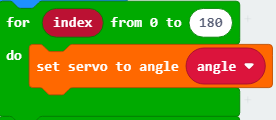;

Click of “Variable” and  of “Math”;put variable”angle” on the left and change the umber on the right to 1:;put it into;

Put behindand add delay in 10ms;

Copy once and change the “+”of  to “-”：.

Complete Program:

① The "on start" command block runs only once to start the program.

②Set the initial value of the angle variable to 0.

③In the "forever" command box, the program runs cyclically

④Cycle 180 times

⑤Rotate the servo to angle

⑥ Angle variable increases 1

⑦ Delay in 10ms

⑧ Cycle 180 times

⑨The servo rotates to angle

⑩Angle angle variable minus 1

⑪ Delay in 10ms

Click“JavaScript" to view the corresponding JavaScript code: ：

**(6)Test Results:**

After uploading the test code and dial POWER switch to ON end, the servo rotates from 0 degree to 180 degrees.

(How to download?] [How to quick download?)

### Project 16：Motor

**(1)Project Description**

The Keyestudio 4WD Mecanum Robot Car is equipped with 4 DC reduction motors, also called gear reduction motor, which is developed on the ordinary DC motor. It has a matching gear reduction box which provides a lower speed but a larger
torque. Furthermore, different reduction ratios of the box can provide different speeds and torques.

Gear motor is the integration of gearmotor and motor, which is applied widely in
steel and machine industry

Micro:bit motor driver shield comes with PCA9685PW and TB6612FNG chip. In order to save the IO port resource, we control the rotation direction and speed of two DC gear motors with TB6612FNG chip.

**Details about chips:**

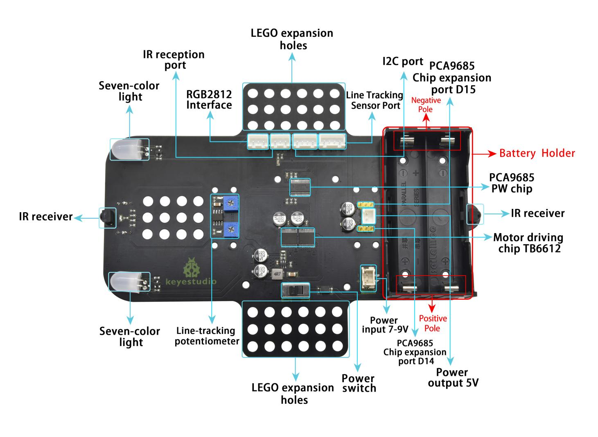

**Front**

**Back**

**(2)Experimental Preparation：**

-   Insert micro:bit board into slot of keyestudio 4WD Mecanum Robot Car

-   Place batteries into battery holder

-   Dial power switch to ON end

-   Connect micro:bit to computer by USB cable

-   Open online Makecode editor

Import Hex profile [(How to import?)], or click“New Project”and drag blocks step by step(add MecanumRobot extension library first)

**How to add MecanumRobot extension?)**

**(3)Test Code：**

**Code 1：**

| File Type | Path                                                                        | File Name               |
|-----------|-----------------------------------------------------------------------------|-------------------------|
| Hex file  | KS4031(4032) folder/Makecode Tutorial/Makecode Code/Project 16：Motor-1.hex | Project 16：Motor-1.hex |

Or you could edit code step by step in the editing area.

(1)Click“ MecanumRobot”to find and drag into“forever”;click the number behind speed to choose 75;

(2)Copyfour times;click the little triangle behind “Motor”to choose Lower_left，Upper_right，Lower_right respectively; and put them all in forever;

(2)Click“Basic”to find and drag“pause (ms) 100”to“forever”;set delay in 2000ms;

(3)Click“MecanumRobot”to find and drag to ; copy  once and put it behind.

Complete Program:

① In the "forever" instruction block, the program runs cyclically.

②Set the front left motor speed to 75, and rotate clockwise.

③Set the speed of the rear left motor to 75 and the direction to rotate clockwise.

④Set the front right motor speed to 75 and the direction to rotate clockwise.

⑤Set the right rear motor speed to 75 and the direction to rotate clockwise

⑥The delay time is 2000 milliseconds

⑦4 motors stop rotating

⑧ Delay time 2000 milliseconds

Click“JavaScript" to view the corresponding JavaScript code: ：

**Code2：**

Code path:

| File Type | Path                                                                        | File Name               |
|-----------|-----------------------------------------------------------------------------|-------------------------|
| Hex file  | KS4031(4032) folder/Makecode Tutorial/Makecode Code/Project 16：Motor-2.hex | Project 16：Motor-2.hex |

Or you could edit code step by step in the editing area.

Drag and copy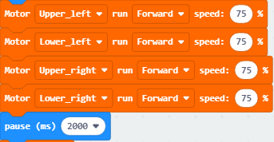three times; click the little triangle behind”run”to choose as shown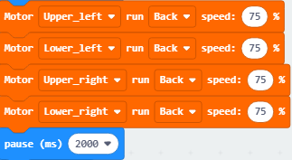，
，

And then put they all in forever and add .

Complete Program:

① In the "forever" instruction block, the program runs cyclically.

②Set the front left motor speed to 75 and the direction to rotate forward.

③Set the speed of the rear left motor to 75 and the direction to rotate forward.

④Set the front right motor speed to 75 and the direction to rotate forward.

⑤Set the right rear motor speed to 75 and the direction to rotate forward.

⑥Wait for 2 seconds

⑦Set the front left motor speed to 75, and the direction is reversed.

⑧ Set the motor speed at the rear left to 75, and the direction is reversed.

⑨Set the front right motor speed to 75, and the direction is reversed.

⑩Set the right rear motor speed to 75, and the direction is reversed.

⑪Wait for 2 seconds

⑫Set the front left motor speed to 75, and the direction is reversed.

⑬Set the motor speed at the rear left to 75, and the direction is reversed.

⑭ Set the front right motor speed to 75 and the direction to rotate forward.

⑮ Set the right rear motor speed to 75, the direction is forward.

⑯Wait for 2 seconds

⑰ Set the front left motor speed to 75 and the direction to rotate forward.

⑱ Set the speed of the rear left motor to 75 and the direction to rotate forward.

⑲Set the front right motor speed to 75, and the direction is reversed.

⑳ Set the right rear motor speed to 75, and the direction is reversed.

㉑Wait for 2 seconds

㉒The car stops

㉓Wait for 2 seconds

Click“JavaScript" to view the corresponding JavaScript code: ：

**(4)Test Results:**

Download code 1 to micro:bit board, dial POWER switch to ON end. Smart car goes forward for 2s and stops for 2s.

Download code 2 to micro:bit board, the car goes forward for 2s, turns back for 2s, turn left for 2s, turn right for 2s and stops for 2s and repeats this pattern.

([How to download?] [How to quick download?])

### Project 17：Line Tracking Sensor

 **17.1: Detect Line Tracking Sensor**

**(1)Project Description**

The motor driving board of the Keyestudio 4WD Mecanum Robot Car comes with a dual-channel line tracking sensors which adopt TCRT5000 IR tubes and 2 potentiometers. TCRT5000 IR tube has an IR emitting tube and a receiving tube.

Low level(0) is output when IR transmitting tube emits IR signals to receiving tube; high level(1) will be output when smart car runs along black line.

When smart car drives on the white ground, TCRT5000 IR tube will emit IR signals which will be reflected by white ground and received by receiving tube, consequently output low level(0); on the contrary, when driving on the black surface, the high level is output.

**(2)Working Principle:**

When the car runs above a white road, the infrared transmitter tube installed under the car emits infrared signals to detect the road and the receiver tube receives signals sending back. Then the output end outputs low level(0); when it
detects black lines, it outputs high level(1).

The 2-way tracking sensor integrated port on the 4WD Mecanum Robot Car is connected to the collection port of G ,5V ,P1 and P2 on the micro:bit expansion board, which is controlled by the P1 and P2 of the micro:bit. The left TCRT5000 infrared pair tube on the sensor is controlled by P1, and the right one by P2.

After putting a white paper on the bottom of the 4WD Mecanum Robot Car,we rotate the two potentiometers on the 2-way tracking sensor. When the indicator light on the sensor module is on, pick up the car to make the two wheels on the 4WD
Mecanum Robot Car separate. The height of the white paper is about 1.5cm, the indicator light on the sensor module is off, and then the sensitivity is adjusted.

**(3)Experimental Preparation：**

-   Insert micro:bit board into slot of keyestudio 4WD Mecanum Robot Car

-   Place batteries into battery holder

-   Dial power switch to ON end

-   Connect micro:bit to computer by USB cable

-   Open online Makecode editor

Import Hex profile (How to import?) , or click“New Project”and drag blocks step by step(add MecanumRobot extension library first)

**(How to add MecanumRobot extension?)**

**(4)Test Code:**

**Code1：**

| File Type | Path                                                                                            | File Name                                   |
|-----------|-------------------------------------------------------------------------------------------------|---------------------------------------------|
| Hex file  | KS4031(4032) folder/Makecode Tutorial/Makecode Code/Project 17.1：Detect Line Tracking Sensor-1 | Project 17.1：Detect Line Tracking Sensor-1 |

Or you could edit code step by step in the editing area.

Click“Advanced”→“Serial”→“serial redirect to USB”

Place it into“on start”

Enter“Advanced”→“Serial”→

Leave it into“forever”block.

Go to“Pins”→“digital read pin P0 ”

Move“digital read pin P0”into 0 box

The right tracking sensor is controlled by P14. Then change P0 into P14 and“x”into“digital signal”.

Click“Advanced”→“Serial”to find and dragt“forever”;

input”left:” and drag it again;

Click“MecanumRobot”to find and drag to;

Copy once and change ”left:” to “ right:”;

Copyonce and change Leftto
Right;

Drag ;

Click“Basic”to find and drag“pause (ms) 100”to“forever”and set delay in 200ms: 

Complete Program:

① The "on start" command block runs only once to start the program.

②Serial redirection USB.

③In the "forever" instruction block, the program runs cyclically.

④Write string "left:" serially

⑤Serially write the output value of the tracking sensor on the left

⑥Serial write string "right:"

⑦Serially write the output value of the tracking sensor on the right

⑧Writing in line break

⑨ Delay time 200 milliseconds

Click“JavaScript" to view the corresponding JavaScript code: ：

Open CoolTerm, click Options to select SerialPort. Set COM port and 115200 baud rate. Click“OK”and“Connect”.

The CoolTerm serial monitor displays the digital signals read by right line tracking sensors.

**Code 2：**

Code path:

| File Type | Path                                                                                            | File Name                                   |
|-----------|-------------------------------------------------------------------------------------------------|---------------------------------------------|
| Hex file  | KS4031(4032) folder/Makecode Tutorial/Makecode Code/Project 17.1：Detect Line Tracking Sensor-2 | Project 17.1：Detect Line Tracking Sensor-2 |

Or you could edit code step by step in the editing area.

Click“Variables” and then click“Make a Variable...”;

The dialog box“New variable name：”pops up and fill it with “LL”;

Click“OK”to establish variable“LL”;

To establish variable “RR” in the same way;

Find and drag“set RR to 0”to“on start”;

Copy“set RR to 0”once and place it to “on start”;

Click the little triangle behind “RR” to choose “LL”:

Click“Variables”to find and drag “set RR to 0”to“forever”;

Click the little triangle behind “RR”to choose LL；

Click“MecanumRobot”to find and dragto the “0”behind “to”;

Copyonce and place it to“forever” and change the second “LL”to “RR”, and ”Left”to ”Right”:

Click“Logic”to find and drag“if true then...else”to“forever”;

Click“”twice and find and drag an“and”to “true”;

Drag a“=”to “and”:

Click“Variables”to find and drag“LL”to the left side of“=”;the 0 on the right of“=”remains unchanged;

Copy“LL”1 once and place it to the right of“and”;

Click the little triangle behind“LL”to choose“RR”and change the “0”to“1”:

Click“Basic”to find and drag“show leds”to the first”then”; Click the blocks to form pattern“←”:

Copy“LL=0 and RR=1”once and place it behind the first“else if”, change the first 0 to 1, and the first 0 behind LL to 1; others remain unchanged:

Click“Basic”to find and drag“show leds”to the second “then”;

Click the blocks to form pattern →”:

Copy“LL=1 and RR=0”once and place it to “else if” and change the first number 1 behind LL to 0:

Click“Basic”to find and drag“show leds”to the third else;

Click these blocks to form the pattern “×”:

Click“Basic”to find and drag“show leds”to else;

Click these blocks to form the pattern“×”:

Complete Program:

① The "on start" command block runs only once to start the program.

②Set the variable LL to 0

③Set variable RR to 0

④In the "forever" instruction block, the program runs cyclically.

⑤Set the variable LL to the digital signal read on the left (1/0)

⑥Set the variable RR to the digital signal read on the right (1/0)

⑦When the variables LL=0 and RR=1 are established, execute the program under then

⑧The left side of the LED dot matrix displays the "←" pattern

⑨When the variables LL=1 and RR=0 are established, execute the program under then

⑩The "→" pattern is displayed on the left of the LED dot matrix

⑪When the variables LL=0 and RR=0 are established, execute the program under then

⑫The "×" pattern is displayed on the left side of the LED dot matrix

⑬When the above conditions are not met, execute the program under else

Click“JavaScript" to view the corresponding JavaScript code: ：

**(5)Test Results:**

Download code 2 to the micro:bit, when only the left TCRT5000 infrared pair tube on the line tracking sensor detects a white object, the micro bit LED dot matrix displays a "←" pattern, and the indicator light on the left side of the tracking sensor lights up;

When only the right TCRT5000 infrared pair tube on the sensor detects a white object, the micro bit LED dot matrix displays a "→" pattern, and the indicator light on the right side of the tracking sensor lights up;

([How to download?] [How to quick download?])

**17.2: Line Tracking Smart Car**

**(1)Project Description**

In this lesson we will combine line tracking sensors with a motor to make a line tracking smart car.

The micro:bit board will analyze the signals and control smart car to show line tracking function.

**(2)The Working Principle**

The smart car will make different moves according to the value received by the 3 channel line tracking sensor.

| Left/Right TCRT5000  IR Tunes（Level） | 4WD Mecanum Robot Car |             |
|----------------------------------------|-----------------------|-------------|
| LOW（0）                               | HIGH（1）             | Turn Right  |
| HIGH（1）                              | LOW（0）              | Turn Left   |
| HIGH（1）                              | HIGH（1）             | Go forward  |
| LOW（0）                               | LOW（0）              | Stop        |

**(2)Experimental Preparation：**

-   Insert micro:bit board into slot of keyestudio 4WD Mecanum Robot Car

-   Place batteries into battery holder

-   Dial power switch to ON end

-   Connect micro:bit to computer by USB cable

-   Open online Makecode editor

Import Hex profile (How to import?) , or click“New Project”and drag blocks step by step(add MecanumRobot extension library first)

**(How to add MecanumRobot extension?)**

Warning: The 2-way tracking sensor should be used in environments without infrared interference such as sunlight. Sunlight contains a lot of invisible light, such as infrared and ultraviolet. In an environment with strong sunlight, the 2-way tracking sensor cannot work properly.

**(3)Flow Chart:**

**(4)Test Code:**

Code path:

| File Type | Path                                                                                          | File Name                                 |
|-----------|-----------------------------------------------------------------------------------------------|-------------------------------------------|
| Hex file  | KS4031(4032) folder/Makecode Tutorial/Makecode Code/Project 17.2：Line Tracking Smart Car.hex | Project 17.2：Line Tracking Smart Car.hex |

Or you could edit code step by step in the editing area.

No need to create variable LL and RR but use and to decide:

Click Functions” of ”Advance”and then tap“Make a Function”:;change“doSomething”to
“car_forward”，“car_back”，“car_left”，“car_right”respectively:

Click “Functions”of ”Advance”to find and drag  to the first

if and drag to the first else if;

Find and dragto the last else;

Click“MecanumRobot”to find and dragto the second else if:

Complete Program:

①forward function

②The front left motor rotates forward at a speed of 40

③The motor at the rear left rotates forward at a speed of 40

④The front right motor rotates forward at a speed of 40

⑤The rear right motor rotates forward at a speed of 40

⑥Backward function

⑦The front left motor reverses, the speed is 40

⑧The rear left motor reverses, the speed is 40

⑨The front right motor reverses, the speed is 40

⑩The rear right motor reverses, the speed is 40

⑪Left turn function

⑫The front left motor reverses, the speed is 60

⑬The rear left motor reverses at a speed of 60

⑭The front right motor rotates forward, the speed is 85

⑮The right rear motor rotates forward, the speed is 85

⑯Right turn function

⑰The front left motor rotates forward, the speed is 85

⑱The rear left motor rotates forward, the speed is 85

⑲The front right motor reverses, the speed is 60

⑳The rear right motor reverses, the speed is 60

Click“JavaScript"to view the corresponding JavaScript code:

**(5)Test Results:**

Download code to micro:bit and dial POWER to ON end, line tacking car goes forward along black line .

Note: turn on the switch at the back of micro:bit car, the width of black line should be larger than the width of line tracking sensor. Avoid to test smart car under the strong light.

### Project 18: Ultrasonic Follow Smart Car

**18.1: Ultrasonic Ranging**

**(1)Project Description**

The ultrasonic sensor uses sonar to determine distance to an object like bats do. It offers excellent non-contact range detection with high accuracy and stable readings in an easy-to-use package. It comes complete with ultrasonic transmitter and receiver modules.

The ultrasonic sensor is being used in a wide range of electronics projects for creating obstacle detection and distance measuring application as well as various other applications.

As the above picture shown, it is like two eyes. One is transmitting end, the other is receiving end.

The ultrasonic module will emit the ultrasonic waves after trigger signal. When the ultrasonic waves encounter the object and are reflected back, the module outputs an echo signal, so it can determine the distance of object from the time difference between trigger signal (TRIG)and echo signal(ECHO).

According to the above wiring diagram, the integrated port of the ultrasonic sensor module is connected to the 5V G P15 P16 port on the micro:bit motor drive backplane. The Trig (T) pin is controlled by P15 of the micro:bit and the pin of Echo (E) the P16.

**(2)Working Principle:**

Pull down TRIG then trigger high level signals with least 10us

After triggering, the module will automatically send eight 40KHz ultrasonic pulses and detect whether there is a signal return.

The propagation speed of sound in the air is about 340m/s, therefore, distance = speed \* time, because the ultrasonic wave emits and comes back, which is 2 times of distance, so it needs to be divided by 2, the distance measured by ultrasonic wave = (speed \* time)/2

**(3)Parameters:**

-   Working voltage: 3-5.5V (DC)

-   Working current: 15mA

-   Working frequency: 40khz

-   Maximum detection distance: about 3m

-   Minimum detection distance: 2-3cm

-   Precision: up to 0.2cm

-   Sensing angle: less than 15 degrees

-   Input trigger pulse: 10us TTL level

-   Output echo signal: output TTL level signal (high), proportional to range

**(4)Experimental Preparation：**

-   Insert micro:bit board into slot of keyestudio 4WD Mecanum Robot Car

-   Place batteries into battery holder

-   Dial power switch to ON end

-   Connect micro:bit to computer by USB cable

-   Open online Makecode editor

Import Hex profile (How to import?) , or click“New Project”and drag blocks step by step(add MecanumRobot extension library first)

**(How to add MecanumRobot extension?)**

**(5)Test Code:**

| File Type | Path                                                                                      | File Name                             |
|-----------|-------------------------------------------------------------------------------------------|---------------------------------------|
| Hex file  | KS4031(4032) folder/Makecode Tutorial/Makecode Code/Project 18.1： Ultrasonic Ranging.hex | Project 18.1： Ultrasonic Ranging.hex |

Or you could edit code step by step in the editing area.

(1)Tap“Advanced”→“Serial” →“serial redirect to USB”

Combine it with“on start”block

(2)Click“Advanced”→“Serial” to find and drag“serial write value x=0”into“forever”; Click“MecanumRobot”to find and drag“Ultrasonic”to the 0 on the right side of“serial write value x=0”and change the x on the left side of “=”to distance:

(2) find and dragof “Basic”,and change 100 to 200and place it behind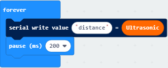

Complete Program:

① The "on start" command block runs only once to start the program.

②Serial redirection USB

③In the "forever" instruction block, the program runs cyclically.

④Serial write value distance=Ultrasonic

⑤ Delay time 200 milliseconds

Click“JavaScript" to view the corresponding JavaScript code: ：

**(6)Test Results:**

Download code to micro:bit, keep USB cable connected, dial POWER switch to ON end. The distance value will be displayed on monitor.

(How to quick download?)

The monitor shows the distance between the obstacle and ultrasonic sensor(as shown below). When the distance is less than 10cm, the passive buzzer of smart car emits sound.

Open CoolTerm, click Options to select SerialPort. Set COM port and 115200 baud rate(the baud rate of USB serial communication of Micro:bit is 115200 through the test). Click “OK” and “Connect”.

CoolTerm serial monitor displays the distance value as follows:

**18.2: Ultrasonic Avoidance Car**

**(1)Project Description**

We’ve learned the knowledge of obstacle avoidance sensor. In this project, we will integrate ultrasonic sensor, and car expansion board to make an ultrasonic avoidance car.

Its principle is to detect the distance between the car and obstacle by ultrasonic sensor and control the motion of smart car.

**(2)Experimental Preparation：**

-   Insert micro:bit board into slot of keyestudio 4WD Mecanum Robot Car

-   Place batteries into battery holder

-   Dial power switch to ON end

-   Connect micro:bit to computer by USB cable

-   Open online Makecode editor

Import Hex profile (How to import?) , or click“New Project”and drag blocks step by step(add MecanumRobot extension library first)

**(How to add MecanumRobot extension?)**

**(3)Flow Chart:**

**(4)Test Code:**

Code path:

| File Type | Path                                                                                            | File Name                                   |
|-----------|-------------------------------------------------------------------------------------------------|---------------------------------------------|
| Hex file  | KS4031(4032) folder/Makecode Tutorial/Makecode Code/Project 18.2： Ultrasonic Avoidance Car.hex | Project 18.2： Ultrasonic Avoidance Car.hex |

Or you could edit code step by step in the editing area.

(1)Enter“Basic” →“show icon ♥”

Place it into“on start”and click the triangle button to select“” pattern

Click“Variables” and then click“Make a Variable..., dialog box“New variable name：”pops up;

Fill it with “distance”;

Click“OK”to establish variable“distance;

Set the functions of servo:

Click“Variables”to find and drag“set distance to 0”to“forever”;

Click“MecanumRobot”to find and drag“Ultrasonic”to the 0 behind the”to”:

Click“Logic”to find and drag“if true then...else”to“forever”;

Find and drag“=”to “true”;

Click“Variables”to find and drag“distance”on the left of“=”;

Click the little triangle behind“=”to choose“\<”;

Change the 2 behind “\>”to 20:

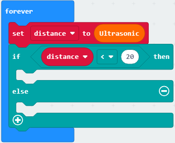

Click Funtionsto of “Advance”to find and drag;

Click“MecanumRobot”to find and drag to then;

Click“Basic”to find  and change the 100 to 500:

Click“MecanumRobot”to find and drag and change the 0 to 180;

Copy  once;

Click“Variables”to find and drag“set distance_l to 0”;

Click“MecanumRobot”to find and drag“Ultrasonic”to 0 behind “to”;

Copy once;

Copy  once;

Change the 180 to 0, distance_l to distance_r and others remain unchanged:

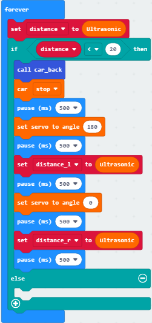

Click“Logic”to find and drag“if true then...else”;

Find and drag“=”to true;

Click“Variables”to find and drag“distance_l to the left of “=”; Click the little triangle behind“=”to choose“\>”;

Change the 0 behind “\>”to “distance_r”:

Click Funtionsto of “Advance”to find and drag;

Click“MecanumRobot”to find and drag;

Change the 0 to 90;

Click“Basic”to find and drag  and change the 100 to 300:

Change  to  and place it in the first “else”：

Click “Funtionsto” of “Advance”to find and drag，and place it to the second “else”：

Complete Program:

Click“JavaScript" to view the corresponding JavaScript code: ：

**(5)Test Results:**

Download code to micro:bit, dial to ON end, and dial POWER to ON end. When the obstacle distance is greater than 20cm, the car goes forward ; on the contrary, smart car turns left.

([How to download?] How to quick download?)

**18.3: Ultrasonic Follow Smart Car**

**(1)Project Description**

In previous lesson, we’ve learned the basic principle of line tracking sensor. Next, we will combine ultrasonic sensor with car shield to make an ultrasonic follow car.

The ultrasonic sensor detects the obstacle distance and control the motion status of car.

**(2)Experimental Preparation：**

-   Insert micro:bit board into slot of keyestudio 4WD Mecanum Robot Car

-   Place batteries into battery holder

-   Dial power switch to ON end

-   Connect micro:bit to computer by USB cable

-   Open online Makecode editor

Import Hex profile (How to import?), or click“New Project”and drag blocks step by step(add MecanumRobot extension library first)

**(How to add MecanumRobot extension?)**

**(3)Flow Chat:**

**(4)Test Code:**

Code path:

| File Type | Path                                                                                              | File Name                                     |
|-----------|---------------------------------------------------------------------------------------------------|-----------------------------------------------|
| Hex file  | KS4031(4032) folder/Makecode Tutorial/Makecode Code/Project 18.3：Ultrasonic Follow Smart Car.hex | Project 18.3：Ultrasonic Follow Smart Car.hex |

Or you could edit code step by step in the editing area.

(1)Enter“Basic” →“show icon ♥”

Place it into“on start”and click the triangle button to select“” pattern。

(2)Click“ MecanumRobot”to find and dragto“on start”and change the angle 0 to 90:

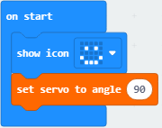

Click“Variables” and then click“Make a Variable...”, the dialog box“New variable name：”pops up; fill it with “distance”;

Click“OK”to establish variable“distance”;

Drag“set distance to 0” to “forever”;

Click“ MecanumRobot”to find and dragto the “0” of“set distance to 0”:

Click“Logic”to find and drag“if true then...else”to“forever”;

Find and drag“=”to true;

Click“Variables”to find and drag“distance”to the left side of “=”;

Click the little triangle behind“=”to choose“\<”;

Change the 0 behind “” to 10:

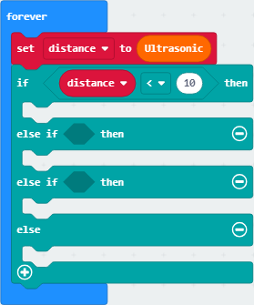

Click “Funcions” of“ Advance”to find and dragto“then”:

Change the 10 to 20, car_back to car stop:

Change the 20 to 40，car stop to car forward;

Place car stop to the last”else”:

Complete Program:

Click“JavaScript" to view the corresponding JavaScript code: ：

**(5)Test Results:**

Download code to micro:bit, dial POWER switch to ON end on shield, smart car could follow the obstacle to move.

(How to download?] [How to quick download?)

### Project 19：IR Remote Control

 19.1：Decode IR Remote Control

**(1)Project Description**

There is no doubt that infrared remote control is ubiquitous in daily life. It is used to control various household appliances, such as TVs, stereos, video recorders and satellite signal receivers. Infrared remote control is composed of infrared transmitting and infrared receiving systems, that is, an infrared remote control and infrared receiving module and a single-chip microcomputer
capable of decoding.

The 38K infrared carrier signal emitted by remote controller is encoded by the encoding chip in the remote controller. It is composed of a section of pilot code, user code, user inverse code, data code, and data inverse code. The time interval of the pulse is used to distinguish whether it is a 0 or 1 signal and the encoding is made up of these 0, 1 signals.

The user code of the same remote control is unchanged. The data code can distinguish the key.

When the remote control button is pressed, the remote control sends out an infrared carrier signal. When the IR receiver receives the signal, the program will decode the carrier signal and determines which key is pressed. The MCU decodes the received 01 signal, thereby judging what key is pressed by the remote control.

Infrared receiver we use is an infrared receiver module. Mainly composed of an infrared receiver head, it is a device that integrates reception, amplification, and demodulation. Its internal IC has completed demodulation, and can achieve
from infrared reception to output and be compatible with TTL signals. Additionally, it is suitable for infrared remote control and infrared data transmission. The infrared receiving module made by the receiver has only three pins, signal line, VCC and GND.

According to the picture above, the integrated port of the infrared receiver is connected to the G port on the motor driver board and controlled by the the P9 of the micro:bit.

**(2)Parameters:**

-   Operating Voltage: 3.3-5V（DC）

-   Interface: 3PIN

-   Output Signal: Digital signal

-   Receiving Angle: 90 degrees

-   Frequency: 38khz

-   Receiving Distance: about 5m

**(3)Experimental Preparation：**

-   Insert micro:bit board into slot of keyestudio 4WD Mecanum Robot Car

-   Place batteries into battery holder

-   Dial power switch to ON end

-   Connect micro:bit to computer by USB cable

-   Open online Makecode editor

Import Hex profile (How to import?) , or click“New Project”and drag blocks step by step(add MecanumRobot extension library first)

**(How to add MecanumRobot extension?)**

**(4)Test Code:**

| File Type | Path                                                                                           | File Name                                  |
|-----------|------------------------------------------------------------------------------------------------|--------------------------------------------|
| Hex file  | KS4031(4032) folder/Makecode Tutorial/Makecode Code/Project 19.1：Decode IR Remote Control.hex | Project 19.1：Decode IR Remote Control.hex |

Click“Advanced”→“Serial”→“serial redirect to USB”

Place it into“on start”block.

Enter“IrRemote”→“connect IR receiver at P0”

Put it into“on start”block

IR receiving module is controlled by P9 of micro:bit board, so click P0 to select P9.

Go to“Variables”→“Make a Variable...”→ “New variable name：” dialog box，

Enter“val”and click“OK”to create variable“val”

Then drag out“set val to 0”block into“forever”block.

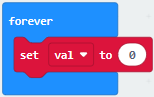

Go to“Ir Remote”→“IR button”

Place it into 0 box

Click“Advanced”→“Serial”→“serial write value“x”=0”

Put it into“forever”block

Change“x”into“IR”

Enter“Variables”to move block“val”into 0 box behind“=”

Drag out block“pause (ms) 100”from“Basic”and delay in 1000ms

Leave it into“forever”block

Complete Program：

“on start”: command block runs once to start program.

Serial redirect to USB

Connect IR receiver to P9

The program under the block “forever” runs cyclically.

Set val to IR button

Serial port prints IR=val

Delay in 1000ms

Click“JavaScript" to switch into the corresponding JavaScript code:

Code explanation: when the buttons are not pressed, the serial monitor constantly shows 0; when pressed, the corresponding key values are displayed.

Notes：

The remote control in this kit is not inclusive of batteries. We recommend you to purchase them online.(battery type:CR2025).

Make sure IR remote is good before test. There is a tip for you to check it.

Open the cellphone camera , make IR remote control point at camera and press button. The remote control is good if you see the purple flashing light in the camera.

Download code to micro: bit board and don’t plug off USB cable Click

([How to quick download?](##_7.3.快速下载))

Make IR remote control point at IR receiver and press the button, the serial monitor will display the corresponding key values, as shown below：

Open CoolTerm, click Options to select SerialPort. Set COM port and 115200 baud rate. Click“OK”and“Connect”.

CoolTerm serial monitor shows the key value as follows:

The key value is displayed as for your reference:

**19.2：IR Remote Control**

**(1)Project Description**

In this project, we combine IR remote control with car shield to make an IR remote smart car. Its principle is to control the motion of car by sending key signals from IR remote control to IR receiving module of car shield.

**(2)Experimental Preparation：**

-   Insert micro:bit board into slot of keyestudio 4WD Mecanum Robot Car

-   Place batteries into battery holder

-   Dial power switch to ON end

-   Connect micro:bit to computer by USB cable

-   Open online Makecode editor

Import Hex profile (How to import?) , or click“New Project”and drag blocks step by step(add MecanumRobot extension library first)

**(How to add MecanumRobot extension?)** ** Note: The infrared sensor and infrared remote control should not be used in
environments with infrared interference such as sunlight. Because sunlight contains a lot of invisible lights, such as infrared and ultraviolet. In an environment with strong sunlight, they cannot work normally.

**(3)Flow Chart:**

**(4)Test Code**

Code path:

| File Type | Path                                                                                     | File Name                            |
|-----------|------------------------------------------------------------------------------------------|--------------------------------------|
| Hex file  | KS4031(4032) folder/Makecode Tutorial/Makecode Code/Project 19.2：IR Remote Control .hex | Project 19.2：IR Remote Control .hex |

Or you could edit code step by step in the editing area.

(1)Create four functions controlling the car to move forward and back and turn left and right:

(2)Click“Ir Remote”to find and drag“connect IR receiver at P0”into“on start”;
Click the little triangle behind P0 to choose P9;

(3)Click“Variables”then click“Make a Variable...”, the dialog box“New variable name：”pops up; fill it with“val” and click“OK”to create variable“val”;

Create variable“val2”with the same method; find and drag“set val2 to 0”to“on start”and copy it once to put into“on start”too;

Click the little triangle behind the first val2 to choose “val”;

(4)Click“Variables”to find and drag“set val2 to 0”to“forever”; Click the little triangle behind val2 to choose val; Click“IrRemote”to find and drag“IR button”to the “0” behind “to”;

(5)Click“Logic”to find and drag“if true then”into“forever”; find and drag “=”into“true”;

Click“Variables”to find and drag“val”to the left side of “=; the 0 on the right side of “=”remain unchanged; click the little triangle behind “=”to choose“≠”;

(6)Click“Variables”to find and drag“set val2 to 0”into “then”;find and drag “val”into the o behind “to” of“set val2 to 0”;

(7)Click“Logic”to find and drag“if...then...else”to then;

Click“”of” if...then...else”four times;

Click“”behind “else”once to delete else;

Find and drag “=” to “true”; 

(8)Click“Variables”to find and drag“val2”to the left side of“=”and change the 0 on the right of“=”to 70:

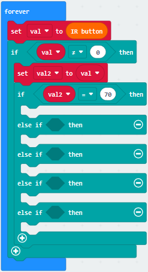

(9)Click“Functions” of“Advance”to find and dragto the second “then”:

(10)Copy “val2=70”once and place it behind the first “if”;change the 70 behind “=” to 68; 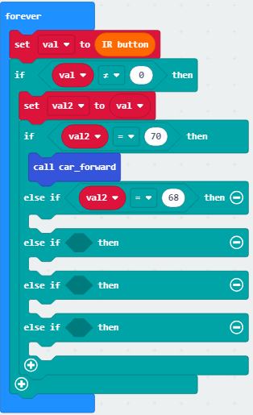

(11)Click“Functions” of“Advance”to find and drag to the second “then” :
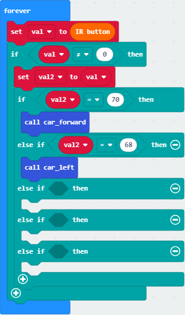

(12)Copy“val2=68”once and place it behind the second “else if “; change the 68 behind “=”to 67； place it in the forth “then”;Click“Functions”of“Advance”to find and dragto the forth “then”:

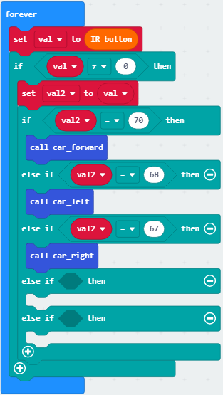

(13)Copy“val2=67”once and put it behind “=” of the third “else if ; change the number 67 to 21;click “Functions” of “Advance”to find and drag to the fifth “then”:

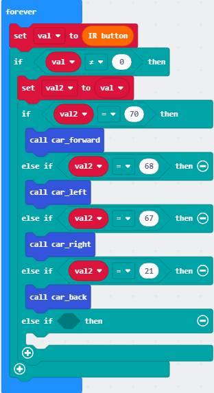

(14)Copy “val2=21”once and place it behind the fourth “else if “;change the the number 21 behind“=”to 64；Click“MecanumRobot”to find and drag  to the sixth “then”:

Complete Program:

① The "on start" command block runs only once to start the program.

②Connect the IR receiver to P9

③Set the variable val to 0

④Set the variable val2 to 0

⑤In the "forever" instruction box, the program runs cyclically

⑥Set val to IR button

⑦When the variable val≠0 is established, execute the program under then

⑧Set variable val2 to val

⑨When val2=70 is established, execute the program under then

⑩The car goes forward

⑪When val2=68 is established, execute the program under then

⑫Turn left

⑬When val2=67 is established, execute the program under then

⑭Car turn right

⑮When val2=21 is established, execute the program under then

⑯The car goes back

⑰When val2=64 is established, execute the program under then

⑱The car stops

Click“JavaScript" to switch into the corresponding JavaScript code:

**(5)Test Results:**

Download code to micro:bit board, and dial POWER to ON end. Make IR remote control point at micro:bit and press the button to control smart car to move.

button makes smart car move forward，stands for turning left，implies rightward turning,
indicates moving backward， stops car，and 4pcs WS2812RGB light up the corresponding color.

(How to download?[How to quick download?)

Note: the distance between IR remote control and IR receiving head of smart car are supposed less than 5m, during the test.

### Project 20: Bluetooth Multi-purpose Smart Car

**20.1: Read Bluetooth Data**

**(1)Project Description**

Micro:bit main board comes with a built in Bluetooth which can be used to communicate with it. And the Micro:bit can also be controlled by Bluetooth or transmit signals back to smartphone or computer via it. This Bluetooth can communicate with the Bluetooth equipped in other devices or with Bluetooth App to control other equipment. It is compatible with both Android system ans IOS system. And we have designed two Bluetooth App for both systems.

The connection of the Bluetooth on the board with these two Apps is similar. In this lesson, we will introduce the functions of all keys and patterns on the Apps and control the smart car via Bluetooth App.

**(2)Experimental Preparation：**

-   Insert micro:bit board into slot of keyestudio 4WD Mecanum Robot Car

-   Place batteries into battery holder

-   Dial power switch to ON end

-   Connect micro:bit to computer by USB cable

-   Open online Makecode editor

Import Hex profile (How to import?), or click“New Project”and drag blocks step by step(add MecanumRobot extension library first)

**(How to add MecanumRobot extension?)**

As the Bluetooth and extension radio can’t work together, therefore, their extension libraries are not compatible.

Therefore, remove extension(s) and add Bluetooth please if you see the following prompt box pop up.

**(3)Test Code:**

Code Path:

| File Type | Path                                                                                      | File Name                             |
|-----------|-------------------------------------------------------------------------------------------|---------------------------------------|
| Hex file  | KS4031(4032) folder/Makecode Tutorial/Makecode Code/Project 20.1：Read Bluetooth Data.hex | Project 20.1：Read Bluetooth Data.hex |

Or you could edit code step by step in the editing area.

Enter“Advanced” →“Serial” → “serial redirect to USB”

Place it into“on start”

\*\*\*\*\*\*\*\*\*\*\*\*\*\*\*\*\*\*\*\*\*\*\*\*\*\*\*\*\*\*\*\*\*\*\*\*\*\*\*\*\*\*\*\*\*\*\*\*\*\*\*\*\*\*\*\*\*\*\*\*\*\*\*\*\*\*\*\*\*\*\*\*\*\*\*\*\*

Click“Bluetooth”→“on bluetooth connected”

Go to“Basic”to move“show icon”block into“on bluetooth connected” block.

\*\*\*\*\*\*\*\*\*\*\*\*\*\*\*\*\*\*\*\*\*\*\*\*\*\*\*\*\*\*\*\*\*\*\*\*\*\*\*\*\*\*\*\*\*\*\*\*\*\*\*\*\*\*\*\*\*\*\*\*\*\*\*\*\*\*\*\*\*\*\*\*\*\*\*\*\*

Click“Variables”→“Make a Variable...”→“New variable name：”dialog box.

Input“connected”and click“OK”to create variable“connected”.

Drag“set connected to 0”under block “show icon” and change 0 into 1.

Go to“Loops”to move block“while true do...”into“on bluetooth connected”block.

Enter“Logic”to drag out “=”block.

Click“Variables” to drag “connected” into left box of “=” block and change 0 into 1.

\*\*\*\*\*\*\*\*\*\*\*\*\*\*\*\*\*\*\*\*\*\*\*\*\*\*\*\*\*\*\*\*\*\*\*\*\*\*\*\*\*\*\*\*\*\*\*\*\*\*\*\*\*\*\*\*\*\*\*\*\*\*\*\*\*\*\*\*\*\*\*\*\*\*\*\*\*

Then we generate variable“rec_data”in same way.

Then drag out“set rec_data to 0”and place it into block“while connected=1 do...”block.

Click“Bluetooth”→“more”→“bluetooth uart read until new line( )”

Keep it into 0 box and click triangle button to select \##.

Go to“Advanced”→“Serial”→“serial write string”

Move it below“set rec_data...until\##”block

And combine variable“rec_data”with“serial write string”block.

Click“Advanced” →“Serial” →“serial write line” and edit code string as follows:

Click“Bluetooth”to drag out“on bluetooth disconnected”.

Go to“Bluetooth”→“on bluetooth disconnected”

Copy“show icon”block and keep it into block“on bluetooth disconnected”

Click triangle button to select“”pattern.

Complete Program

“on start”: command block runs once to start program.

Serial redirect to USB

Connect Bluetooth 

LED dot matrix shows“❤”pattern

Set variable connected to 1

When connected=1, the code under do block will be executed.

Set rec_data to bluetooth uart read until ##

Serial port prints rec_data

Print a blank space

Disconnect Bluetooth

LED dot matrix displays“”pattern.

                                                                                                                                                                                                                                                                                                                                                                                                                                                                                                                                  |

Click“JavaScript" to view the corresponding JavaScript code:

**(4)Test Results:**

If you drag blocks step by step, you need to set as follows after finishing test code.

Click 

However, you could skip this step if you directly import test code.

After setting, download code to micro:bit board, don’t plug off USB cable(How to download? How to quick download?)

Next to download App.

**For IOS System:**

a.open App Store;

b.search mecanum_robot and click“”to download the Bluetooth App of mecanum_robot;

c. After downloading the APP, click "OPEN" or click the application mecanum_robot on the phone/iPad desktop to open the APP. A dialog box appears on the APP interface, and click "OK" in the dialog box.

d. First turn on the Bluetooth of the mobile phone/iPad, and then click the connect button (control) in the upper left corner of the APP interface to perform a Bluetooth search. In the search results, click "BCC micro:bit". After a few seconds, the Bluetooth is connected.

**For Android System:**

a. Use the scanning function in the browser to scan and identify the QR code or enter the <http://8.210.52.206/mecanum_robot.apk> to download. After the identification is successful, click "go to website" to enter the download mecanum_robot.apk page , Click "Download" to download the mecanum_robot application.

B.Click“Allow allow”to enter Installation Diagram; click“install”to install the App;

C.Click "Open" or click the application mecanum_robot on the mobile phone desktop to open the APP, and a dialog box appears. In the dialog box, click "Allow" to turn on the Bluetooth of the mobile phone. You can also turn on the phone's Bluetooth before opening the APP.

Click  on the upper right corner to search for Bluetooth and click“connect”; a few seconds later, the Bluetooth is paired.

Open CoolTerm, click Options to select SerialPort. Set COM port and 115200 baud rate. Click“OK”and“Connect”.

Point at micro:bit board and press the icons on APP, the corresponding characters are shown on CoolTerm monitor.

Through the test, we get the function of every icon, as shown below:

**20.2: Multi-purpose Smart Car**

**(1)Project Description**

In this lesson, we will control the smart car to perform multipurpose function.

**(2)Experimental Preparation：**

Insert micro:bit board into slot of keyestudio 4WD Mecanum Robot Car

Place batteries into battery holder

Dial power switch to ON end

Connect micro:bit to computer by USB cable

Open online Makecode editor

Import Hex profile (How to import?) , or click“New Project”and drag blocks step by step(add MecanumRobot extension library first)

**(How to add MecanumRobot extension?)**

As the Bluetooth and extension radio can’t work together, therefore, their extension libraries are not compatible.

Therefore, remove extension(s) and add Bluetooth please if you see the following prompt box pop up.

**(3)Test Code:**

**Code path:**

| File Type | Path                                                                                          | File Name                                 |
|-----------|-----------------------------------------------------------------------------------------------|-------------------------------------------|
| Hex file  | KS4031(4032) folder/Makecode Tutorial/Makecode Code/Project 20.2：Multi-purpose Smart Car.hex | Project 20.2：Multi-purpose Smart Car.hex |

Complete Code:

Click“JavaScript" to view the corresponding JavaScript code: ：

**(4)Test Results:**

This experiment combines the previous projects to make the car to perform actions by Bluetooth.

Enter Makecode online editor→Project Settings→, enable “No Pairing....”(you could skip this step if you import test code directly)

Download code to micro:bit board, dial POWER to ON end, and connect the Bluetooth, then you can control the car via the Bluetooth App of mecanum_robot.

How to download? How to quick download?

## Resources:

Download PDF files: https://fs.keyestudio.com/KS4031-4032

BBC microbit MicroPython:

<https://microbit-micropython.readthedocs.io/en/latest/tutorials/introduction.html>

MicroPython:

<https://docs.openmv.io/reference/index.html>

ustruct library:

<https://docs.openmv.io/library/ustruct.html>

math library:

<https://docs.openmv.io/library/math.html>

utime(sleep_us,tick_us) library:

[https://docs.openmv.io/library/utime.html\##](https://docs.openmv.io/library/utime.html)

 
