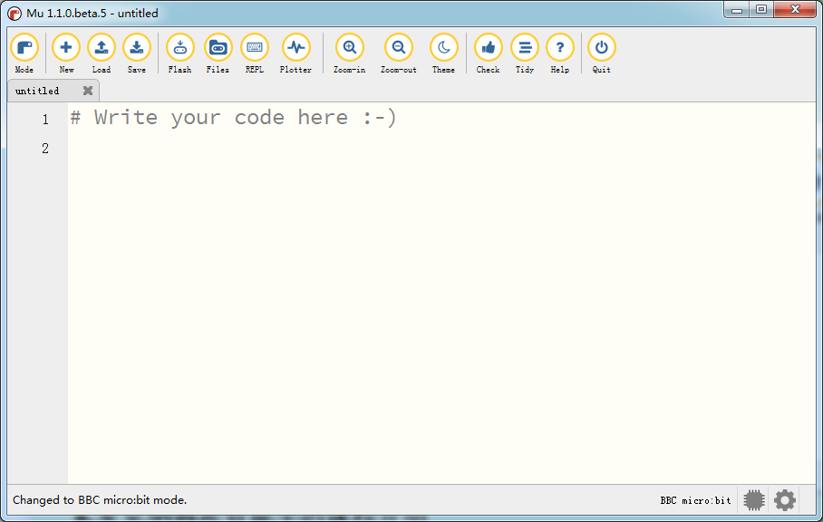
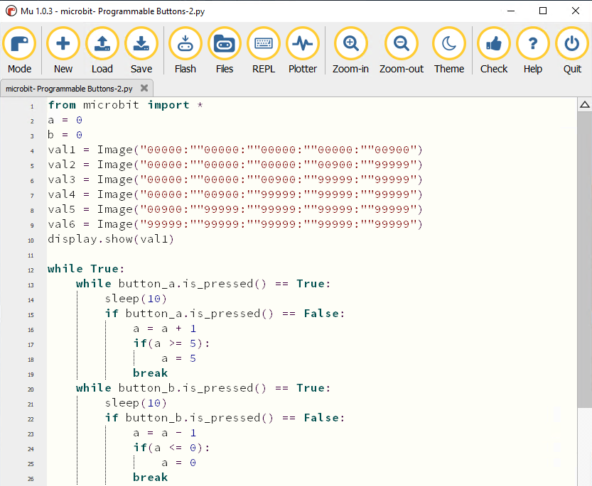
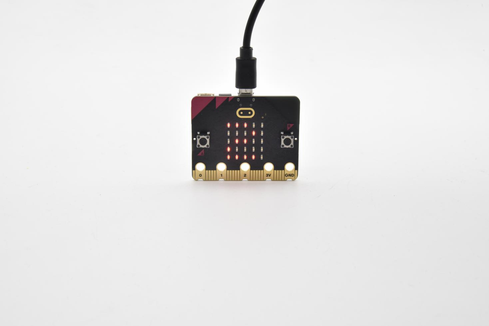
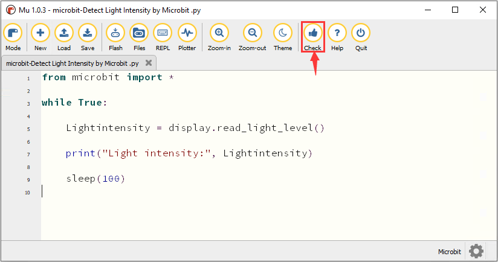
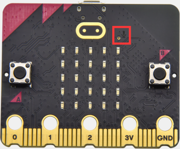
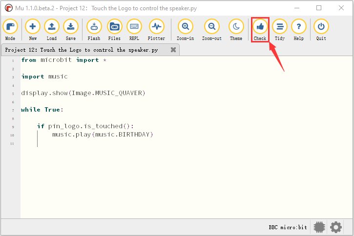
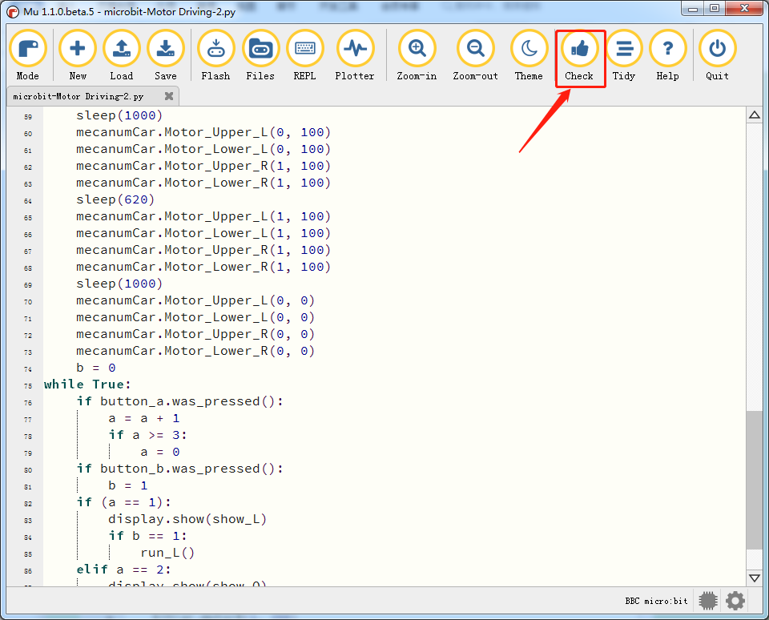
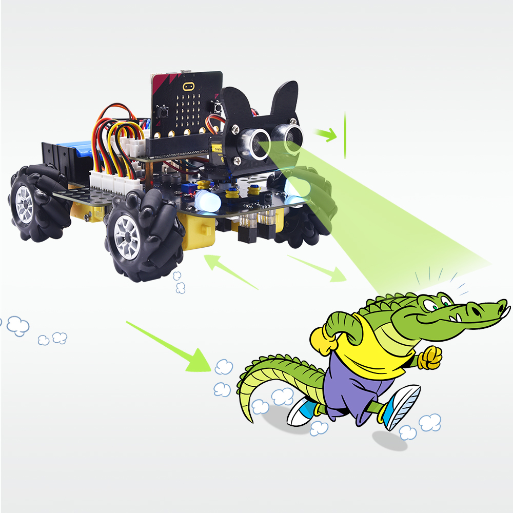

# **MicroPython Tutorial**

****

                                                                                                                                                         |

## Getting Started With MicroPython

This tutorial is written for Python language. If you want to use graphical code
programming, please refer to the manual "Makecode Tutorial.pdf". In the root
directory of the resource you downloaded, there is a folder named "Python
tutorial", which stores all the Python code of Micro:bit 4WD Mecanum Robot Car.
The Python code file is a file ending with ".py".

**What is MicroPython?**

[MicroPython](https://www.micropython.org/) is a tiny open source [Python
programming language](https://www.python.org/) interpreter that runs on small
embedded development boards. With MicroPython you can write clean and simple
Python code to control hardware instead of having to use complex low-level
languages like C or C++ (what Arduino uses for programming).

The simplicity of the Python programming language makes MicroPython an excellent
choice for beginners who are new to programming and hardware. However
MicroPython is also quite full-featured and supports most of Python's syntax so
even seasoned Python veterans will find MicroPython familiar and fun to use.

More details please log in official micro:bit website:

https://microbit-micropython.readthedocs.io/en/latest/index.html

<https://microbit-micropython.readthedocs.io/en/latest/tutorials/introduction.html>

**Python has two types of editors（web version and offline version)**

Web version: <https://python.microbit.org/v/1.1>

The other one is the offline compiler tool\-----Mu

(Download Mu：<https://codewith.mu/en/download>)

**Mu**

Official Website：<https://codewith.mu/>

Mu, a Python code editor, is suitable for starters.

Mu doesn’t support 32-bit Windows. The latest version is Mu 1.1.0-beta 2

Download Mu

Click“This PC”and right- click to select Properties to check the version of your
computer.

Below is shown system type of your computer.

Enter link: <https://codewith.mu/en/download> to download the corresponding
version of Mu.

**Mac OSX：**<https://codewith.mu/en/howto/1.1/install_macos>

Windows 10

You will view the page pop up, then click More info

Then click“Run anyway”.

After it is installed, click“finish”.

After it is installed, click“finish”.

Start Mu

Next, find it according to the following picture

Its main interface is shown as follows:

## Projects

(Note: project 1 to 12 will be conducted with the built-in sensors and LED dot
matrix of the Micro:bit main board V2)

### Project 1: Heartbeat

**(1)Project Introduction**

This project is easy to conduct with a micro:bit main board, a Micro USB cable
and a computer.This experiment serves as a starter for your entry to the magical
programming world of Micro:bit.

**(2)Preparations:**

A. Attach the Micro:bit main board to your computer via the USB cable;

B.Open the offline version of Mu.

**(3)Test Code：**

Open Mu software, click Mode, then click“BBC
micro：bit”and“OK”:

Tap“Load”, select“Project 1：Heartbeat.py”file and click“open”:

| File Type   | Route                                                                  | File Name               |
|-------------|------------------------------------------------------------------------|-------------------------|
| Python file | KS4031(KS4032) folder/Python Tutorial/Python Code/Project 1：Heartbeat | Project 1：Heartbeat.py |

There is another way to import code. Open Mu software and drag
file”Project1:Heartbeat.py”into it.

You can also input code in the edit window yourself.

(note:all English words and symbols must be written in English.)

The following is a list of built-in images:

• Image.HEART

• Image.HEART_SMALL

• Image.HAPPY

• Image.SMILE

• Image.SAD

• Image.CONFUSED

• Image.ANGRY

• Image.ASLEEP

• Image.SURPRISED

• Image.SILLY

• Image.FABULOUS

• Image.MEH

• Image.YES

• Image.NO

• Image.CLOCK12, Image.CLOCK11, Image.CLOCK10, Image.CLOCK9, Image.CLOCK8,
Image.CLOCK7, Image.CLOCK6, Image.CLOCK5,

Image.CLOCK4, Image.CLOCK3, Image.CLOCK2,Image.CLOCK1

• Image.ARROW_N, Image.ARROW_NE, Image.ARROW_E, Image.ARROW_SE, Image.ARROW_S,
Image.ARROW_SW, Image.ARROW_W, Image.ARROW_NW

• Image.TRIANGLE

• Image.TRIANGLE_LEFT

• Image.CHESSBOARD

• Image.DIAMOND

• Image.DIAMOND_SMALL

• Image.SQUARE

• Image.SQUARE_SMALL

• Image.RABBIT

• Image.COW

• Image.MUSIC_CROTCHET

• Image.MUSIC_QUAVER

• Image.MUSIC_QUAVERS

• Image.PITCHFORK

• Image.PACMAN

• Image.TARGET

• Image.TSHIRT

• Image.ROLLERSKATE

• Image.DUCK

• Image.HOUSE

• Image.TORTOISE

• Image.BUTTERFLY

• Image.STICKFIGURE

• Image.GHOST

• Image.SWORD

• Image.GIRAFFE

• Image.SKULL

• Image.UMBRELLA

• Image.SNAKE，Image.ALL_CLOCKS，Image.ALL_ARROWS

Connect micro:bit board to computer with USB cable, click“Flash”to download code
to micro:bit board.

The code, even it is wrong, can be downloaded to micro:bit board successfully,
yet not working on micro:bit board.

Click“Flash”to download code to micro:bit.

Click“REPL”and press the reset button on micro:bit, the error information will
be displayed on REPL window, as shown below:

Click“REPL”again to turn off REPL mode, then you could refresh new code.

To make sure code correct, you only need to tap“Check”. The errors will be shown
on the window.

Modify the code according to the prompt and click“Check”.

More tutorials, log in website please:<https://codewith.mu/en/tutorials/>

**(4)Test Results:**

After uploading test code to micro:bit main board, clicking“Flash”again and
keeping the connection with the computer to power the main board, the LED dot
matrix shows pattern “”and then
“”alternatively.

**(5)Code Explanation：**

| **from**  microbit **import** \* | Import the library file of micro：bit                                 |
|----------------------------------|-----------------------------------------------------------------------|
| **while True:**                  | This is a permanent loop that makes micro:bit execute the code of it. |
| display.show(Image.HEART)        | micro：bit shows “❤”                                                  |
| sleep(500)                       | Delay in 500ms                                                        |
| display.show(Image.HEART_SMALL)  | micro：bit displays“”  |

### Project 2: Light A Single LED

**Project Introduction**

The LED dot matrix consists of 25 LEDs arranged in a 5 by 5 square. In order to
locate these LEDs quickly, as the figure shown below, we can regarded this
matrix as a coordinate system and create two aces by marking those in rows from
0 to 4 from top to bottom, and the ones in columns from 0 to 4 from the left to
the right. Therefore, the LED sat in the second of the first line is (1,0）and
the LED positioned in the fifth of the fourth column is (3,4）and others
likewise.

**(2)Preparations:**

A. Attach the Micro:bit main board to your computer via the USB cable;

B.Open the offline version of Mu.

**(3)Test Code：**

Enter Mu software and open the file“Project 2： Light A Single LED.py”to import
code:

| Type        | Route                                                                            | File Name                         |
|-------------|----------------------------------------------------------------------------------|-----------------------------------|
| Python file | KS4031(KS4032) folder/Python Tutorial/Python Code/Project 2： Light A Single LED | Project 2： Light A Single LED.py |

You can also input code in the editing window yourself.

(Note:all English words and symbols must be written in English)

Click“Check”to examine error in the code. The program proves wrong if underlines
and cursors are shown.

If the code is correct, connect micro:bit to computer and click“Flash”to
download code to micro:bit board.

**(4)Test Results:**

After uploading test code to micro:bit main board and powering the main board
via the USB cable, the LED in (1,0) lights up for 0.5s and the one in (3,4)
shines for 0.5s and repeat this sequence.

**(5)Code Explanation:**

| from microbit import \*                                                                                                                                                     | Import the library file of micro：bit                                                                                                                                                                                                                                                  |
|-----------------------------------------------------------------------------------------------------------------------------------------------------------------------------|----------------------------------------------------------------------------------------------------------------------------------------------------------------------------------------------------------------------------------------------------------------------------------------|
| val1 = Image("09000:""00000:""00000:""00000:""00000:")      val2 = Image("00000:""00000:""00000:""00000:""00090:")  val3 = Image("00000:""00000:""00000:""00000:""00000:")  | Set Image() to val1 Set pixel of LED on micro:bit to the value in 0\~9  Pixel of each LED on micro:bit can be set in one of ten values If set pixel to 0 (zero) ，which means in close state, literally, 0 is brightness, 9 is best brightness Set Image() to val2 Set Image() to val3 |
| while True:                                                                                                                                                                 | This is a permanent loop that makes micro:bit execute the code of it.                                                                                                                                                                                                                  |
| display.show(val1)  sleep(500)  display.show(val3)  sleep(500)                                                                                                              |  LED at (1,0) blinks for 0.5s                                                                                                                                                                                                                                                          |
| display.show(val2)  sleep(500)  display.show(val3)  sleep(500)                                                                                                              |  LED at (3,4) flashes for 0.5s                                                                                                                                                                                                                                                         |

**(6)Reference**

sleep(ms) : delay time

For more details about delay, please refer to:

https://microbit-micropython.readthedocs.io/en/latest/utime.html

### Project 3: LED Dot Matrix

**Project Introduction**

Dot matrices are very commonplace in daily life. They have found wide
applications in LED advertisement screens, elevator floor display, bus stop
announcement and so on.

The LED dot matrix of Micro: Bit main board contains 25 LEDs in a grid.
Previously, we have succeeded in controlling a certain LED to light by
integrating its position value into the test code. Supported by the same theory,
we can turn on many LEDs at the same time to showcase patterns, digits and
characters.

What’s more, we can also click”show icon“ to choose the pattern we like to
display. Last but not the least, we can design patterns by ourselves as well.

**(2)Preparations:**

A. Attach the Micro:bit main board to your computer via the USB cable;

B. Open the offline version of Mu.

**(3)Test Code：**

**Code1:**

You could open“Project 3： LED Dot Matrix-1.hex“file to Import code（[How to
load the project code?](##AS)）

| File Type   | Route                                                                              | File Name                        |
|-------------|------------------------------------------------------------------------------------|----------------------------------|
| Python file | KS4031(KS4032) folder/Python Tutorial/Python Code/Project 3： LED Dot Matrix-1.hex | Project 3： LED Dot Matrix-1.hex |

You can also input code in the editing window yourself.

(note:all words and symbols must be written in English.)

Click“Check”to examine error in the code. The program proves wrong if underlines
and cursors are shown.

If the code is correct, connect micro:bit to computer and click“Flash”to
download code to micro:bit board.

**Code2：**

You could open“Project 3： LED Dot Matrix-2.hex“file to Import code（[How to
load the project code?](##AS)）

| File Type   | Route                                                                              | File Name                        |
|-------------|------------------------------------------------------------------------------------|----------------------------------|
| Python file | KS4031(KS4032) folder/Python Tutorial/Python Code/Project 3： LED Dot Matrix-2.hex | Project 3： LED Dot Matrix-2.hex |

You can also input code in the editing window yourself.

(note:all words and symbols must be written in English.)

Click“Check”to examine error in the code. The program proves wrong if underlines
and cursors are shown.

If the code is correct, connect micro:bit to computer and click“Flash”to
download code to micro:bit board.

**(4)Test Results:**

After uploading test code to micro:bit main board and powering the main board
via the USB cable, we find that the 5\*5 dot matrix start to show numbers
1,2,3,4 and 5, and then it alternatively shows a downward arrow
, word “Hello”, a heart pattern
, an arrow pointing at northeast
, then at southeast
, then at southwest
, and then at northwest
.

**(5)Code Explanation:**

| **from** microbit **import** \*                                                                                      | Import the library file of micro：bit                                                                                                 |
|----------------------------------------------------------------------------------------------------------------------|---------------------------------------------------------------------------------------------------------------------------------------|
| val = Image("09000:""00000:""00000:""00000:""00000:")                                                                |  Set Image() to variable val                                                                                                          |
| display.show(val)                                                                                                    | micro:bit shows“→”                                                                                                                    |
| display.show('1')                                                                                                    | micro:bit shows“1”                                                                                                                    |
| sleep(500)                                                                                                           | Delay in 500ms                                                                                                                        |
| display.scroll("hello!")                                                                                             | micro:bit scrolls to show“hello!”                                                                                                     |
| display.show(Image.HEART)                                                                                            | micro:bit displays“❤”pattern                                                                                                          |
| display.show(Image.ARROW_NE) display.show(Image.ARROW_SE) display.show(Image.ARROW_SW)  display.show(Image.ARROW_NW) | micro:bit shows“Northeast”arrow micro:bit displays“Southeast”arrow micro:bit shows“Southwest”arrow micro:bit displays“Northwest”arrow |
| display.clear()                                                                                                      | The LED dot matrix of micro:bit clears                                                                                                |

**(6) Reference:**

display.scroll() ：

The display scrolls to show the values, if it is integer or float, we use
str（）to transfer into character strings.

More details, please refer to

<https://microbit-micropython.readthedocs.io/en/latest/utime.html>

### Project 4: Programmable Buttons

**Project Introduction**

Buttons can be used to control
circuits. In an integrated circuit with a push button, the circuit is connected
when pressing the button and it is open the other way around.

Both ends of button are like two mountains. There is a river in between.

The internal metal piece connect the two sides to let the current pass, just
like building a bridge to connect two mountains.

Micro: Bit main board boasts three push buttons, two are programmable
buttons(marked with A and B), and the one on the other side is a reset button.
By pressing the two programmable buttons can input three different signals. We
can press button A or B alone or press them together and the LED dot matrix
shows A,B and AB respectively. Let’s get started.

**(2)Preparations:**

A. Attach the Micro:bit main board to your computer via the USB cable;

Open the offline version of Mu.

**(3)Test Code1：**

Enter Mu software and open the file“Project 4：Code-1.py”to import code:

（[How to load the project code?](##AS)）

| File Type   | Route                                                                             | File Name             |
|-------------|-----------------------------------------------------------------------------------|-----------------------|
| Python file | KS4031(KS4032) folder/Python Tutorial/Python Code/Project 4：Programmable Buttons | Project 4：Code-1.py  |

You can also input code in the editing window yourself.

(note:all words and symbols must be written in English)

Click“Check”to examine error in the code. The program proves wrong if underlines
and cursors are shown.

If the code is correct, connect micro:bit to computer and click“Flash”to
download code to micro:bit board.

**(4)Test Results1:**

After uploading test code to micro:bit main board and powering the main board
via the USB cable, the 5\*5 LED dot matrix shows “A”if button A is pressed and
then released, “B” if button B pressed and released, and “AB” if button A and B
pressed together and then released.

**(5)Test Code2：**

Enter Mu software and open the file“Project 4：Code-2.py

”to import code:（[How to load the project code?](##AS)）

| File Type   | Route                                                                      | File Name             |
|-------------|----------------------------------------------------------------------------|-----------------------|
| Python file | KS4031(KS4032)/Python Tutorial/Python Code/Project 4：Programmable Buttons | Project 4：Code-2.py  |

You can also input code in the editing window yourself.

(note:all English words and symbols must be written in English)

Click“Check”to examine error in the code. The program proves wrong if underlines
and cursors are shown.

If the code is correct, connect micro:bit to computer and click“Flash”to
download code to micro:bit board.

**(6)Test Results2：**

After uploading test code to micro:bit main board and powering the main board
via the USB cable, when the button A is pressed, the LEDs turning red increase
while when the button B pressed, the LEDs turning red reduce.

**(7)Code Explanation：**

| from microbit import \*                                                                                                                                                                                                                                                                                                                                                                                                       | Import the library file of micro：bit                                                                                                                                                                                                                                                                                                                                                                                                                                                                                                                                                        |
|-------------------------------------------------------------------------------------------------------------------------------------------------------------------------------------------------------------------------------------------------------------------------------------------------------------------------------------------------------------------------------------------------------------------------------|----------------------------------------------------------------------------------------------------------------------------------------------------------------------------------------------------------------------------------------------------------------------------------------------------------------------------------------------------------------------------------------------------------------------------------------------------------------------------------------------------------------------------------------------------------------------------------------------|
| while True:                                                                                                                                                                                                                                                                                                                                                                                                                   | This is a permanent loop that makes micro:bit execute the code of it.                                                                                                                                                                                                                                                                                                                                                                                                                                                                                                                        |
| if button_a.is_pressed():  display.show("A")  elif button_a.is_pressed() and button_b.is_pressed(): display.scroll("AB")  elif button_b.is_pressed():  display.show("B")                                                                                                                                                                                                                                                      | If button A is pressed micro:bit shows“A” If button A and B are pressed at same time micro:bit displays“AB” If button B is pressed micro:bit shows“B”                                                                                                                                                                                                                                                                                                                                                                                                                                        |
| while button_a.is_pressed() == True: sleep(10) if button_a.is_pressed() == False: a = a + 1 if(a \>= 5): a = 5 break while button_b.is_pressed() == True: sleep(10) if button_b.is_pressed() == False: a = a - 1 if(a \<= 0): a = 0 break if a == 0: display.show(val1) if a == 1: display.show(val2) if a == 2: display.show(val3) if a == 3: display.show(val4) if a == 4: display.show(val5) if a == 5: display.show(val6) | When the button A is pressed Delay in 10ms to eliminate the shaking of button A when button A is released, Variable a adds 1 If variable a≥5 Variable a=5 exit the loop  when button B is pressed Delay in 10ms to eliminate the shaking of button B When the button B is released Variable a reduces 1 gradually When a≤0 Variable a=0 exit the loop When a=0 micro:bit shows pattern val1 When a=1 micro:bit displays pattern val2 When a=2 micro:bit shows pattern val3 If a=3 micro:bit displays pattern val4 If a=4 micro:bit shows pattern val5 If a=5 micro:bit displays pattern val6 |

### Project 5: Temperature Detection

**Project Introduction**

The Micro:bit main board is not equipped with a temperature sensor, but uses the
temperature sensor built into NFR52833 chip for temperature detection.
Therefore, the detected temperature is more closer to the temperature of the
chip, and there maybe deviation from the ambient temperature.

In this project, we use the sensor to test the temperature in the current
environment, and display the test results in the display data (device). And then
control the LED dot matrix to display different patterns by setting the
temperature range detected by the sensor.

Note: the temperature sensor of Micro:bit main board is shown below:

**(2)Preparations:**

A. Attach the Micro:bit main board to your computer via the USB cable;

B. Open the offline version of Mu.

**(3)Test Code1:**

Enter Mu software and open the file“Project 5：Code-1.py”to import code:

| File Type   | Route                                                                              | File Name            |
|-------------|------------------------------------------------------------------------------------|----------------------|
| Python file | KS4031(KS4032) folder/Python Tutorial/Python Code/Project 5：Temperature Detection | Project 5：Code-1.py |

You can also input code in the editing window yourself.(note:all English words
and symbols must be written in English)

Click“Check”to examine error in the code. The program proves wrong if underlines
and cursors are shown.

If the code is correct, connect micro:bit to computer and click“Flash”to
download code to micro:bit board.

**(4)Test Results1:**

After downloading test code 1 to micro:bit board, keep USB connected and
click“REPL”and press the reset button on micro:bit. Then REPL window will show
the ambient temperature value, as shown below:( C stands for temperature unit)

**(5)Test Code2:**

Enter Mu software and open the file“Project 5：Code-2.py”to import code:

| File Type   | Route                                                                              | File Name            |
|-------------|------------------------------------------------------------------------------------|----------------------|
| Python file | KS4031(KS4032) folder/Python Tutorial/Python Code/Project 5：Temperature Detection | Project 5：Code-2.py |

You can also input code in the editing window yourself.(note:all English words
and symbols must be written in English)

The temperature value can be set in compliance with the real temperature.

Click“Check”to examine error in the code. The program proves wrong if underlines
and cursors are shown.

If the code is correct, connect micro:bit to computer and click“Flash”to
download code to micro:bit board.

**(6)Test Results2:**

After uploading the code 2 to the board, when the ambient temperature is less
than 35℃, the 5\*5 LED dot matrix shows
. When the temperature is
equivalent to or greater than 35℃, the
pattern appears.

**(7)Code Explanation:**

| **from** microbit **import** \*                                                                     | Import the library file of micro：bit                                                                                                        |
|-----------------------------------------------------------------------------------------------------|----------------------------------------------------------------------------------------------------------------------------------------------|
| **while True:**                                                                                     | This is a permanent loop that makes micro:bit execute the code of it.                                                                        |
| Temperature = temperature()                                                                         | Set temperature() to Temperature                                                                                                             |
| print("Temperature:", Temperature, "C")                                                             | BBC micro:bit REPL prints temperature value                                                                                                  |
| sleep(500)                                                                                          | Delay in 500ms                                                                                                                               |
| **if** temperature() \>= 35: display.show(Image.HEART)  **else**:  display.show(Image.HEART_SMALL)  | If temperature value ≥35℃  micro:bit shows“♥” If temperature value\<35℃  micro:bit displays“” |

### Project 6: Geomagnetic Sensor

**(1)Project Description**

This project mainly introduces the use of the Micro:bit’s compass. In addition
to detecting the strength of the magnetic field, it can also be used to
determine the direction, an important part of the heading and attitude reference
system (AHRS) as well.

It uses FreescaleMAG3110 three-axis magnetometer. Its I2C interface communicates
with the outside, the range is ±1000µT, the maximum data update rate is 80Hz.
Combined with accelerometer, it can calculate the position. Additionally, it is
applied to magnetic detection and compass blocks.

Then we could read the value detected by it to determine the location. We need
to calibrate the Micro:bit board when magnetic sensor works.

The correct calibration method is to rotate the Micro:bit board.

In addition, the objects nearby may affect the accuracy of readings and
calibration.

。

**(2)Preparations:**

A. Attach the Micro:bit main board to your computer via the USB cable;

B.Open the offline version of Mu.

**(3)Test Code1:：**

Enter Mu software and open the file“Project 6：Code-1.py”to import code:

| File Type   | Route                                                                          | File Name            |
|-------------|--------------------------------------------------------------------------------|----------------------|
| Python file | KS4031(KS4032) folder/Python Tutorial/Python Code/Project 6 Geomagnetic Sensor | Project 6：Code-1.py |

You can also input code in the editing window yourself.

(note:all English words and symbols must be written in English)

Click“Check”to examine error in the code. The program proves wrong if underlines
and cursors are shown.

If the code is correct, connect micro:bit to computer and click“Flash”to
download code to micro:bit board.

**(4)Test Result1：**

After uploading test code1 to micro:bit main board and powering the board via
the USB cable, and pressing the button A, the board asks us to calibrate compass
and the LED dot matrix shows “TILT TO FILL SCREEN”. Then enter the calibration
page. Rotate the board until all 25 red LEDs are on as shown below.

After that, a smile pattern
 appears, which implies
the calibration is done. When the calibration process is completed, pressing the
button A will make the magnetometer reading display directly on the screen. And
the direction north, east, south and west correspond to 0°, 90°, 180° and 270°
respectively.

**(5)Test Code2:**

For the below picture, the arrow pointing to the upper right when the value
ranges from 292.5 to 337.5. Because 0.5 can’t be input in the code, the values
we get are 293 and 338.

Then add other statements to make a set of complete code.

Enter Mu software and open the file“Project 6：Code-2.py”to import code:

| File Type   | Route                                                                          | File Name            |
|-------------|--------------------------------------------------------------------------------|----------------------|
| Python file | KS4031(KS4032) folder/Python Tutorial/Python Code/Project 6 Geomagnetic Sensor | Project 6：Code-2.py |

You can also input code in the editing window yourself.(note:all English words
and symbols must be written in English)

Click“Check”to examine error in the code. The program proves wrong if underlines
and cursors are shown.

If the code is correct, connect micro:bit to computer and click“Flash”to
download code to micro:bit board.

**(6)Test Results2:**

Upload code 2 and plug micro:bit into power. After calibration, tilt micro:bit
board, and the LED dot matrix displays the direction signs.

**(6)Code Explanation：**

| **from** microbit **import** \*                                                                                                                                                                                                                                                                                                                                                                                                                                                                         | Import the library file of micro：bit                                                                                                                                                                                                                                                                               |
|---------------------------------------------------------------------------------------------------------------------------------------------------------------------------------------------------------------------------------------------------------------------------------------------------------------------------------------------------------------------------------------------------------------------------------------------------------------------------------------------------------|---------------------------------------------------------------------------------------------------------------------------------------------------------------------------------------------------------------------------------------------------------------------------------------------------------------------|
| compass.calibrate()                                                                                                                                                                                                                                                                                                                                                                                                                                                                                     | Compass calibration                                                                                                                                                                                                                                                                                                 |
| **while True:**                                                                                                                                                                                                                                                                                                                                                                                                                                                                                         | This is a permanent loop that makes micro:bit execute the code of it.                                                                                                                                                                                                                                               |
| **if** button_a.is_pressed():  display.scroll(compass.heading())                                                                                                                                                                                                                                                                                                                                                                                                                                        | When the button A is pressed Micro:bit scrolls to show the value of compass                                                                                                                                                                                                                                         |
| x = 0                                                                                                                                                                                                                                                                                                                                                                                                                                                                                                   | Set variable x=0                                                                                                                                                                                                                                                                                                    |
| x = compass.heading()                                                                                                                                                                                                                                                                                                                                                                                                                                                                                   | Set the value of compass to variable x                                                                                                                                                                                                                                                                              |
| **if**...**elif**...**else**                                                                                                                                                                                                                                                                                                                                                                                                                                                                            | Condition judgement statement:if...else if...else                                                                                                                                                                                                                                                                   |
| display.show(Image("00999:""00099:""00909:""09000:""90000")) display.show(Image("99900:""99000:""90900:""00090:""00009")) display.show(Image("00900:""09000:""99999:""09000:""00900")) display.show(Image("00009:""00090:""90900:""99000:""99900")) display.show(Image("00900:""00900:""90909:""09990:""00900")) display.show(Image("90000:""09000:""00909:""00099:""00999")) display.show(Image("00900:""00090:""99999:""00090:""00900")) display.show(Image("00900:""09990:""90909:""00900:""00900")) | Micro:bit shows the Northeast arrow sign Micro:bit shows the Northwest arrow sign Micro:bit shows the west arrow sign Micro:bit shows the Southwest arrow sign Micro:bit shows the South arrow sign Micro:bit shows the South arrow sign  Micro:bit shows the East arrow sign Micro:bit shows the North arrow sign  |

### Project 7: Accelerometer

**Project Introduction**

The Micro: Bit main board V2 has a built-in LSM303AGR gravity acceleration
sensor, also known as accelerometer, with a resolution of 8/10/12 bits. The code
section sets the range to 1g, 2g, 4g, and 8g.

We often use accelerometer to detect the status of machines.

In this project, we will introduce how to measure the position of the board with
the accelerometer. And then have a look at the original three-axis data output
by the accelerometer.

**(2)Preparations:**

A. Attach the Micro:bit main board to your computer via the USB cable;

B. Open the offline version of Mu.

**(3)Test Code1:**

Enter Mu software and open the file“Project 7：Accelerometer-1.py”to import
code:

（[How to load the project code?](##AS)）

| File Type   | Route                                                                      | File Name                     |
|-------------|----------------------------------------------------------------------------|-------------------------------|
| Python file | KS4031(KS4032) folder/Python Tutorial/Python Code/Project 7：Accelerometer | Project 7：Accelerometer-1.py |

You can also input code in the editing window yourself.(note:all English words
and symbols must be written in English)

Click“Check”to examine error in the code. The program proves wrong if underlines
and cursors are shown.

If the code is correct, connect micro:bit to computer and click“Flash”to
download code to micro:bit board.

**(4)Test Results1：**

After uploading the test code 1 to micro:bit main board and powering the board
via the USB cable, if we shake the Micro: Bit main board，no matter at any
direction, the LED dot matrix displays the digit “1”.

When it is kept upright（make its logo above the LED dot matrix）, the number 2
shows.

When it is kept upside down( make its logo below the LED dot matrix) , it shows
as below.

When it is placed still on the desk, showing its front side, the number 4
appears.

When it is placed still on the desk, showing its back side, the number 5
exhibits.

When the board is tilted to the left , the LED dot matrix shows the number 6 as
shown below.

When the board is tilted to the right , the LED dot matrix displays the number 7
as shown below：

When the board is knocked to the floor, this process can be considered as a free
fall and the LED dot matrix shows the number 8. (Please note that this test is
not recommended for it may damage the main board.)

Attention: if you’d like to try this function, you can also set the acceleration
to 3g, 6g or 8g. But still ,we do not recommend.

**(5)Test code2:**

Enter Mu software and open the file“Project 7：Accelerometer-2.py”to import
code:

（[How to load the project code?](##AS)）

| File Type   | Route                                                                      | File Name                     |
|-------------|----------------------------------------------------------------------------|-------------------------------|
| Python file | KS4031(KS4032) folder/Python Tutorial/Python Code/Project 7：Accelerometer | Project 7：Accelerometer-2.py |

You can also input code in the editing window yourself.(note:all English words
and symbols must be written in English)

Click“Check”to examine error in the code. The program proves wrong if underlines
and cursors are shown.

If the code is correct, connect micro:bit to computer and click“Flash”to
download code to micro:bit board.

After referring to the MMA8653FC data manual and the hardware schematic diagram
of the Micro: Bit main board, the accelerometer coordinate of the Micro: Bit are
shown in the figure below:

**(6)Test Results2:**

Upload the test code 1 to micro:bit main board and power the board via the USB
cable.

Click“REPL”and press the reset button. The value of acceleration on X axis, Y
axis and Z axis are shown below:

**(7)Code Explanation：**

| **from** microbit **import** \*                                                                                                                                                                                                                                                                                                                                                              | Import the library file of micro：bit                                                                                                                                                                                                                                                                                                                                                                                                                                                                                                      |
|----------------------------------------------------------------------------------------------------------------------------------------------------------------------------------------------------------------------------------------------------------------------------------------------------------------------------------------------------------------------------------------------|--------------------------------------------------------------------------------------------------------------------------------------------------------------------------------------------------------------------------------------------------------------------------------------------------------------------------------------------------------------------------------------------------------------------------------------------------------------------------------------------------------------------------------------------|
| gesture = accelerometer.current_gesture()                                                                                                                                                                                                                                                                                                                                                    | Set accelerometer.current_gesture() to gesture                                                                                                                                                                                                                                                                                                                                                                                                                                                                                             |
| **while True:**                                                                                                                                                                                                                                                                                                                                                                              | This is a permanent loop that makes micro:bit execute the code of it.                                                                                                                                                                                                                                                                                                                                                                                                                                                                      |
| **if** gesture == "shake":  display.show("1")  **if** gesture == "up":  display.show("2")  **if** gesture == "down":  display.show("3")  **if** gesture == "face up":  display.show("4")  **if** gesture == "face down":  display.show("5")  **if** gesture == "left":  display.show("6")  **if** gesture == "right":  display.show("7")  **if** gesture == "freefall":  display.show("8")   | Shaking micro:bit board, number 1 will appear When log points to the North, number 2 will show up. When log points to the South, number 3 will be shown When the LED dot matrix is upward, the number 4 is shown. the number 5 is displayed when the LED dot matrix is downward. When Micro:bit board is tilt to the left, number 6 is shown. When micro:bit is tilt to the right When Micro:bit board is inclined to the right, number 7 is displayed. When it is free fall(accidentally making it fall), number 8 appears on dot matrix. |
| x = accelerometer.get_x()  y = accelerometer.get_y()  z = accelerometer.get_z()                                                                                                                                                                                                                                                                                                              | Read the acceleration value on x axis，the return value is integer, and set x= the read value on x axis Read the acceleration value on y axis，the return value is integer, and set y= the read value on y axis Read the acceleration value on z axis，the return value is integer, and set z= the read value on z axis                                                                                                                                                                                                                    |
| print("x, y, z:", x, y, z)                                                                                                                                                                                                                                                                                                                                                                   | The value of acceleration will be shown                                                                                                                                                                                                                                                                                                                                                                                                                                                                                                    |
| sleep(100)                                                                                                                                                                                                                                                                                                                                                                                   | Delay in 100ms                                                                                                                                                                                                                                                                                                                                                                                                                                                                                                                             |

### Project 8: Light Detection

**Project Introduction**

In this project, we focus on the light detection function of the Micro: Bit main
board. It is achieved by the LED dot matrix since the main board is not equipped
with a photoresistor.

**(2)Preparations:**

A. Attach the Micro:bit main board to your computer via the USB cable;

B. Open the offline version of Mu.

**(3)Test Code:**

Enter Mu software and open the file“project 8：Light Detection.py”to import
code:

（[How to load the project code?](##AS)）

| File Type   | Route                                                                                     | File Name                     |
|-------------|-------------------------------------------------------------------------------------------|-------------------------------|
| Python file | KS4031(KS4032) folder/Python Tutorial/Python Code/Project Code/Project 8：Light Detection | project 8：Light Detection.py |

You can also input code in the editing window yourself.

(note:all English words and symbols must be written in English)

Click“Check”to examine error in the code. The program proves wrong if underlines
and cursors are shown.

If the code is correct, connect micro:bit to computer and click“Flash”to
download code to micro:bit board.

**(4)Test Results:**

Upload the test code to micro:bit main board, power the board via the USB cable
and click “Show console Device”.

Download code onto micro:bit board, don’t plug off USB cable. Click “REPL”and
press the reset buttons, the light intensity value will be displayed, as shown
below.

When the LED dot matrix is covered by hand, the light intensity showed is
approximately 0; when the LED dot matrix is exposed to light,the light intensity
displayed gets stronger with the light.

**(5)Code Explanation:**

| **from** microbit **import** \*             | Import the library file of micro：bit                                 |
|---------------------------------------------|-----------------------------------------------------------------------|
| gesture = accelerometer.current_gesture()   | Set accelerometer.current_gesture() to gesture                        |
| **while True:**                             | This is a permanent loop that makes micro:bit execute the code of it. |
| Lightintensity = display.read_light_level() | Set display.read_light_level() to Lightintensity                      |
| print("Light intensity:", Lightintensity)   | BBC microbit REPL prints the detected light intensity value           |
| sleep(100)                                  | Delay in 100ms                                                        |

### Project 9: Speaker

**Project Introduction**

Micro: Bit main board has an built-in speaker, which makes adding sound to the
programs easier. It can also be programmed to air all kinds of tones, like
playing the song *Ode to Joy.*

**(2)Preparations:**

A. Attach the Micro:bit main board to your computer via the USB cable;

B.Open the offline version of Mu.

**(3)Test Code1:**

Enter Mu software and open the file“Project 9：Speaker.py”to import code:

（[How to load the project code?](##AS)）

| File Type   | Route                                                                 | File Name             |
|-------------|-----------------------------------------------------------------------|-----------------------|
| Python file | KS4031(KS4032)  folder/Python Tutorial/Python Code/Project 9：Speaker | Project 9：Speaker.py |

You can also input code in the editing window yourself.

(note:all English words and symbols must be written in English)

Click“Check”to examine error in the code. The program proves wrong if underlines
and cursors are shown.

If the code is correct, connect micro:bit to computer and click“Flash”to
download code to micro:bit board.

**(4)Test Results1:**

After uploading the test code1 to micro:bit main board and powering the board
via the USB cable, the speaker utters sound and the LED dot matrix shows the
logo of music.

**(5)Code Explanation：**

| **from** microbit **import** \* | Import the library of micro：bit                                      |
|---------------------------------|-----------------------------------------------------------------------|
| **import** audio                | Audio library                                                         |
| **while True:**                 | This is a permanent loop that makes micro:bit execute the code of it. |
| audio.play(Sound.GIGGLE)        | Emit the“giggle”sound                                                 |
| sleep(1000)                     | delay in 1000ms                                                       |

### Project 10: Touch-sensitive Logo

**Project Introduction**

The Micro: Bit main board V2 is equipped with a golden touch-sensitive logo,
which can act as an input component and function like an extra button.

It contains a capacitive touch sensor that senses small changes in the electric
field when pressed (or touched), just like your phone or tablet screen do.When
you press it , you can activate the program.

**(2)Preparations:**

A. Attach the Micro:bit main board to your computer via the USB cable;

B.Open the offline version of Mu.

**(3)Test Code：**

Enter Mu software and open the file“Project 10：Touch-sensitive Logo.py”to
import code:

（[How to load the project code?](##AS)）

| File Type   | Route                                                                                 | File Name                           |
|-------------|---------------------------------------------------------------------------------------|-------------------------------------|
| Python file | KS4031(KS4032)  folder/Python Tutorial/Python Code/Project 10：Touch-sensitive Logo   | Project 10：Touch-sensitive Logo.py |

You can also input code in the editing window yourself.

(note:all English words and symbols must be written in English)

**How Micro:bit works?**

The runtime is recorded in milliseconds(ms) .

2.  When you press button A, a variable named start is set to the current
    running time.

3.  When you press button B, the start time will be subtracted from the new
    running time to calculate how much time has passed since you started the
    stopwatch. This difference is added to the total time, which is stored in a
    variable named time.

4.  If you press the golden logo, the program will display the total elapsed
    time on the LED display. It converts time from milliseconds (thousandths of
    a second) to seconds by dividing by 1000. It uses the integer division
    operator to give an integer (integer) result.

5.  The program is also controlled by a Boolean variable named running. Boolean
    variable can only have two values: true or false. If "running" is "true", it
    means that the stopwatch has started. If "running" is false, it means that
    the stopwatch has not started or has stopped.

6.  If "running" is true, the beating heart pattern is displayed on the LED dot
    matrix screen.

7.  (7) If the stopwatch has stopped and the "running" is false, when you press
    the golden logo, it will only display the time.

8.  If the stopwatch has been started and"running" is true, it only need to
    ensure that the time variable will only change when button B is pressed, and
    the code can also prevent false readings.

Click“Check”to examine error in the code. The program proves wrong if underlines
and cursors are shown.

If the code is correct, connect micro:bit to computer and click“Flash”to
download code to micro:bit board.

**(4)Test Results:**

Upload the test code to micro:bit main board and power the board via the USB
cable, and press button A to start the stopwatch. When timing, the beating heart
pattern will be displayed on the LED dot matrix screen. Press button B to stop
it and you can start and stop it at any time. It will keep recording time, just
like a real stopwatch. Press the golden logo on the front of the micro:bit to
display the measured time in seconds. And time can be reset to zero by pressing
the reset button on the back of it.

### Project 11: Microphone

**Project Introduction**

The Micro: Bit main board is built with a microphone which can test the volume
of ambient environment. When you clap, the microphone LED indicator turns on.
Since it can measure the intensity of sound, you can make a noise scale or disco
lighting changing with music. The microphone is placed on the opposite side of
the microphone LED indicator and in proximity with holes that lets sound
pass.When the board detects sound, the LED indicator lights up.

**(2)Preparations:**

A. Attach the Micro:bit main board to your computer via the USB cable;

B.Open the offline version of Mu.

**(3)Test Code 1：**

Enter Mu software and open the file“Project 11：Microphone-1.py”to import code:

（[How to load the project code?](##AS)）

| File Type   | Route                                                                      | File Name                   |
|-------------|----------------------------------------------------------------------------|-----------------------------|
| Python file | KS4031(KS4032)  folder/Python Tutorial/Python Code/Project 11：Microphone  | Project 11：Microphone-1.py |

You can also input code in the editing window yourself. (note:all English words
and symbols must be written in English)

Click“Check”to examine error in the code. The program proves wrong if underlines
and cursors are shown.

If the code is correct, connect micro:bit to computer and click“Flash”to
download code to micro:bit board.

**(4)Test Results1:**

After uploading test code to micro:bit main board and powering the board via the
USB cable, the LED dot matrix displays pattern
“”when you claps and pattern
 when it is quiet around.

**(5)Test Code2：**

Enter Mu software and open the file“Project 11：Microphone-2.py”to import code:

（[How to load the project code?](##AS)）

| File Type   | Route                                                                      | File Name                   |
|-------------|----------------------------------------------------------------------------|-----------------------------|
| Python file | KS4031(KS4032)  folder/Python Tutorial/Python Code/Project 11：Microphone  | Project 11：Microphone-2.py |

You can also input code in the editing window yourself.

(note:all English words and symbols must be written in English)

Click“Check”to examine error in the code. The program proves wrong if underlines
and cursors are shown.

If the code is correct, connect micro:bit to computer and click“Flash”to
download code to micro:bit board.

**(6)Test Results2:**

Upload test code to micro:bit main board and power the board via the USB cable.
When the button A is pressed, the LED dot matrix displays the value of the
biggest volume( please note that the biggest volume can be reset via the Reset
button on the other side of the board ) while when clapping, the LED dot matrix
shows the pattern of the sound.

**(7)Code Explanation：**

| **from** microbit **import** \*                                                                                                                                                                | Import the library of micro：bit                                                                                                                                                                                                                                                                                   |
|------------------------------------------------------------------------------------------------------------------------------------------------------------------------------------------------|--------------------------------------------------------------------------------------------------------------------------------------------------------------------------------------------------------------------------------------------------------------------------------------------------------------------|
| **while True:**                                                                                                                                                                                | This is a permanent loop that makes micro:bit execute the code of it.                                                                                                                                                                                                                                              |
| **if** microphone.current_event() == SoundEvent.LOUD: display.show(Image.HEART) sleep(200) **if** microphone.current_event() == SoundEvent.QUIET: display.show(Image.HEART_SMALL)              | If there is a sound LED shows ❤ Delay in 200ms if no sound is detected LED lights show                                                                                                                                                                              |
| print("Light intensity:", Lightintensity)                                                                                                                                                      | BBC microbit REPL prints the detected light intensity value                                                                                                                                                                                                                                                        |
| maxSound = 0                                                                                                                                                                                   | The initial value of maxSound is 0                                                                                                                                                                                                                                                                                 |
| lights = Image("11111:""11111:""11111:""11111:""11111")                                                                                                                                        | Assign Image() to variable lights                                                                                                                                                                                                                                                                                  |
| soundLevel = microphone.sound_level()                                                                                                                                                          | Assign microphone.sound_level() to the variable soundLevel                                                                                                                                                                                                                                                         |
| **if** button_a.is_pressed(): display.scroll(maxSound) **else:** soundLevel = microphone.sound_level() display.show(lights \* soundLevel) **if** soundLevel \> maxSound: maxSound = soundLevel | if the button A is pressed LED lights show the sound value If not Assign microphone.sound_level() to the variable soundLevel As the sound changes，the micro:bit will display the breathing light effect If the sound value is higher than its maximum value the maximum sound value is equal to sound level value |

### Project 12: Touch-sensitive Logo Controlled Speaker

**Project Introduction**

In the previous projects, we have learned about the touch-sensitive logo and the
speaker respectively. In the project, we will combine these two components to
play music. That’s the logo will be applied to control the speaker to sing
songs.

**(2)Components Needed:**

|  |   |
|-----------------------------------------------------|----------------------------------------------------|
| Micro:bit main board \*1                            | USB cable\*1                                       |

**(3)Connection Diagram:**

Attach the Micro:bit main
board to your computer via the USB cable.

**(4)Test Code:**

Enter Mu software and open the file“Project 12：Touch-sensitive Logo Controlled
Speaker.py”to import code:

（[How to load the project code?](##AS)）

| File Type   | Route                                                                                                  | File Name                                              |
|-------------|--------------------------------------------------------------------------------------------------------|--------------------------------------------------------|
| Python file | KS4031(KS4032)  folder/Python Tutorial/Python Code/Project 12：Touch-sensitive Logo Controlled Speaker | Project 12：Touch-sensitive Logo Controlled Speaker.py |

You can also input code in the editing window yourself.

(note:all words and symbols must be written in English)

Click“Check”to examine error in the code. The program proves wrong if underlines
and cursors are shown.

If the code is correct, connect micro:bit to computer and click“Flash”to
download code to micro:bit board.

**(5)Test Results:**

After uploading test code to micro:bit main board and powering the board via the
USB cable, the speaker plays the song *Happy Birthday to You* when the logo is
touched.

**(6)Code Explanation：**

| **from** microbit **import** \*    | Import the library of micro：bit                                      |
|------------------------------------|-----------------------------------------------------------------------|
| **while True:**                    | This is a permanent loop that makes micro:bit execute the code of it. |
| display.show（Image.MUSIC_QUAVER） | Music logo shows on the LED dot matrix on the micro:bit               |
| **if** pin_logo. is_touched( ):    | When the logo is touched, it executes the following command           |
| music.play（music.BIRTHDAY）       | The speaker plays the song”*Happy Birthday to You*”                   |

**Bluetooth Wireless Communication**

With 16k RAM, micro:bit owns a low-consumption Bluetooth module and support
Bluetooth communication. However, BLE heap stack occupies 12K RAM, which implies
that there is no enough space to run microPython.

At present, microPython doesn’t support Bluetooth.

https://microbit-micropython.readthedocs.io/en/latest/ble.html

The former projects are the introduction of sensors and modules. The further
lessons are challenging for new starters.

(Note: In order to prevent the micro:bit board from being burned, disconnect the
micro USB cable from it and turn off the power on the micro:bit motor drive
board before installing it on the car expansion board and dial the POWER switch
to the OFF end; likewise, before removing the the main board from the car
expansion board, disconnect the micro USB cable from it and turn off the power
on the micro:bit motor drive backplane.

### Project 13: Colorful Lights

**(1)Project Description**

This module consists of a commonly used LED with 7colors but in white
appearance. It can automatically flash different colors to create fantastic
light effects when high level is input like a normal LED.

**(2)Experimental Preparation：**

-   Insert micro:bit board into slot of keyestudio 4WD Mecanum Robot Car

-   Place batteries into battery holder

-   Dial power switch to ON end

-   Connect micro:bit to computer by USB cable

-   Open the offline version of Mu.

**(3)Test Code:**

Enter Mu software and open the file“Project 13：Colorful Lights.py”to import
code:

（[How to load the project code?](##AS)）

| File Type   | Route                                                                          | File Name                      |
|-------------|--------------------------------------------------------------------------------|--------------------------------|
| Python file | KS4031(KS4032)  folder/Python Tutorial/Python Code/Project 13：Colorful Lights | Project 13：Colorful Lights.py |

You can also input code in the editing window yourself.

(note:all words and symbols must be written in English)

Don't click "Flash", but import the "keyes_mecanum_Car.py" library file into the
micro:bit. This file contains the control method of the Micro:bit Mini Smart
Mecanum Wheel Smart Car.

**Import the "keyes_mecanum_Car.py" library file.**

The default directory where Mu saves files is "Mu_code", which is located in the
root directory of the user directory. Reference link:
<https://codewith.mu/en/tutorials/1.0/files>

For example, in the windows system, suppose your system is installed on the C
drive of the computer, and the user name is "Administrator", then the path of
the "mu_code" directory is "C:\\Users\\Administrator\\mu\_ code". On Linux
systems, the path of the "mu_code" directory is "\~/home/mu_code".

**Enter the “mu_code”folder.**

Copy“keyes_mecanum_Car.py“library file to folder”mu_code“ and the path is :

| File type    | Path                                               | File name            |
|--------------|----------------------------------------------------|----------------------|
| Python file  | ../PythonCode/LibrariesmecanumCar_python_Libraries | keyes_mecanum_Car.py |

When the copy is done, it should be look like this:

First open the Mu software and connect the micro:bit to your computer, then
click the "Files" , and then drag the "keyes_mecanum_Car.py" library file to
micro:bit.

After a few seconds, the import is complete and you can see it in the box on the
left.

After the library file is imported successfully, you also need to click the
"Check" button to check the code for errors. If a cursor or an underline appears
on a certain line, it indicates that there is an error in the program.

However, during this process, the following prompt will appear even if there is
no error in the code. These prompts are just warnings, not code error prompts.
In other words, the entire code is error-free.

If the code is correct, connect micro:bit to computer and click“Flash”to
download code to micro:bit board.

If it indicates an error after clicking the "Flash" button, please confirm
whether you have imported the "keyes_mecanum_Car.py" library file that we
provided to micro:bit.

Note:

Before programming with Micropython, you need to import the
"keyes_mecanum_Car.py" library file to the micro:bit. If you program with
different micro:bit, the library file"keyes_mecanum_Car.py" needs to be imported
again to a new micro:bit.

**(4)Test Results:**

Download code to micro:bit board and dial POWER switch to ON end, 2 RGB lights
of smart car flash in 3s and then stop in 3s and repeat this pattern.

**Code Explanation：**

| **from** microbit **import** \*          | Import the library file of micro：bit                                 |
|------------------------------------------|-----------------------------------------------------------------------|
| **from** keyes_mecanum_Car **import \*** | Import the library file of keyes_mecanum_Car                          |
| mecanumCar = Mecanum_Car_Driver()        | Instantiate an object Mecanum_Car_Driver() as mecanumCar              |
| **while True:**                          | This is a permanent loop that makes micro:bit execute the code of it. |
| mecanumCar.left_led(1)                   | Light up the colorful light on the left. (1 is on, 0 is off)          |
| mecanumCar.right_led(1)                  | Light up the colorful lights on the right. (1 is on, 0 is off)        |
| sleep(3000)                              | Delay in 3000ms                                                       |
| mecanumCar.left_led(0)                   | Turn off the colorful lights on the left. (1 is on, 0 is off)         |
| mecanumCar.right_led(0)                  | Turn off the colorful lights on the right. (1 is on, 0 is off)        |

### Project 14: WS2812 RGB LEDs

**(1)Project Description**

The driver shield cooperates 4 pcs WS2812 RGB LEDs, compatible with micro:bit
board and controlled by P8. In this lesson, we will make RGB LEDs display
different colors by P8. In this lesson, 3 sets of test code are provided to make
the 4 WS2812 RGB LEDs display different effects.

| Sample                                                    | Color  | RGB Value（R,G,B） | Color Code (16 colors) | Sample                                          | Color   | RGB Value（R,G,B） | Color Code (16 colors)） |
|-----------------------------------------------------------|--------|--------------------|------------------------|-------------------------------------------------|---------|--------------------|--------------------------|
|     | Red    | 255, 0, 0          | \##FF0000               |  | Orange  | 255, 165, 0        | \##FFA500                 |
|            | Yellow | 255, 255, 0        | \##FFFF00               |  | Green   | 0, 255, 0          | \##00FF00                 |
|            | Blue   | 0, 255, 0          | \##0000FF               |  | Indigo  | 75, 0, 130         | \##4B0082                 |
|            | Violet | 238, 130, 238      | \##EE82EE               |  | Purple  | 160, 32, 240       | \##A020F0                 |
|            | Black  | 0, 0, 0            | \##000000               |  | White   | 255, 255, 255      | \##FFFFFF                 |
| ......                                                    | ...... | .......            | ......                 | ......                                          | ......  | ......             | ......                   |
| Change the value of the R,G and B to get different colors |        |                    |                        |                                                 |         |                    |                          |

**(2)Experimental Preparation：**

-   Insert micro:bit board into slot of keyestudio 4WD Mecanum Robot Car

-   Place batteries into battery holder

-   Dial power switch to ON end

-   Connect micro:bit to computer by USB cable

-   Open the offline version of Mu.

**(3)Test Code:**

**Code1:**

Enter Mu software and open the file“Project 14：WS2812 RGB LEDs.py”to import
code:

（[How to load the project code?](##AS)）

| File Type   | Route                                                                          | File Name |
|-------------|--------------------------------------------------------------------------------|-----------|
| Python file | KS4031(KS4032)  folder/Python Tutorial/Python Code/Project 14：WS2812 RGB LEDs | Code-1.py |

You can also input code in the editing window yourself.

(note:all words and symbols must be written in English)

Click“Check”to examine error in the code. The program proves wrong if underlines
and cursors are shown.

If the code is correct, connect micro:bit to computer and click“Flash”to
download code to micro:bit board.

**Code2：**

Enter Mu software and open the file“Project 14：WS2812 RGB LEDs.py”to import
code:

（[How to load the project code?](##AS)）

| File Type   | Route                                                                          | File Name |
|-------------|--------------------------------------------------------------------------------|-----------|
| Python file | KS4031(KS4032)  folder/Python Tutorial/Python Code/Project 14：WS2812 RGB LEDs | Code-2.py |

You can also input code in the editing window yourself.

(note:all words and symbols must be written in English)

Click“Check”to examine error in the code. The program proves wrong if underlines
and cursors are shown.

If the code is correct, connect micro:bit to computer and click“Flash”to
download code to micro:bit board.

**Code3：**

Enter Mu software and open the file“Project 14：WS2812 RGB LEDs.py”to import
code:

（[How to load the project code?](##AS)）

| File Type   | Route                                                                          | File Name |
|-------------|--------------------------------------------------------------------------------|-----------|
| Python file | KS4031(KS4032)  folder/Python Tutorial/Python Code/Project 14：WS2812 RGB LEDs | Code-3.py |

You can also input code in the editing window yourself.

(note:all words and symbols must be written in English)

Click“Check”to examine error in the code. The program proves wrong if underlines
and cursors are shown.

If the code is correct, connect micro:bit to computer and click“Flash”to
download code to micro:bit board.

**(4)Test Results:**

Download code 1 to micro：bit, and dial POWER to ON end. All four WS2812RGB LEDs
light up a different color a time cyclically.

Download code 2 to micro：bit, WS2812RGB LEDs display like flow light.

Download code 3 to micro：bit, every WS2812RGB light shows random color one by
one.

**(5)Code Explanation：**

| **from** microbit **import** \*                                                                                                                                                                                                                                             | Import the library file of micro：bit                                                                                                                                                                                                                                                                                                                                                                                                                                                                                                                                                                                                                                                                                                                          |
|-----------------------------------------------------------------------------------------------------------------------------------------------------------------------------------------------------------------------------------------------------------------------------|----------------------------------------------------------------------------------------------------------------------------------------------------------------------------------------------------------------------------------------------------------------------------------------------------------------------------------------------------------------------------------------------------------------------------------------------------------------------------------------------------------------------------------------------------------------------------------------------------------------------------------------------------------------------------------------------------------------------------------------------------------------|
| **import** neopixel                                                                                                                                                                                                                                                         | Import the library file of neopixel                                                                                                                                                                                                                                                                                                                                                                                                                                                                                                                                                                                                                                                                                                                            |
| np = neopixel.NeoPixel(pin8, 4)                                                                                                                                                                                                                                             | LED Set Neopixel to pin P8, and initialize 4 LEDs                                                                                                                                                                                                                                                                                                                                                                                                                                                                                                                                                                                                                                                                                                              |
| np.clear()                                                                                                                                                                                                                                                                  | The RGB lights on the Neopixel strip are all off                                                                                                                                                                                                                                                                                                                                                                                                                                                                                                                                                                                                                                                                                                               |
| **while True:**                                                                                                                                                                                                                                                             | This is a permanent loop that makes micro:bit execute the code of it.                                                                                                                                                                                                                                                                                                                                                                                                                                                                                                                                                                                                                                                                                          |
| **for** pixel_id1 **in** range(0, len(np)):                                                                                                                                                                                                                                 | For the RGB pixels in the range of (0, len(np)), pixel_id1                                                                                                                                                                                                                                                                                                                                                                                                                                                                                                                                                                                                                                                                                                     |
| **for** index **in** range(0, 4):                                                                                                                                                                                                                                           | The RGB pixels in the range (0, 4) are index                                                                                                                                                                                                                                                                                                                                                                                                                                                                                                                                                                                                                                                                                                                   |
| np.show()                                                                                                                                                                                                                                                                   | Display the current pixel on the Neopixel strip                                                                                                                                                                                                                                                                                                                                                                                                                                                                                                                                                                                                                                                                                                                |
| np[pixel_id1] = (255, 0, 0) np[pixel_id2] = (255, 165, 0) np[pixel_id3] = (255, 255, 0) np[pixel_id4] = (0, 255, 0) np[pixel_id5] = (0, 0, 255) np[pixel_id6] = (75, 0, 130) np[pixel_id7] = (238, 130, 238) np[pixel_id8] = (160, 32, 240) np[pixel_id9] = (255, 255, 255) | Set the RGB light on the Neopixel strip to pixel_id1 to turn on the red light; Set the RGB light on the Neopixel strip to pixel_id2 to turn on the orange light; Set the RGB light on the Neopixel strip to pixel_id3 to turn on the yellow light; Set the RGB light on the Neopixel strip to pixel_id4 to turn on the green light; Set the RGB light on the Neopixel strip to pixel_id5 to turn on the blue light; Set the RGB light on the Neopixel strip to pixel_id6 to turn on the indigo light; Set the RGB light on the Neopixel strip to pixel_id7 to turn on the violet light; Set the RGB light on the Neopixel strip to pixel_id1 to turn on the purple light; Set the RGB light on the Neopixel strip to pixel_id1 to turn on the white light;     |
| **from** random **import** randint                                                                                                                                                                                                                                          | Import randint from random variables                                                                                                                                                                                                                                                                                                                                                                                                                                                                                                                                                                                                                                                                                                                           |
| np[pixel_id] = (R, G, B)                                                                                                                                                                                                                                                    | Set the RGB light on the Neopixel strip to pixel_id to turn on colorful light;                                                                                                                                                                                                                                                                                                                                                                                                                                                                                                                                                                                                                                                                                 |
| R = 0 G = 0 B = 0                                                                                                                                                                                                                                                           | Set the initial value of variable R to 0 Set the initial value of variable G to 0 Set the initial value of variable B to 0                                                                                                                                                                                                                                                                                                                                                                                                                                                                                                                                                                                                                                     |
| R = randint(10, 255) G = randint(10, 255) B = randint(10, 255)                                                                                                                                                                                                              | Set R=randint(10, 255) Set G=randint(10, 255) Set B=randint(10, 255)                                                                                                                                                                                                                                                                                                                                                                                                                                                                                                                                                                                                                                                                                           |

### Project 15: Servo

**(1)Project Description**

For those DIY smart cars, they often have the function of automatic obstacle
avoidance. In the DIY process, we need a servo to control the ultrasonic module
to rotate left and right, and then detect the distance between the car and the
obstacle, so as to control the car to avoid the obstacle. If other
microcontrollers are used to control the rotation of the servo, we need to set a
certain frequency and a certain width of pulse to control the servo angle. But
if the micro:bit main board is used to control the servo angle, we only need to
set the control angle in the development environment where the corresponding
pulse will be automatically set to control the servo rotation. In this project,
you will learn how to control the servo to rotate back and forth between 0° and
90°.

Servo motor is a position control rotary actuator. It mainly consists of
housing, circuit board, core-less motor, gear and position sensor. Its working
principle is that the servo receives the signal sent by MCU or receiver, and
produces a reference signal with a period of 20ms and width of 1.5ms, then
compares the acquired DC bias voltage to the voltage of the potentiometer and
obtains the voltage difference output.

For the servo used in this
project, the brown wire is the ground, the red one is the positive wire, and the
orange one is the signal wire.

**(2)Background Information of the Servo**

The rotation angle of servo motor is controlled by regulating the duty cycle of
PWM (Pulse-Width Modulation) signal. The standard cycle of PWM signal is 20ms
(50Hz). Theoretically, the width is distributed between 1ms-2ms, but in fact,
it's between 0.5ms-2.5ms. The width corresponds to the rotation angle from 0° to
180°. But note that for different brand motor, the same signal may have
different rotation angle.

After measurement, the pulse range of the servo is 0.65ms\~2.5ms. For a 180
degree servo, the corresponding control relationship is as follows:

| Time on High Level | Angle of the Servo | Reference Signal Cycle Time（20ms） |
|--------------------|--------------------|-------------------------------------|
| 0.65ms             | 0 degree           | 0.65ms high level+19.35ms low level |
| 1.5ms              | 90 degrees         | 1.5ms high level+18.5ms low level   |
| 2.5ms              | 180degrees         | 2.5ms high level+17.5ms low level   |

**(3)Parameters:**

-   Working voltage: DC 4.8V \~ 6V

-   Operating angle range: about 180 ° (at 500 → 2500 μsec)

-   Pulse width range: 500 → 2500 μsec

-   No-load speed: 0.12 ± 0.01 sec / 60 (DC 4.8V) 0.1 ± 0.01 sec / 60 (DC 6V)

-   No-load current: 200 ± 20mA (DC 4.8V) 220 ± 20mA (DC 6V)

-   Stopping torque: 1.3 ± 0.01kg · cm (DC 4.8V) 1.5 ± 0.1kg · cm (DC 6V)

-   Stop current: ≦ 850mA (DC 4.8V) ≦ 1000mA (DC 6V)

-   Standby current: 3 ± 1mA (DC 4.8V) 4 ± 1mA (DC 6V)

It should be noted that do not use a computer for power supply, because if the
current demand is greater than 500mA, the servo may be burned out. It is
recommended to use an external battery for power supply.

**(4)Experimental Preparation：**

-   Insert micro:bit board into slot of keyestudio 4WD Mecanum Robot Car

-   Place batteries into battery holder

-   Dial power switch to ON end

-   Connect micro:bit to computer by USB cable

-   Open the offline version of Mu.

**(5)Test Code:**

Enter Mu software and open the file“Project 15：Servo.py”to import code:

（[How to load the project code?](##AS)）

| File Type   | Route                                                                | File Name         |
|-------------|----------------------------------------------------------------------|-------------------|
| Python file | KS4031(KS4032)  folder/Python Tutorial/Python Code/Project 15：Servo | Project 15：Servo |

You can also input code in the editing window yourself.

(note:all words and symbols must be written in English)

Click“Check”to examine error in the code. The program proves wrong if underlines
and cursors are shown.

If the code is correct, connect micro:bit to computer and click“Flash”to
download code to micro:bit board.

**(6)Test Results:**

After uploading the test code, dialing POWER switch to ON end and powering it by
external power , the LED dot matrix shows a smiley pattern and the servo rotates
in the pattern 0°\~45°\~90°\~135°\~180°\~0°.

### Project 16: Motor

**(1)Project Description**

The Keyestudio 4WD Mecanum Robot Car is equipped with 4 DC reduction motors,
also called gear reduction motor, which is developed on the ordinary DC motor.
It has a matching gear reduction box which provides a lower speed but a larger
torque. Furthermore, different reduction ratios of the box can provide different
speeds and torques.

Gear motor is the integration of gearmotor and motor, which is applied widely in
steel and machine industry

Micro:bit motor driver shield comes with PCA9685PW and TB6612FNG chip. In order
to save the IO port resource, we control the rotation direction and speed of two
DC gear motors with TB6612FNG chip.

**Details about chips:**

**Front**

**Back**

**(2)Experimental Preparation：**

-   Insert micro:bit board into slot of keyestudio 4WD Mecanum Robot Car

-   Place batteries into battery holder

-   Dial power switch to ON end

-   Connect micro:bit to computer by USB cable

-   Open the offline version of Mu.

**(3)Test Code:**

Enter Mu software and open the file“Project 16：Motor.py”to import code:

（[How to load the project code?](##AS)）

| File Type   | Route                                                                | File Name |
|-------------|----------------------------------------------------------------------|-----------|
| Python file | KS4031(KS4032)  folder/Python Tutorial/Python Code/Project 16：Motor | Code-1.py |

You can also input code in the editing window yourself.

(note:all words and symbols must be written in English)

Click“Files”to import“keyes_mecanum_Car.py“library file tomicro:bit ([How to
import files?](##AW) ). No need to do it again if you have imported it before.

Tap“Check”button to confirm if the code has errors. The program proves wrong if
there are underlines and cursors

If the code is correct, connect micro:bit to computer and click“Flash”to
download code to micro:bit board.

**Code 2：**

Enter Mu software and open the file“Project 16：Motor.py”to import code:

（[How to load the project code?](##AS)）

| File Type   | Route                                                                | File Name |
|-------------|----------------------------------------------------------------------|-----------|
| Python file | KS4031(KS4032)  folder/Python Tutorial/Python Code/Project 16：Motor | Code-2.py |

You can also input code in the editing window yourself.

(note:all words and symbols must be written in English)

Click“Files”to import“keyes_mecanum_Car.py“library file tomicro:bit ([How to
import files?](##AW) ). No need to do it again if you have imported it before.

Tap“Check”button to confirm if the code has errors. The program proves wrong if
there are underlines and cursors.

If the code is correct, connect micro:bit to computer and click“Flash”to
download code to micro:bit board.

**(4)Test Results:**

Download code 1 to micro:bit, and turn on the switch on robot car. The robot car
will go forward for 1s, back for 1s, turn left for 1s, right for 1s, turn
anticlockwise for 1s, clockwise for 1 and stop 1s. Matrix also displays the
patterns.

Download code 2 to micro:bit board, dial POWER switch to ON end.

When the button A and B are firstly pressed, micro”bit will show “L”, the route
of car is“L”. When they are pressed again,“口”is shown on micro:bit, and route
of car is“口”. The car repeats this pattern.

**(5)Code Explanation：**

| **from** microbit **import** button_a, button_b, display, Image, sleep                                                                                                                                                        | Due to insufficient memory, only the necessary parts such as button_a, button_b, display, Image, sleep and so on in the micro:bit library file are imported here                                                                                                                                                                                      |
|-------------------------------------------------------------------------------------------------------------------------------------------------------------------------------------------------------------------------------|-------------------------------------------------------------------------------------------------------------------------------------------------------------------------------------------------------------------------------------------------------------------------------------------------------------------------------------------------------|
| **from** keyes_mecanum_Car  **import \***                                                                                                                                                                                     | Import library file keyes_mecanum_Car                                                                                                                                                                                                                                                                                                                 |
| mecanumCar =Mecanum_Car_Driver()()                                                                                                                                                                                            | Instantiate an object Mecanum_Car_Driver()() as mecanumCar                                                                                                                                                                                                                                                                                            |
| **while True:**                                                                                                                                                                                                               | This is a permanent loop that makes micro:bit execute the code of it.                                                                                                                                                                                                                                                                                 |
| display.show(Image.ARROW_S) display.show(Image.ARROW_N) display.show(Image.ARROW_E) display.show(Image.ARROW_W) display.show(Image("00900:""09990:""99999:""99999:""09090"))                                                  | micro:bit shows arrow pointing to South micro:bit shows arrow pointing to North micro:bit shows arrow pointing to East micro:bit shows arrow pointing to West micro:bit displays“❤”                                                                                                                                                                   |
| mecanumCar.Motor_Upper_L(1, 100) mecanumCar.Motor_Lower_L(1, 100) mecanumCar.Motor_Upper_R(1, 100) mecanumCar.Motor_Lower_R(1, 100)                                                                                           | The left motor of car rotates clockwise at the speed of PWM100 （1: clockwise，0: anticlockwise；PWM100 means speed（0\~255））  The rear left motor of car rotates clockwise at the speed of PWM100.  The front right motor of car rotates clockwise at the speed of PWM100.  The rear right motor of car rotates clockwise at the speed of PWM100.  |
| mecanumCar.Motor_Upper_L(0, 100) mecanumCar.Motor_Lower_L(0, 100) mecanumCar.Motor_Upper_R(0, 100) mecanumCar.Motor_Lower_R(0, 100)                                                                                           | The front left motor of car rotates anticlockwise at the speed of PWM100.  The rear left motor of car rotates anticlockwise at the speed of PWM100.  The front right motor of car rotates anticlockwise at the speed of PWM100.  The rear right motor of car rotates anticlockwise at the speed of PWM100.                                            |
| sleep(1000)                                                                                                                                                                                                                   | Delay in 1000ms                                                                                                                                                                                                                                                                                                                                       |
| a = 0 b = 0                                                                                                                                                                                                                   | Set the initial value of variable a to 0 Set the initial value of variable b to 0                                                                                                                                                                                                                                                                     |
| **def** run_L(): **def** run_O():                                                                                                                                                                                             | Define sub-function run_L() Define sub-function run_O()                                                                                                                                                                                                                                                                                               |
| show_L = Image("90000:""90000:""90000:""90000:""99999")                                                                                                                                                                       | Assign Image() to the variable show_L                                                                                                                                                                                                                                                                                                                 |
| **if** button_a.was_pressed(): a = a + 1 **if** a \>= 3: a = 0 **if** button_b.was_pressed(): b = 1 **if** (a == 1): display.show(show_L) **if** b == 1: run_L() **elif** a == 2: display.show(show_O) **if** b == 1: run_O() | if button A is pressed, a = a + 1 If a≥3 a=0 If button B is pressed, b=1 If a=1 micro:bit shows“L”pattern If b=1 The track of car is route L  If a=2 micro:bit shows“O”image If b=1 The track of car is route O                                                                                                                                       |

### Project 17：Line Tracking Sensor

17.1: Detect Line Tracking Sensor

**(1)Project Description**

The motor driving board of the Keyestudio 4WD Mecanum Robot Car comes with a
dual-channel line tracking sensors which adopt TCRT5000 IR tubes and 2
potentiometers.

TCRT5000 IR tube has an IR emitting tube and a receiving tube.

Low level(0) is output when IR transmitting tube emits IR signals to receiving
tube; high level(1) will be output when smart car runs along black line.

When smart car drives on the white ground, TCRT5000 IR tube will emit IR signals
which will be reflected by white ground and received by receiving tube,
consequently output low level(0); on the contrary, when driving on the black
surface, the high level is output.

**(2)Working Principle:**

When the car runs above a white road, the infrared transmitter tube installed
under the car emits infrared signals to detect the road and the receiver tube
receives signals sending back. Then the output end outputs low level(0); when it
detects black lines, it outputs high level(1).

The 2-way tracking sensor integrated port on the 4WD Mecanum Robot Car is
connected to the collection port of G ,5V ,P1 and P2 on the micro:bit expansion
board, which is controlled by the P1 and P2 of the micro:bit. The left TCRT5000
infrared pair tube on the sensor is controlled by P1, and the right one by P2.

After putting a white paper on the bottom of the 4WD Mecanum Robot Car,we rotate
the two potentiometers on the 2-way tracking sensor. When the indicator light on
the sensor module is on, pick up the car to make the two wheels on the 4WD
Mecanum Robot Car separate. The height of the white paper is about 1.5cm, the
indicator light on the sensor module is off, and then the sensitivity is
adjusted.

**(2)Experimental Preparation：**

-   Insert micro:bit board into slot of keyestudio 4WD Mecanum Robot Car

-   Place batteries into battery holder

-   Dial power switch to ON end

-   Connect micro:bit to computer by USB cable

-   Open the offline version of Mu.

**(4)Test Code:**

Enter Mu software and open the file“Project 17：Line Tracking Sensor.py”to
import code:

（[How to load the project code?](##AS)）

| File Type   | Route                                                                                    | File Name |
|-------------|------------------------------------------------------------------------------------------|-----------|
| Python file | KS4031(KS4032)  folder/Python Tutorial/Python Code/Project 17：Line Tracking Sensor/17.1 | Code-1.py |

You can also input code in the editing window yourself.

(note:all words and symbols must be written in English)

Click“Check”to examine error in the code. The program proves wrong if underlines
and cursors are shown.

If the code is correct, connect micro:bit to computer and click“Flash”to
download code to micro:bit board.

Download code 1 onto micro:bit board, don’t plug off USB cable. Click“REPL”and
press the reset buttons, the readings detected by left TCRT5000 IR tube are
displayed on monitor.

When the left TCRT5000 IR tube detects white object, 0 will be shown and left
indicator will be on; when no white objects and only black object are detected,
1 will be displayed and indicator will be off, as shown below.

**Code2：**

Enter Mu software and open the file“Project 17：Line Tracking Sensor.py”to
import code:

（[How to load the project code?](##AS)）

| File Type   | Route                                                                                    | File Name |
|-------------|------------------------------------------------------------------------------------------|-----------|
| Python file | KS4031(KS4032)  folder/Python Tutorial/Python Code/Project 17：Line Tracking Sensor/17.1 | Code-2.py |

You can also input code in the editing window yourself.

(note:all words and symbols must be written in English)

Click“Check”to examine error in the code. The program proves wrong if underlines
and cursors are shown.

If the code is correct, connect micro:bit to computer and click“Flash”to
download code to micro:bit board.

**(5)Test Results:**

Download code 2 to the micro:bit, when only the left TCRT5000 infrared pair tube
on the line tracking sensor detects a white object, the micro bit LED dot matrix
displays a "←" pattern, and the indicator light on the left side of the tracking
sensor lights up;

When only the right TCRT5000 infrared pair tube on the sensor detects a white
object, the micro bit LED dot matrix displays a "→" pattern, and the indicator
light on the right side of the tracking sensor lights up;

When both the TCRT5000 infrared pair tubes on the sensor detect a white object,
the micro bit LED dot matrix displays a “❤” pattern, and the indicator light on
the both sides of the tracking sensor light up;

When none of the TCRT5000 infrared pair tubes on the sensor detect a white
object, the micro bit LED dot matrix displays a “↑” pattern, and the indicator
light on the both sides of the tracking sensor remain off;

**(6)Code Explanation：**

| **from** microbit **import** \*                                                                                                                                                                                                                                                                                       | import the library file of micro:bit                                                                                                                                                                                                                                                                                                                                                                                   |
|-----------------------------------------------------------------------------------------------------------------------------------------------------------------------------------------------------------------------------------------------------------------------------------------------------------------------|------------------------------------------------------------------------------------------------------------------------------------------------------------------------------------------------------------------------------------------------------------------------------------------------------------------------------------------------------------------------------------------------------------------------|
| val_LL = 0                                                                                                                                                                                                                                                                                                            | Set the initial value of val_LL to 0                                                                                                                                                                                                                                                                                                                                                                                   |
| val_RR = 0                                                                                                                                                                                                                                                                                                            | Set the initial value of val_RR to 0                                                                                                                                                                                                                                                                                                                                                                                   |
| **while True:**                                                                                                                                                                                                                                                                                                       | This is a permanent loop that makes micro:bit execute the code of it.                                                                                                                                                                                                                                                                                                                                                  |
| val_LL = pin1.read_digital()                                                                                                                                                                                                                                                                                          | Set the digital signal read by TCRT5000 IR tube connected to P1 to val_LL                                                                                                                                                                                                                                                                                                                                              |
| val_RR = pin2.read_digital()                                                                                                                                                                                                                                                                                          | Set the digital signal read by TCRT5000 IR tube connected to P2 to val_LL                                                                                                                                                                                                                                                                                                                                              |
| **if** val_LL **==** 0 **and** val_RR **== 1:**  display.show(Image.ARROW_W) **elif** val_LL **==** 1 **and** val_RR **== 0:** **display.show(Image.ARROW_E)** **elif** val_LL == 1 **and** val_RR **== 1:** **display.show(Image.ARROW_N)**   else: **display.show(Image("00900:""09990:""99999:""99999:""09090"))** | If val_LL = 0 and val_RR = 1 is true The symbol "←" is displayed on the left of the LED dot matrix on the micro:bit;  If val_LL =1 and val_RR = 0 is true The symbol "→" is displayed in the middle of the LED dot matrix; If val_LL =1 and val_RR = 1 is true The symbol "↑" is displayed on the right of the LED dot matrix; When none of the above conditions are met, the LED dot matrix displays the pattern "❤". |

17.2: Line Tracking Smart Car

****

**(1)Project Description**

In this lesson we will combine line tracking sensors with a motor to make a line
tracking smart car.

The micro:bit board will analyze the signals and control smart car to show line
tracking function.

**(2)The Working Principle**

The smart car will make different moves according to the value received by the 3
channel line tracking sensor.

| Left/Right TCRT5000  IR Tunes（Level） | 4WD Mecanum Robot Car |             |
|----------------------------------------|-----------------------|-------------|
| LOW（0）                               | HIGH（1）             | Turn Right  |
| HIGH（1）                              | LOW（0）              | Turn Left   |
| HIGH（1）                              | HIGH（1）             | Go forward  |
| LOW（0）                               | LOW（0）              | Stop        |

The 2-way tracking sensor integrated port on the 4WD Mecanum Robot Car is
connected to the collection port of G ,5V ,P1 and P2 on the micro:bit expansion
board, which is controlled by the P1 and P2 of the micro:bit. The left TCRT5000
infrared pair tube on the sensor is controlled by P1, and the right one by P2.

**(2)Experimental Preparation：**

-   Insert micro:bit board into slot of keyestudio 4WD Mecanum Robot Car

-   Place batteries into battery holder

-   Dial power switch to ON end

-   Connect micro:bit to computer by USB cable

-   Open the offline version of Mu.

Warning: The 2-way tracking sensor should be used in environments without
infrared interference such as sunlight. Sunlight contains a lot of invisible
light, such as infrared and ultraviolet. In an environment with strong sunlight,
the 2-way tracking sensor cannot work properly.

**(3)Flow Chart:**

**(4)Test Code:**

Enter Mu software and open the file“Project 17：Line Tracking Sensor.py”to
import code:

（[How to load the project code?](##AS)）

| File Type   | Route                                                                                    | File Name            |
|-------------|------------------------------------------------------------------------------------------|----------------------|
| Python file | KS4031(KS4032)  folder/Python Tutorial/Python Code/Project 17：Line Tracking Sensor/17.2 | Line tracking car.py |

You can also input code in the editing window yourself.

(note:all words and symbols must be written in English)

Click“Files”to import“keyes_mecanum_Car.py“library file tomicro:bit ([How to
import files?](##AW) ). No need to do it again if you have imported it before.

Click“Check”to examine error in the code. The program proves wrong if underlines
and cursors are shown.

If the code is correct, connect micro:bit to computer and click“Flash”to
download code to micro:bit board.

**(5)Test Results:**

Download code to micro:bit and dial POWER to ON end, line tacking car goes
forward along black line .

Note: turn on the switch at the back of micro:bit car.

the width of black line should be larger than the width of line tracking sensor.

Avoid to test smart car under the strong light.

**(6)Code Explanation：**

| **from** microbit **import \***                                                                                                                                                                                                                                                                                                                                                                                                                                                                                                                                                                                                                                   | Import the library of micro:bit                                                                                                                                                                                                                                                                                                                                                                                                                                                                                                                                                                                                                                                                                                                                                                                                                                                                                                                                                                                                                                                                                                                                                                                                                                                                                                                               |
|-------------------------------------------------------------------------------------------------------------------------------------------------------------------------------------------------------------------------------------------------------------------------------------------------------------------------------------------------------------------------------------------------------------------------------------------------------------------------------------------------------------------------------------------------------------------------------------------------------------------------------------------------------------------|---------------------------------------------------------------------------------------------------------------------------------------------------------------------------------------------------------------------------------------------------------------------------------------------------------------------------------------------------------------------------------------------------------------------------------------------------------------------------------------------------------------------------------------------------------------------------------------------------------------------------------------------------------------------------------------------------------------------------------------------------------------------------------------------------------------------------------------------------------------------------------------------------------------------------------------------------------------------------------------------------------------------------------------------------------------------------------------------------------------------------------------------------------------------------------------------------------------------------------------------------------------------------------------------------------------------------------------------------------------|
| **from** keyes_mecanum_Car  **import \***                                                                                                                                                                                                                                                                                                                                                                                                                                                                                                                                                                                                                         | Import the library of keyes_mecanum_Car                                                                                                                                                                                                                                                                                                                                                                                                                                                                                                                                                                                                                                                                                                                                                                                                                                                                                                                                                                                                                                                                                                                                                                                                                                                                                                                       |
| mecanumCar = Mecanum_Car_Driver()                                                                                                                                                                                                                                                                                                                                                                                                                                                                                                                                                                                                                                 | Instantiate an object Mecanum_Car_Driver() as mecanumCar                                                                                                                                                                                                                                                                                                                                                                                                                                                                                                                                                                                                                                                                                                                                                                                                                                                                                                                                                                                                                                                                                                                                                                                                                                                                                                      |
| display.show(Image.HAPPY)                                                                                                                                                                                                                                                                                                                                                                                                                                                                                                                                                                                                                                         | The LED dot matrix on the micro:bit displays a "smile" pattern                                                                                                                                                                                                                                                                                                                                                                                                                                                                                                                                                                                                                                                                                                                                                                                                                                                                                                                                                                                                                                                                                                                                                                                                                                                                                                |
| **while True:**                                                                                                                                                                                                                                                                                                                                                                                                                                                                                                                                                                                                                                                   | This is a permanent loop that makes micro:bit execute the code of it.                                                                                                                                                                                                                                                                                                                                                                                                                                                                                                                                                                                                                                                                                                                                                                                                                                                                                                                                                                                                                                                                                                                                                                                                                                                                                         |
| val_LL = pin1.read_digital()                                                                                                                                                                                                                                                                                                                                                                                                                                                                                                                                                                                                                                      | Assign the digital signal read by the TCRT5000 infrared pair tube connected to the P1 control port to the variable val_LL                                                                                                                                                                                                                                                                                                                                                                                                                                                                                                                                                                                                                                                                                                                                                                                                                                                                                                                                                                                                                                                                                                                                                                                                                                     |
| val_RR = pin2.read_digital()                                                                                                                                                                                                                                                                                                                                                                                                                                                                                                                                                                                                                                      | Assign the digital signal read by the TCRT5000 infrared pair tube connected to the P2 control port to the variable val_RR                                                                                                                                                                                                                                                                                                                                                                                                                                                                                                                                                                                                                                                                                                                                                                                                                                                                                                                                                                                                                                                                                                                                                                                                                                     |
| **if val_LL == 0 and val_RR == 1:** mecanumCar.Motor_Upper_L(1, 220) mecanumCar.Motor_Lower_L(1, 220) mecanumCar.Motor_Upper_R(0, 120) mecanumCar.Motor_Lower_R(0, 120) **elif val_LL == 1 and val_RR == 0:** mecanumCar.Motor_Upper_L(0, 120) mecanumCar.Motor_Lower_L(0, 120) mecanumCar.Motor_Upper_R(1, 220) mecanumCar.Motor_Lower_R(1, 220) **elif val_LL == 0 and val_RR == 0:** mecanumCar.Motor_Upper_L(0, 0) mecanumCar.Motor_Lower_L(0, 0) mecanumCar.Motor_Upper_R(0, 0) mecanumCar.Motor_Lower_R(0, 0) **else:** mecanumCar.Motor_Upper_L(1, 100) mecanumCar.Motor_Lower_L(1, 100) mecanumCar.Motor_Upper_R(1, 100) mecanumCar.Motor_Lower_R(1, 100) | **if val_LL = 0 and val_RR = 1 is true**, the front left motor of car rotates clockwise at the speed of PWM220; the rear left motor of car rotates clockwise at the speed of PWM220; the front right motor of car rotates anticlockwise at the speed of PWM120; the rear right motor of car rotates anticlockwise at the speed of PWM120; **if val_LL = 1 and val_RR = 0 is true,** the front left motor of car rotates anticlockwise at the speed of PWM120; the rear left motor of car rotates anticlockwise at the speed of PWM120; the front right motor of car rotates clockwise at the speed of PWM220; the rear right motor of car rotates clockwise at the speed of PWM220;  **if val_LL = 0 and val_RR = 0 is true,** the front left motor of car rotates at the speed of 0 and stops; the rear left motor of car rotates at the speed of 0 and stops; the front right motor of car rotates clockwise at the speed of 0 and stops; the rear right motor of car rotates clockwise at the speed of 0 and stops; **When none of the above conditions are met,** the front left motor of car rotates clockwise at the speed of PWM100; the rear left motor of car rotates clockwise at the speed of PWM100; the front right motor of car rotates clockwise at the speed of PWM100; the rear right motor of car rotates clockwise at the speed of PWM100; |

### Project 18: Ultrasonic Following Smart Car

**18.1: Ultrasonic Ranging**

**(1)Project Description**

The
ultrasonic sensor uses sonar to determine distance to an object like bats do. It
offers excellent non-contact range detection with high accuracy and stable
readings in an easy-to-use package. It comes complete with ultrasonic
transmitter and receiver modules.

The ultrasonic sensor is being used in a wide range of electronics projects for
creating obstacle detection and distance measuring application as well as
various other applications.

As the above picture shown, it is like two eyes. One is transmitting end, the
other is receiving end.

The ultrasonic module will emit the ultrasonic waves after trigger signal. When
the ultrasonic waves encounter the object and are reflected back, the module
outputs an echo signal, so it can determine the distance of object from the time
difference between trigger signal (TRIG)and echo signal(ECHO).

According to the above wiring diagram, the integrated port of the ultrasonic
sensor module is connected to the 5V G P15 P16 port on the micro:bit motor drive
backplane. The Trig (T) pin is controlled by P15 of the micro:bit and the pin of
Echo (E) the P16.

**(2)Working Principle:**

(1)Pull down TRIG then trigger high level signals with least 10us;

(2)After triggering, the module will automatically send eight 40KHz ultrasonic
pulses and detect whether there is a signal return;

(3)The propagation speed of sound in the air is about 340m/s, therefore,
distance = speed \* time, because the ultrasonic wave emits and comes back,
which is 2 times of distance, so it needs to be divided by 2, the distance
measured by ultrasonic wave = (speed \* time)/2.

**(3)Parameters:**

-   Working voltage: 3-5.5V (DC)

-   Working current: 15mA

-   Working frequency: 40khz

-   Maximum detection distance: about 3m

-   Minimum detection distance: 2-3cm

-   Precision: up to 0.2cm

-   Sensing angle: less than 15 degrees

-   Input trigger pulse: 10us TTL level

-   Output echo signal: output TTL level signal (high), proportional to range

**(4)Experimental Preparation：**

-   Insert micro:bit board into slot of keyestudio 4WD Mecanum Robot Car

-   Place batteries into battery holder

-   Dial power switch to ON end

-   Connect micro:bit to computer by USB cable

-   Open the offline version of Mu.

**(5)Test Code:**

Enter Mu software and open the file“Project 18：Ultrasonic Following Smart
Car.py”to import code:

（[How to load the project code?](##AS)）

| File Type   | Route                                                                                                                               | File Name             |
|-------------|-------------------------------------------------------------------------------------------------------------------------------------|-----------------------|
| Python file | KS4031(KS4032)  folder/Python Tutorial/Python Code/Project Code/Project 18：Ultrasonic Following Smart Car/18.1：Ultrasonic Ranging | Ultrasonic Ranging.py |

You can also input code in the editing window yourself.

(note:all words and symbols must be written in English)

Click“Files”to import“keyes_mecanum_Car.py“library file tomicro:bit ([How to
import files?](##AW) ). No need to do it again if you have imported it before.

Click“Check”to examine error in the code. The program proves wrong if underlines
and cursors are shown.

If the code is correct, connect micro:bit to computer and click“Flash”to
download code to micro:bit board.

**(6)Test Results:**

Download code onto micro:bit board, don’t plug off USB cable. Click “REPL”and
press the reset buttons, the distance value of obstacle will be displayed, as
shown below.

When the distance is less than 10cm, the passive buzzer of smart car emits
sound.

**(7)Code Explanation：**

| **from** microbit **import \***                         | Import the library of micro:bit                                                                  |
|---------------------------------------------------------|--------------------------------------------------------------------------------------------------|
| **from** keyes_mecanum_Car **import \***                | Import the library of keyes_mecanum_Car                                                          |
| mecanumCar = Mecanum_Car_Driver()()                     | instantiate Mecanum_Car_Driver()() to mecanumCar                                                 |
| **import** music                                        | Import the library of music                                                                      |
| tune = ["C4:4"]                                         | Create tune to save                                                                              |
| **while True:**                                         | This is a permanent loop that makes micro:bit execute the code of it.                            |
| i = 0                                                   | Set variable i=0                                                                                 |
| distance_val = mecanumCar.get_distance()                | Assign mecanumCar.get_distance()to variable distance_val                                         |
| print("distance:", distance_val)                        | BBC microbit REPL window shows the distance value between the ultrasonic sensor and the obstacle |
| **if** distance \< 10:                                  | if distance \< 10                                                                                |
| **while** i \< 1:                                       | When i＜1                                                                                        |
| music.play(tune) sleep(200) music.play(tune) sleep(200) |  Passive buzzer emits sound                                                                      |
| i += 1                                                  | Variable i adds 1 gradually                                                                      |

**18.2: Ultrasonic Avoidance Car**

**(1)Project Description**

We’ve learned the knowledge of obstacle avoidance sensor. In this project, we
will integrate ultrasonic sensor, and car expansion board to make an ultrasonic
avoidance car.

Its principle is to detect the distance between the car and obstacle by
ultrasonic sensor and control the motion of smart car.

**(2)Experimental Preparation：**

-   Insert micro:bit board into slot of keyestudio 4WD Mecanum Robot Car

-   Place batteries into battery holder

-   Dial power switch to ON end

-   Connect micro:bit to computer by USB cable

-   Open the offline version of Mu.

**(3)Flow Chart:**

**(4)Test Code:**

Enter Mu software and open the file“Project 18：Ultrasonic Following Smart
Car.py”to import code:

（[How to load the project code?](##AS)）

| File Type   | Route                                                                                                                        | File Name                   |
|-------------|------------------------------------------------------------------------------------------------------------------------------|-----------------------------|
| Python file | KS4031(KS4032)  folder/Python Tutorial/Python Code/Project 18：Ultrasonic Following Smart Car/18.2：Ultrasonic Avoidance Car | Ultrasonic Avoidance Car.py |
|             |                                                                                                                              |                             |

You can also input code in the editing window yourself.

(note:all words and symbols must be written in English)

Click“Files”to import“keyes_mecanum_Car.py“library file tomicro:bit ([How to
import files?](##AW) ). No need to do it again if you have imported it before.

Click“Check”to examine error in the code. The program proves wrong if underlines
and cursors are shown.

If the code is correct, connect micro:bit to computer and click“Flash”to
download code to micro:bit board.

**(5)Test Results:**

Download code to micro:bit, dial to ON end, and dial POWER to ON end. When the
obstacle distance is greater than 20cm, the car goes forward ; on the contrary,
smart car turns left.

**(6)Code Explanation：**

| **from** microbit **import \***                                                                                                                                                                                                                                                                                                                                                                                                                                                                                                                                                                                                                                                                                                                                                                                                            | Import the library of micro:bit                                                                                                                                                                                                                                                                                                                                                                                                                                                                                                                                                                                                                                                                                                                                                                                                                                                                                                                                                                                                                                                                                                                                                                                                                                                                                                                                                                                                                                                                                                                                                                                                                                                                                                                                                                                                                   |
|--------------------------------------------------------------------------------------------------------------------------------------------------------------------------------------------------------------------------------------------------------------------------------------------------------------------------------------------------------------------------------------------------------------------------------------------------------------------------------------------------------------------------------------------------------------------------------------------------------------------------------------------------------------------------------------------------------------------------------------------------------------------------------------------------------------------------------------------|---------------------------------------------------------------------------------------------------------------------------------------------------------------------------------------------------------------------------------------------------------------------------------------------------------------------------------------------------------------------------------------------------------------------------------------------------------------------------------------------------------------------------------------------------------------------------------------------------------------------------------------------------------------------------------------------------------------------------------------------------------------------------------------------------------------------------------------------------------------------------------------------------------------------------------------------------------------------------------------------------------------------------------------------------------------------------------------------------------------------------------------------------------------------------------------------------------------------------------------------------------------------------------------------------------------------------------------------------------------------------------------------------------------------------------------------------------------------------------------------------------------------------------------------------------------------------------------------------------------------------------------------------------------------------------------------------------------------------------------------------------------------------------------------------------------------------------------------------|
| **from** keyes_mecanum_Car **import \***                                                                                                                                                                                                                                                                                                                                                                                                                                                                                                                                                                                                                                                                                                                                                                                                   | Import the library of keyes_mecanum_Car                                                                                                                                                                                                                                                                                                                                                                                                                                                                                                                                                                                                                                                                                                                                                                                                                                                                                                                                                                                                                                                                                                                                                                                                                                                                                                                                                                                                                                                                                                                                                                                                                                                                                                                                                                                                           |
| mecanumCar = Mecanum_Car_Driver()()                                                                                                                                                                                                                                                                                                                                                                                                                                                                                                                                                                                                                                                                                                                                                                                                        | Instantiate Mecanum_Car_Driver()()to mecanumCar                                                                                                                                                                                                                                                                                                                                                                                                                                                                                                                                                                                                                                                                                                                                                                                                                                                                                                                                                                                                                                                                                                                                                                                                                                                                                                                                                                                                                                                                                                                                                                                                                                                                                                                                                                                                   |
| distance_val = 0                                                                                                                                                                                                                                                                                                                                                                                                                                                                                                                                                                                                                                                                                                                                                                                                                           | Set the initial value of the variable distance_val to 0                                                                                                                                                                                                                                                                                                                                                                                                                                                                                                                                                                                                                                                                                                                                                                                                                                                                                                                                                                                                                                                                                                                                                                                                                                                                                                                                                                                                                                                                                                                                                                                                                                                                                                                                                                                           |
| distance_l = 0                                                                                                                                                                                                                                                                                                                                                                                                                                                                                                                                                                                                                                                                                                                                                                                                                             | Set the initial value of the variable distance_l to 0                                                                                                                                                                                                                                                                                                                                                                                                                                                                                                                                                                                                                                                                                                                                                                                                                                                                                                                                                                                                                                                                                                                                                                                                                                                                                                                                                                                                                                                                                                                                                                                                                                                                                                                                                                                             |
| distance_r = 0                                                                                                                                                                                                                                                                                                                                                                                                                                                                                                                                                                                                                                                                                                                                                                                                                             | Set the initial value of the variable distance_r to 0                                                                                                                                                                                                                                                                                                                                                                                                                                                                                                                                                                                                                                                                                                                                                                                                                                                                                                                                                                                                                                                                                                                                                                                                                                                                                                                                                                                                                                                                                                                                                                                                                                                                                                                                                                                             |
| Servo(pin14).write_angle(90)                                                                                                                                                                                                                                                                                                                                                                                                                                                                                                                                                                                                                                                                                                                                                                                                               | The steering gear is connected to P14, the rotation angle is 90 degrees                                                                                                                                                                                                                                                                                                                                                                                                                                                                                                                                                                                                                                                                                                                                                                                                                                                                                                                                                                                                                                                                                                                                                                                                                                                                                                                                                                                                                                                                                                                                                                                                                                                                                                                                                                           |
| **while True:**                                                                                                                                                                                                                                                                                                                                                                                                                                                                                                                                                                                                                                                                                                                                                                                                                            | This is a permanent loop that makes micro:bit execute the code of it.                                                                                                                                                                                                                                                                                                                                                                                                                                                                                                                                                                                                                                                                                                                                                                                                                                                                                                                                                                                                                                                                                                                                                                                                                                                                                                                                                                                                                                                                                                                                                                                                                                                                                                                                                                             |
| distance_val = mecanumCar.get_distance()                                                                                                                                                                                                                                                                                                                                                                                                                                                                                                                                                                                                                                                                                                                                                                                                   | Assign mecanumCar.get_distance()to variable distance_val                                                                                                                                                                                                                                                                                                                                                                                                                                                                                                                                                                                                                                                                                                                                                                                                                                                                                                                                                                                                                                                                                                                                                                                                                                                                                                                                                                                                                                                                                                                                                                                                                                                                                                                                                                                          |
| if distance_val \< 20: mecanumCar.Motor_Upper_L(0, 0) mecanumCar.Motor_Lower_L(0, 0) mecanumCar.Motor_Upper_R(0, 0) mecanumCar.Motor_Lower_R(0, 0) sleep(500) Servo(pin14).write_angle(180) distance_l = mecanumCar.get_distance() Servo(pin14).write_angle(0) distance_r = mecanumCar.get_distance() if distance_l \> distance_r: mecanumCar.Motor_Upper_L(0, 150) mecanumCar.Motor_Lower_L(0, 150) mecanumCar.Motor_Upper_R(1, 150) mecanumCar.Motor_Lower_R(1, 150) Servo(pin14).write_angle(90) sleep(300) else: mecanumCar.Motor_Upper_L(1, 150) mecanumCar.Motor_Lower_L(1, 150) mecanumCar.Motor_Upper_R(0, 150) mecanumCar.Motor_Lower_R(0, 150) Servo(pin14).write_angle(90) sleep(300) else: mecanumCar.Motor_Upper_L(1, 150) mecanumCar.Motor_Lower_L(1, 150) mecanumCar.Motor_Upper_R(1, 150) mecanumCar.Motor_Lower_R(1, 150) | If distance_val \<20 is established (stop) The left front motor of the Mecanum wheel smart car stops rotating; The left rear motor of the Mecanum wheel smart car stops rotating; The right front motor of the Mecanum wheel smart car stops rotating; The right rear motor of the Mecanum wheel smart car stops rotating; Delay in 500ms The servo connected to P14 rotates to 180 degrees; Assign mecanumCar.get_distance() to the variable distance_l; The servo connected to P14 turns to 0 degrees; Assign mecanumCar.get_distance() to the variable distance_r; If distance_l\> distance_r condition is true (turn left) The front left motor of car rotates clockwise at the speed of PWM150. The rear left motor of car rotates clockwise at the speed of PWM150. The front right motor of car rotates anticlockwise at the speed of PWM150. The rear right motor of car rotates anticlockwise at the speed of PWM150. The servo connected to P14 turns to 90 degrees; Delay in 300ms; If distance_l\> distance_r condition is not true (turn right), The front left motor of car rotates anticlockwise at the speed of PWM150. The rear left motor of car rotates anticlockwise at the speed of PWM150. The front right motor of car rotates clockwise at the speed of PWM150. The rear right motor of car rotates clockwise at the speed of PWM150. The servo connected to P14 turns to 90 degrees; Delay in 300ms; If condition distance_val \<20 is not true (move forward) The front left motor of car rotates clockwise at the speed of PWM150. The rear left motor of car rotates clockwise at the speed of PWM150. The front right motor of car rotates clockwise at the speed of PWM150. The rear right motor of car rotates clockwise at the speed of PWM150. The servo connected to P14 turns to 90 degrees; Delay in 300ms;   |

**18.3: Ultrasonic Following Smart Car**

**(1)Description：**

In previous lesson, we’ve learned the basic principle of line tracking sensor.
Next, we will combine ultrasonic sensor with car shield to make an ultrasonic
follow car.

The ultrasonic sensor detects the obstacle distance and control the motion
status of car.

**(2)Experimental Preparation：**

-   Insert micro:bit board into slot of keyestudio 4WD Mecanum Robot Car

-   Place batteries into battery holder

-   Dial power switch to ON end

-   Connect micro:bit to computer by USB cable

-   Open the offline version of Mu.

**(3)Flow Chart:**

**(4)Test Code:**

Enter Mu software and open the file“18.3：Ultrasonic Follow Smart Car.py”to
import code:

（[How to load the project code?](##AS)）

| File Type   | Route                                                                                                                                        | File Name                       |
|-------------|----------------------------------------------------------------------------------------------------------------------------------------------|---------------------------------|
| Python file | KS4031(KS4032)  folder/Python Tutorial/Python Code/Project Code/Project 18：Ultrasonic Following Smart Car/18.3：Ultrasonic Follow Smart Car | Ultrasonic Follow Smart Carr.py |
|             |                                                                                                                                              |                                 |

You can also input code in the editing window yourself.

(note:all words and symbols must be written in English)

Click“Files”to import“keyes_mecanum_Car.py“library file tomicro:bit ([How to
import files?](##AW) ). No need to do it again if you have imported it before.

Click“Check”to examine error in the code. The program proves wrong if underlines
and cursors are shown.

If the code is correct, connect micro:bit to computer and click“Flash”to
download code to micro:bit board.

**(5)Test Results:**

Download code to micro:bit, dial POWER switch to ON end on shield, smart car
could follow the obstacle to move and WS2812 RGB lights will display different
colors.

Note: the obstacle only moves in front of smart car, not turning around.

**6.Code Explanation：**

| **from** microbit **import \***                                                                                                                                                                                                                                                                                                                                                                                                                                                                                                                                                                                                                                                                                                                                                                                                    | Import the library of micro:bit                                                                                                                                                                                                                                                                                                                                                                                                                                                                                                                                                              |
|------------------------------------------------------------------------------------------------------------------------------------------------------------------------------------------------------------------------------------------------------------------------------------------------------------------------------------------------------------------------------------------------------------------------------------------------------------------------------------------------------------------------------------------------------------------------------------------------------------------------------------------------------------------------------------------------------------------------------------------------------------------------------------------------------------------------------------|----------------------------------------------------------------------------------------------------------------------------------------------------------------------------------------------------------------------------------------------------------------------------------------------------------------------------------------------------------------------------------------------------------------------------------------------------------------------------------------------------------------------------------------------------------------------------------------------|
| **from** keyes_mecanum_Car **import \***                                                                                                                                                                                                                                                                                                                                                                                                                                                                                                                                                                                                                                                                                                                                                                                           | Import the library of keyes_mecanum_Car                                                                                                                                                                                                                                                                                                                                                                                                                                                                                                                                                      |
| mecanumCar = Mecanum_Car_Driver()()                                                                                                                                                                                                                                                                                                                                                                                                                                                                                                                                                                                                                                                                                                                                                                                                | Instantiate Mecanum_Car_Driver()()to mecanumCar                                                                                                                                                                                                                                                                                                                                                                                                                                                                                                                                              |
| **import** neopixel                                                                                                                                                                                                                                                                                                                                                                                                                                                                                                                                                                                                                                                                                                                                                                                                                | Import the library of neopixel                                                                                                                                                                                                                                                                                                                                                                                                                                                                                                                                                               |
| np = neopixel.NeoPixel(pin8, 4)                                                                                                                                                                                                                                                                                                                                                                                                                                                                                                                                                                                                                                                                                                                                                                                                    | Set Neopixel to pin P8, and initialize 4 LEDs                                                                                                                                                                                                                                                                                                                                                                                                                                                                                                                                                |
| Servo(pin14).write_angle(90)                                                                                                                                                                                                                                                                                                                                                                                                                                                                                                                                                                                                                                                                                                                                                                                                       | The servo connected to P14 pin turns to 90 degrees                                                                                                                                                                                                                                                                                                                                                                                                                                                                                                                                           |
| **while True:**                                                                                                                                                                                                                                                                                                                                                                                                                                                                                                                                                                                                                                                                                                                                                                                                                    | This is a permanent loop that makes micro:bit execute the code of it.                                                                                                                                                                                                                                                                                                                                                                                                                                                                                                                        |
| distance_val = 0                                                                                                                                                                                                                                                                                                                                                                                                                                                                                                                                                                                                                                                                                                                                                                                                                   | Set the initial value of the variable distance_val to 0                                                                                                                                                                                                                                                                                                                                                                                                                                                                                                                                      |
| distance_val = mecanumCar.get_distance()                                                                                                                                                                                                                                                                                                                                                                                                                                                                                                                                                                                                                                                                                                                                                                                           | Assign mecanumCar.get_distance() to the variable distance_val                                                                                                                                                                                                                                                                                                                                                                                                                                                                                                                                |
| **if** distance_val \>= 20 **and** distance_val \<= 40: mecanumCar.Motor_Upper_L(1, 150) mecanumCar.Motor_Lower_L(1, 150) mecanumCar.Motor_Upper_R(1, 150) mecanumCar.Motor_Lower_R(1, 150) **for** pixel_id1 **in** range(0, len(np)): np[pixel_id1] = (255, 0, 0) np.show() **if** distance_val \<= 10: mecanumCar.Motor_Upper_L(0, 150) mecanumCar.Motor_Lower_L(0, 150) mecanumCar.Motor_Upper_R(0, 150) mecanumCar.Motor_Lower_R(0, 150) **for** pixel_id1 **in** range(0, len(np)): np[pixel_id1] = (255, 255, 0) np.show() **if** distance_val \> 10**and** distance_val \< 20 **or** distance_val \> 40: mecanumCar.Motor_Upper_L(0, 0) mecanumCar.Motor_Lower_L(0, 0) mecanumCar.Motor_Upper_R(0, 0) mecanumCar.Motor_Lower_R(0, 0) **for** pixel_id1 **in** range(0, len(np)): np[pixel_id1] = (255, 255, 255) np.show() | If distance_val ≥20 and distance_val ≤ 40 are true, The car moves forward.  RGB pixels in the range of (0, len(np)) are pixel_id1 Set pixel_id1 to light up red Display pixels on Neopixel strip If distance_val ≤10 holds The car moves back.   RGB pixels in the range of (0, len(np)) are pixel_id1 Set pixel_id1 to bright yellow light Display pixels on Neopixel strip If distance_val\>10 and distance_val\<20 or distance_val\>40 is true The car stops.  RGB pixels in the range of (0, len(np)) are pixel_id1 Set pixel_id1 to bright white light Display pixels on Neopixel strip |

